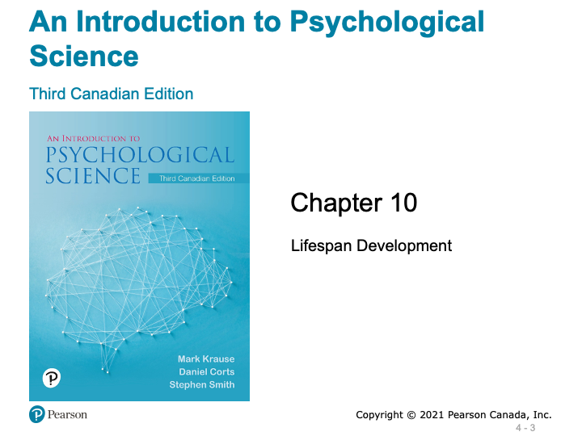
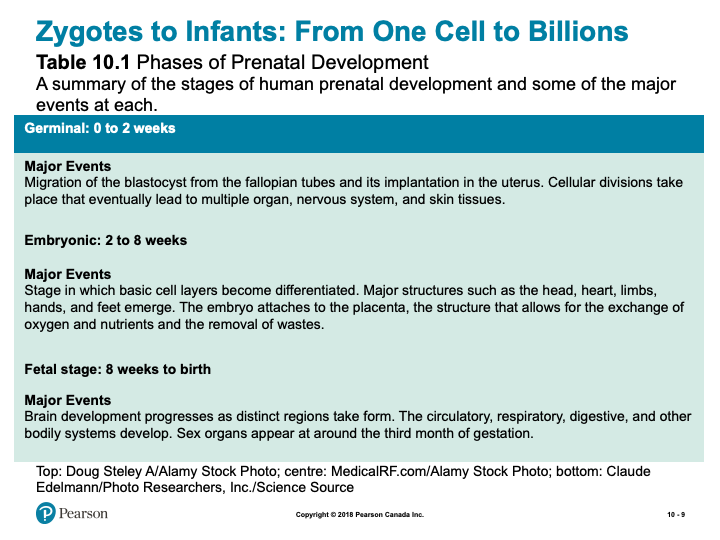
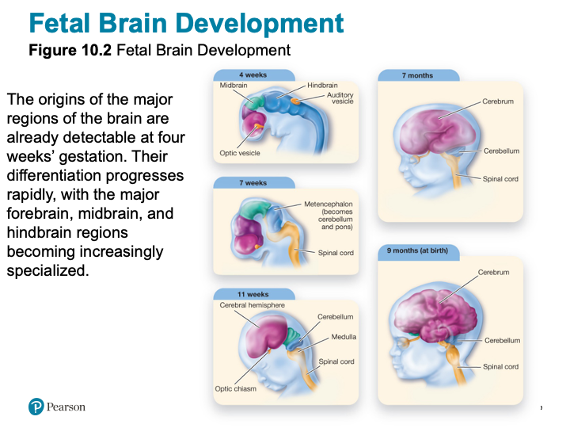
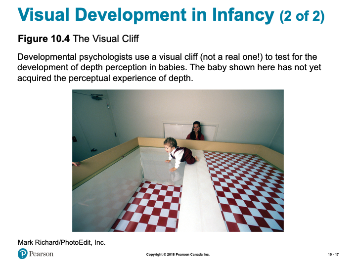
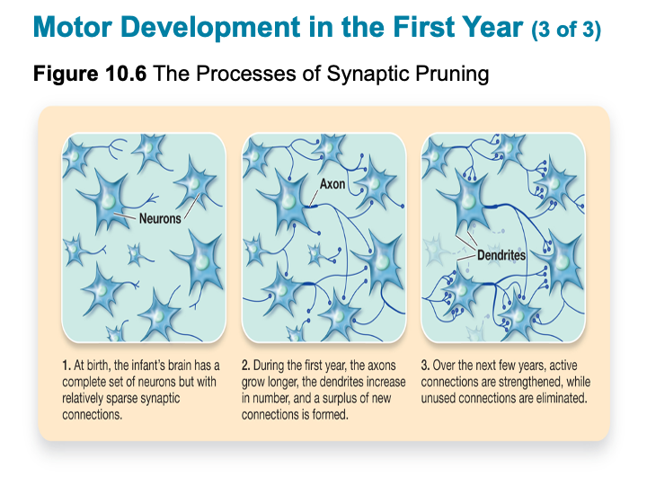
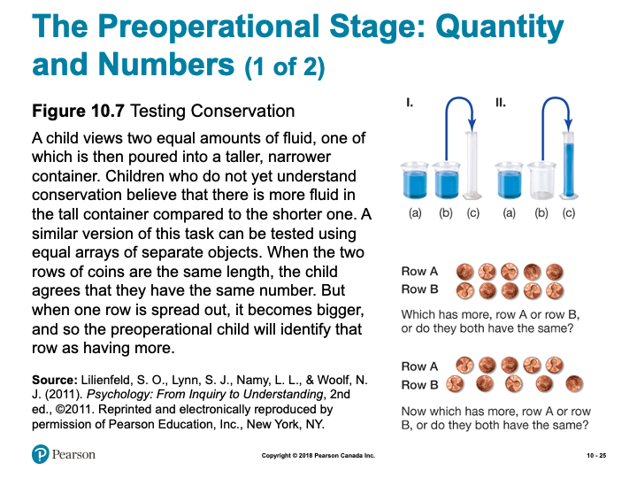
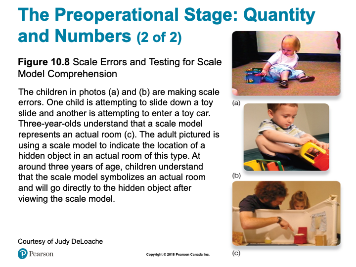
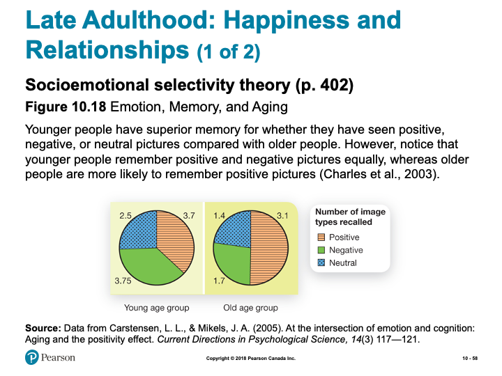
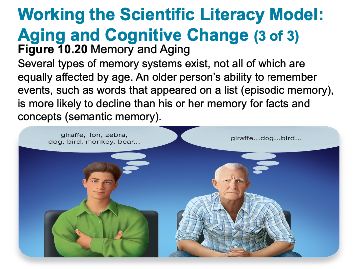

# The Developing Person - Part 1

## Overview {-}

Now that we have covered over some broad and influential topics in psychology, we begin our focus on human development. The focus of the content for this unit, will be on Chapter 10 in your textbook. As you turn ahead, you will notice that Chapter 10 contains a large amount of information - because of this, we will be covering it in this unit, and the next (Unit 4).

In this Unit (Part 1), you will learn about various strategies for researching human development, normal and abnormal prenatal development, and various cognitive, physical, and social developmental factors for infancy, childhood, and adolescence.

### Topics {-}

This unit is divided into the following topics:

 1. Prenatal Development  
 2. Infancy and Childhood  
 3. Adolescence  

### Learning Outcomes {-}

By the end of this unit, student's will be able to:

- Define the key terminology related to prenatal and infant physical development, infancy and childhood, and adolescent development.  
- Understand advantages and disadvantages to different research designs in developmental psychology.  
- Understand the cognitive changes that occur during infancy and childhood, and the importance of attachment and the different styles of attachment.  
- Understand the process of identity formation, relationships, and moral emotions during adolescence.  
- Apply your understanding to identify the best ways expectant parents can ensure the health of their developing fetus, how to promote learning, and how to categorize moral reasoning.  
- Analyze the effects of preterm birth, how to effectively discipline children, and adolescent judgment and risk taking.  

### Activity Checklist {-}

Here is a checklist of learning activities you will benefit from in completing this unit. You may find it useful for planning your work:

```{block2, type='reflect'}

<!-- [plugin:content-inject](_schedule) -->

<span class="blockhead">Read and Reflect</span> 

- Read *Krause et al. (2021). Revel for An Introduction to Psychological Science, 3rd Canadian Edition*  
- Continue our study of development - in particular, some of the major changes adolescents go through in their growth.  
- Review *Unit 3 - Slides*

<details> <summary>CLICK HERE</summary>

<h5>An Introduction to Psychological Science - Chapter 10:Lifespan Development</h5> 

<h5>Learning Objectives</h5>  

| ^12^ The righteous will flourish like a palm tree, they will grow like a cedar of Lebanon;  
| ^13^ planted in the house of the Lord, they will flourish in the courts of our God.  
| ^14^ They will still bear fruit in old age,they will stay fresh and green,  
| ^15^ proclaiming, “The Lord is upright; he is my Rock, and there is no wickedness in him.”  

- Video: [Annie Murphy Paul: What we learn before we're born](http://www.ted.com/talks/annie_murphy_paul_what_we_learn_before_we_re_born.html){target="_blank”}  
  


*Slide showing - Introduction*

<h5>Modules</h5>

- Physical Development from Conception through Infancy  
- Infancy and Childhood: Cognitive and Emotional Development  
- Adolescence  
- Adulthood and Aging  

<h5>Learning Objectivess</h5>

- Know the key terminology related to prenatal and infant physical development.  
- Understand pros and cons to different research designs in developmental psychology.  
- Apply your understanding to identify the best ways expectant parents can ensure the health of their developing fetus.  
- Analyze the effects of preterm birth.  

<h5>Developmental Psychology</h5>

- Developmental psychology (p. 362)  
  - Early development influences later behaviours  


*Slide showing - Cross-Sectional and Longitudinal Methods*

<h5>Patterns of Development: Stages and Continuity</h5>

- Stages  
  - Abrupt transitions  
- Continuous  
  - Slow changes  



*Slide showing - Phases of Prenatal Development*



*Slide showing - Fetal Brain Development*

<h5>Nutrition, Teratogens, and Fetal Development</h5>

- Teratogen (p. 366)  
  - Alcohol  
  - Cigarettes  
- Fetal Alcohol Syndrome (p. 366)  
  - 1.5 in 1000 worldwide  
    - Likely higher  
- Stress  

<h5>Working the Scientific Literacy Model: The Long-Term Effects of Premature Birth</h5>

- What do we know about premature birth?  
  - Preterm infants (p. 368)  
  - 25 weeks: 50% survival  
  - 30 weeks: 95% survival  
- How can science be used to help preterm infants?  
  - NIDCAP  
- Can we critically evaluate this research?  
  - Small sample size  
  - Why does the program work?  
- Why is this relevant?  
  - 9% of infants are born preterm  
  - Simple interventions available:  
    - Massage  
    - Kangaroo care  

<h5>Myths in Mind: Vaccinations and Autism</h5>

- 1990 claim that MMR vaccine linked to autism  
  - One dose given at year 1  
  - Second does before starting school  
  - Many parents refused  
- Lack of scientific support  
  - Article retracted 2010  

<h5>Sensory Development in Infancy</h5>

- Sensory before birth  
  - 4 months gestation, brain receiving signals from eyes and ears  
  - 7-8 months gestation, fetus actively listening  
- Vision at birth  
  - 30 cm or less  
  - 20/20 by 12 months  
- Smell at birth  
  - Cringe at foul odours  
  - Discriminate mother’s breastmilk  


*Slide showing - Experimental Stimuli for Studying Visual Habituation in Infants*



*Slide showing - The Visual Cliff*


*Slide showing - A Few Key Infant Reflexes*


*Slide showing - Motor Skills Develop in Stages*



*Slide showing - The Processes of Synaptic Pruning*

<h5>Learning Objectives</h5>

- Know the key terminology associated with infancy and childhood.  
- Understand the cognitive changes that occur during infancy and childhood.  
- Understand the importance of attachment and the different styles of attachment.  
- Apply the concept of scaffolding and the zone of proximal development to understand how to best promote learning.  
- Analyze how to effectively discipline children in order to promote moral behaviour.  

<h5>The Importance of Sensitive Periods</h5>

- Sensitive period (p. 375)  
  - Language fluency  
  - Perception  
  - Balance  
  - Recognition of parents  
  - Identifying with a particular culture  


*Slide showing - Piaget’s Stages of Cognitive Development*

<h5>The Sensorimotor Stage: Objects and the Physical World</h5>

- Sensorimotor stage (p. 375)  
  - Birth to 2 years  
  - Object permanence (p. 376)  
    - Hidden toy test  



*Slide showing - Testing Conservation*



*Slide showing - Scale Errors and Testing for Scale Model Comprehension*

<h5>The Concrete Operational Stage: Using Logical Thought</h5>

- Concrete operational stage (p. 377)  
  - 7 to 11 years  
  - Transitivity  

<h5>The Formal Operational Stage: Abstract and Hypothetical Thought</h5>

- Formal operational stage (p. 378)  
  - 11 years to adulthood  
  - Scientific thinking  

<h5>Working the Scientific Literacy Model: Evaluating Piaget</h5>

- What do we know about cognitive abilities in infants?  
  - Core knowledge hypothesis (p. 378)  
  - Habituation (p. 378)  
  - Dishabituation (p. 378)  


*Slide showing - Testing Infants’ Understanding of Quantity*

<h5>Complementary Approaches to Piaget</h5>

- Vygotsky  
  - Zone of proximal development (p. 380)  
    - Scaffolding (p. 380)  
      - Cultural differences  

<h5>Social Development and Attachment</h5>

- Attachment (p. 381)  
- Harry Harlow’s monkey experiments  
- Strange situation test (p.382)  


*Slide showing - The Strange Situation*

<h5>Social Development and Attachment</h5>

- Types of Attachment  
  - Secure attachment  
    - Insecure attachment  
    - Disorganized  
    - Anxious/Ambivalent  
    - Avoidant  
- Parenting and Attachment  
- Attachment behavioural system (p. 383)  
- Caregiving behavioural system (p. 383)  
- Conditional approaches  
- Introjection (p. 383)  
- Inductive discipline (p. 383)  

<h5>Self-Awareness</h5>

- Self-awareness (p. 384)  
  - Reflection in mirror  
- Egocentric (p. 384)  


*Slide showing - Piaget’s Test for Egocentric Perspective in Children*

- Theory of mind (p. 384)  
- False-belief task  

<h5>Psychosocial Development Across the Lifespan</h5>

- Infancy  
  - Sense of security  
- Toddlerhood  
  - Exploring autonomy  
- Early Childhood  
  - Pushing boundaries and experimenting  
- Childhood  
  - Active engagement  

<h5>Learning Objectives</h5>

- Know the key terminology concerning adolescent development.  
- Understand the process of identity formation during adolescence.  
- Understand the importance of relationships in adolescence.  
- Understand the functions of moral emotions.  
- Apply your understanding of the categories of moral reasoning.  
- Analyze the relationship between brain development and adolescent judgment and risk taking.  


*Slide showing - Physical Changes That Accompany Puberty in Male and Female Adolescents*

<h5>Emotional Challenges in Adolescence</h5>

- Intense and volatile emotions  
- Cognitive reframing  
- Ability to delay gratification (p. 392)  

<h5>Working the Scientific Literacy Model: Adolescent Risk and Decision Making</h5>

- What do we know about adolescence and decision making?  
  - Ongoing changes in prefrontal cortex  
    - Region involved in impulse control, mood, planning, organizing, and reasoning  


*Slide showing - Extended Brain Development*

- Can we critically evaluate this explanation for risky decision making?  
  - Still capable of making good decisions  
  - Temperament and personality  
  - Situational factors  
- Why is this relevant?  
  - Major public health problem  


*Slide showing - What Drives Teenagers to Take Risks?*

<h5>Cognitive Development: Moral Reasoning vs. Emotions</h5>

- Formal operational stage  
  - Abstract thinking  
  - Scientific thinking  
  - Perspective taking  

<h5>Kohlberg’s Moral Development: Learning Right from Wrong</h5>

- A trolley is hurtling down the tracks toward a group of five unsuspecting people. You are standing next to a lever that, if pulled, would direct the trolley onto another track, thereby saving the five individuals. However, on the second track stands a single, unsuspecting person, who would be struck by the diverted trolley.  


*Slide showing - Kohlberg’s Stages of Moral Reasoning*

<h5>Moral Development</h5>

- Social intuitionist model  
  - Julie and Steven are brother and sister. They are travelling together in France on summer vacation from college. One night they are staying alone in a cabin near the beach. They decide that it would be interesting and fun if they shared a romantic kiss. At the very least it would be a new experience for each of them. They both enjoy the experience, but they decide not to do it again. They keep that night as a special secret, which makes them feel even closer to each other.  

<h5>Social Development: Identity and Relationships</h5>

- Identity (p. 395)  
  - Personal qualities  
  - Social qualities  
  - Future goals  
- Adolescence identity crisis  
  - Curiosity, questioning, and exploration  
- Peer groups  
- Romantic relationships  

<h5>Learning Objectives</h5>

- Know the key terminology concerning adulthood and aging.  
- Know the key areas of growth experiences by emerging adults.  
- Understand age-related disorders such as Alzheimer’s disease.  
- Understand how cognitive abilities change with age.  
- Apply your attitudes about marriage.  
- Analyze the stereotype that old age is a time of unhappiness.  

<h5>Physical Changes in Adulthood</h5>

- Age brackets:  
  - Young adulthood: 18-40 years  
  - Middle adulthood: 40-65 years  
  - Older adulthood: 65 years and onward  
- Menopause (p. 399)  

<h5>Psychosocial Development Across the Lifespan</h5>

- Ages 25 to 40  
  - Separate from parents
  - Work on intimate relationships
  - Failure can result in isolation
- Ages 45 to 65
- Producing something of value
- Work and/or family
- Ages 65+
- Reflect on life of fulfillment (or not)

<h5>Love and Marriage</h5>

- Most adults pursue some kind of long-term relationship
- Marriage associated with longer life, happiness
- Gottman
  - Conflict and communication
  - “Four horsemen of the Apocalypse”

<h5>Parenting</h5>

- Shift in identity, lifestyle
- Children affect marriage
- Empty nest myth



*Slide showing - Emotion, Memory, and Aging*

<h5>PSYCH @ The Driver’s Seat</h5>

- Driving skills and age
- UFOV Speed of Processing training
  - Computer-based
  - Decreases accident risk


*Slide showing - How Alzheimer’s Disease Affects the Brain*

<h5>Working the Scientific Literacy Model: Aging and Cognitive Change</h5>

- What do we know about cognitive abilities?
  - Fluid intelligence declines
  - Crystalized intelligence remains largely intact
- How can science explain age-related differences in cognitive abilities?
  - Activation of brain areas

<h5>Working the Scientific Literacy Model: Aging and Cognitive Change</h5>

- Can we critically evaluate our assumptions about age-related cognitive changes?
  - Too simplistic to say memory declines
    - Many different types of memory
  - Compensation
- Why is this relevant?
  - Control over how one ages



*Slide showing - Memory and Aging*

</details>

**Note:** The slides are intended to supplement the information found in your textbook. If you are having trouble viewing them, they can also be downloaded by scrolling to the bottom of the screen and clicking on the "Unit 3 - Slides" link.

<span class="blockhead">Designer Babies</span>

 - Explore and reflect upon this contemporary and controversial issue. Designer babies pose many ethical issues and requires careful consideration.

<span class="blockhead">Cognitive Change</span>

 - Reflect on your own development before taking a "test" to develop additional insights into your own developmental trajectory.

<span class="blockhead">Terminology Practice</span>

- Take this flip-card activity to self-evaluate how well you know some of the important terms from Chapter 10.   

<span class="blockhead">Learning Lab Preparation</span>

- Each topic will provide a question or scenario for you to consider prior to attending your Learning Lab. Be sure to carefully consider each prompt as you will be expected to contribute to the group discussion.  

```

### Resources {-}

Here are some additional resources that will help you complete this unit:

- Krause, M., Corts, D., Smith, S. C., & Dolderman, D. (2018). *Revel for An Introduction to Psychological Science, 2nd Canadian Edition.* Pearson Ed.  
- Other resources will be provided online.  

## Prenatal Development

### Physical Development {-}

Prenatal development is a time of rapid growth and change. This rapid change continues throughout the first few years of life. Development during early life is clearly a function both of nature and of the environment.

<!-- [plugin:content-inject](_alert) -->

### Questions to Consider {-}

After you have read the first few pages of this chapter you should be able to answer the following questions:

- ***How is the gender of an offspring determined?***  
- ***What differentiates zygotes from embryos and embryos from fetuses?***  

*(These questions are intended for personal reflection - you are not intended to submit anything for assessment)*

### Designer Babies {-}

It is beginning to look inevitable that, however fierce the debate, the technology to make designer babies will happen - maybe just 20 years from now. Geneticists claim to have found the gene for good-parenting, genes for obesity, Alzheimer's, red hair, and even happiness. Incredibly, scientists have even constructed an artificial human chromosome, which could carry any genes a geneticist - or prospective parents - desired.

Embryo A technique called Pre-implantation Genetic Diagnosis (PGD) is already being used to screen embryos for genetic diseases. Embryos created outside the body using in vitro fertilization are tested to see whether they carry a genetic disorder before being transferred to the uterus. It's deeply controversial whether parents should ever be allowed to select embryos just because they're genetically different.

At the moment the technique is used for therapeutic purposes only, to screen for children who may have a deadly genetic disease. Even if some parents and their doctors were willing to use PGD for cosmetic or enhancement purposes, which remains absolutely taboo, the technique is limited in a crucial way - PGD can only select an embryo with genes inherited from the parents.

***Bottled Genes?*** *One day parents may be able to pick any gene they desire from a range of bottled genes and have it put into their embryos. (quoted from "Designer Babies" website)*

<!-- [plugin:content-inject](_activities) -->

### Activity: Designer Babies {-}

```{block2, type='reflect'}

This activity involves some reading and reflection around the topic of genetic engineering. As this is a contemporary issue, it will be valuable to familiarize yourself with some of the complexities of this technology and think critically about some of the ethical challenges. Your task is to read the following resources and carefully consider the implications of this technology:

- [**Editing the DNA of Embryos with CRISPR**](https://www.statnews.com/2019/09/16/could-editing-the-dna-of-embryos-with-crispr-help-save-people-who-are-already-alive/){target="_blank”}  
- [**Designer Babies, CRISPR, & Genetic Engineering**](https://www.geneticsandsociety.org/internal-content/designer-babies-crispr-genetic-engineering){target="_blank”}  

<span class="blockhead">Learning Lab Preparation</span>

Prior to your Learning Lab, take some time to think about the following scenario and questions. You will be asked to share your thoughts in this week's Learning Lab:

*Modern techniques of conception and human genetic engineer­ing raise important new issues for human development. A pam­phlet containing the following message was left at doorsteps in TWU professor Philipchalk's neighborhood:*


*Image showing an example of surrogacy message *

(*You may also wish to comment on the “Designer Babies” topic above.*)

1. ***How do you feel about this request?***
2. ***What problems might you anticipate?***

```

## Infancy and Childhood

### A Child’s View of God {-}

One evening on a camping trip several years ago, my wife and I listened outside the tent as our five-year-old Joelle and three-year-old Matthew tried to get to sleep. Always the "mother," Joelle attempted to dispel her little brother's fear of bears and other wild creatures by reminding him that Jesus was watching over them. Not content with generalities, Matt responded, "Does Jesus got a gun?" *(Psychology and Christianity by Ronald Philipchalk, p. 141)*

As any Sunday School teacher knows, children see God differently from adults—often in very concrete terms (protection requires a gun!). Studying cognitive development can help us to understand as well as teach children at their own level.

### The Process of Cognitive Change {-}

Our textbook provides a good summary of the structure (stages) of cognitive development. The section, however, does not address the process by which a person moves from one stage to the next. Piaget believed that the key to cognitive development is something called cognitive conflict or cognitive disequilibrium. For cognitive development to proceed, the individual must constantly re-evaluate his or her schemas. According to Piaget, we develop schemas from an early age of life. Schemas are our cognitive representations of the world. Schemas help us to organize our experiences. They also allow us to make predictions about what outcomes might result from particular behaviours. Schemas are very important in helping us to understand and to adapt to the world.

Although schemas are important in helping us to understand the world, they are not always accurate. People at all ages can have mental representations of the world that are not correct.

***Can you think of any examples of inaccurate schemas?***

Although people at all ages can have inaccurate mental representations of the world, children are especially prone to view the world in an incorrect way. The reason children may view the world in an incorrect way is because the structure of their cognitive processing is developing. Piaget believed that inaccurate schemas are changed only when they are challenged in the cognitive structure of the child. This challenge has been termed cognitive conflict.


Basically, the process of cognitive change works as follows:

- People are motivated to maintain a state of cognitive equilibrium.  
- When a child encounters information from the world and the information is inconsistent with his or her schema, the new piece of information creates a state of disequilibrium or cognitive conflict.  
- ***Equilibrium*** may be restored through one of the two processes of adapation called assimilation and accommodation.  
- ***Assimilation*** occurs when a child re-organizes the new information in such a way as to make the new piece of information consistent with his or her preexisting schema of the world.  
- ***Accommodation*** occurs when a child alters his or her schema such that the new piece of information can now be incorporated into the new schema.  

Thus the process of accommodation produces the greatest cognitive change. Can you think of examples of both assimilation and accommodation? Here is an example:

**Equilibrium-Preexisting Schema:** Child has grown up in an environment where all people he interacted with were of the same race (mom, dad, siblings, grandma, grandpa, etc.) Child has seen people of other racial groups, but has never interacted with them. Child develops the schema that people tend to like others who are of the same race as him or her.

**Cognitive Conflict Produced:** At four years of age the child begins to attend preschool. At this time he starts to interact with children of various races. The child begins to develop a friendship with a child of a different race. This friendship creates cognitive conflict for the child: "How can I like someone who is a different color?" To resolve this cognitive conflict, the child has two options:

***Option A***- **Assimilation:** In order to maintain his or her preexisting schema, the child re-organizes the information such that the other child is not perceived to be so dissimilar after all: "Maybe he is a different color from me, but we both speak English. We must not be so dissimilar after all."

***Option B***- **Accommodation:** The child's preexisting schema is altered such that the new information can be incorporated into a new way of perceiving the world, "Maybe I can be friends with someone who is different from me."

### Cognitive Equilibrium is Restored {-}

Although cognitive equilibrium is restored via either assimilation or accommodation, assimilation serves to maintain an inaccurate schema (that differences inhibit the development of friendships) whereas accommodation serves to produce cognitive change and hence produces a more accurate representation of the world (that differences do not inhibit the development of friendships).

<!-- [plugin:content-inject](_activities) -->

### Activity:Cognitive Change  {-}

```{block2, type='reflect'}

The first three links below are articles that are intended to give you an opportunity to reflect upon your own considerations around development. The last link is a test - along with the first three links, it is intended to provide some insights about your developmental trajectory in light of your crisis resolution, attachment style, and parenting styles:

- [**Erik Erikson’s Stages of Social-Emotional Development**](http://www.childdevelopmentinfo.com/development/erickson.shtml ){target="_blank”}  
- [**The Link Between Substance Abuse and Attachment Disorder**](http://www.attachmentdisorder.net/ ){target="_blank”}  
- [**Stepfamilies: How to Help Your Child Adjust**](https://www.mayoclinic.org/healthy-lifestyle/childrens-health/in-depth/stepfamilies/art-20047046){target="_blank”}  
- [**What is Your Parenting Style**](https://www.3smartcubes.com/pages/tests/parentingstyle/parentingstyle_instructions/){target="_blank”}  

<span class="blockhead">Learning Lab Preparation</span>

Prior to your Learning Lab, take some time to think about the following questions. You will be asked to share your thoughts in this week's Learning Lab:

 - ***What is God like for children of different levels of cognitive development? If you can, give some examples from children you know....***  
 - ***Would children even have an idea of God if they were not taught it?***  

```

## Adolescence

John has just turned 13. Over the past year he has experienced may changes. He has grown over six inches and he has developed acne over his face and back. Not only is he changing physically, he is also experiencing a wave of emotional, spiritual, cognitive, and sexual changes. John has become self-focused and very self-critical. In addition, he is beginning to think abstractly and to challenge adults' "dominion" on knowledge. John is also on a quest to understand "who he is" and "what his place is in the world". John's quest for an identity makes him more vulnerable to peer pressure and to the influence of radical groups and cults. During this time that we call adolescence, John will make many decisions that will have a profound effect on the direction his life will take.

*Does any of the above sound familiar?*

Before you begin reading the textbook section on adolescence, think back to your own adolescence. As you think about your experience of adolescence, use the following questions to guide your reflection:

- What physical changes did you experience in adolescence?  
- How did these physical changes make you feel?  
- In what ways did your view of the world change during adolescence?  
- How did your way of treating other people change during adolescence?  
- What was most important to you during adolescence?  
- To what extent is "who you are today" a function of "who you became during adolescence"?  

### No Adolescence? {-}

In other times and in other cultures to­day, adolescence does not exist as a significant and distinct period of develop­ment. This might seem surprising and difficult to imagine. Think of how modern society would be different, or if it could even exist, without a period of adolescence. What are the advantages and disadvantages of having an adolescent period?

### Identity  {-}

The concept of identity is a rich topic for consideration. The most familiar aspect of identity is occupational identity, since much of “who we are” in our society rests on the kind of work we do. Perhaps you can readily relate to this in your choice of major. Less familiar, but equally important, is ideological identity. Ideologi­cal identity, including both religious and political orientations, may un­dergo a tremen­dous upheaval during your student years. Do you have the same political beliefs as your parents? What about religious beliefs? Conflict and questioning of parental beliefs and values may be a necessary part of establishing your personal iden­tity—even if the beliefs and values you ultimately adopt are the same as those of your parents.

<!-- [plugin:content-inject](_activities) -->
### Learning Activities {-}

```{block2, type='reflect'}

<span class="blockhead">Read and Reflect</span>

In this section we explore adolescence and the changes in development we go through. Below are some resources that help to help support your understanding:

- [**Journal of Adolescence**](https://www.sciencedirect.com/journal/journal-of-adolescence){target="_blank”}  
- [**Erik Erikson’s Stages of Social-Emotional Development**](https://childdevelopmentinfo.com/child-development/erickson/#gs.d8mpcv){target="_blank”}  
- [**4 Tips for Parenting Teenagers**](http://drjamesdobson.org/quiz/parenting-quiz/4-tips-for-parenting-teenagers){target="_blank”}  

<span class="blockhead">Terminology Practice</span>

In order to review some of the major terms from Chapter 10 in your textbook, practice using the activity below. Although you will not be evaluated on these terms, they will assist you in the assessments for this course:

<span class="blockhead">Learning Lab Preparation</span>

Prior to your Learning Lab, take some time to think about the following questions. You will be asked to share your thoughts in this week's Learning Lab:

- ***Would you want to live your adolescence over again if you could? Why or why not?***  

```

## Assessment {-}

```{block2, type='assessment'}

While there is no "formal" assignment that you will be responsible for submitting for Unit 3, you will be expected to participate in discussion during your Learning Lab. Your facilitator will be providing a participation mark based on your contributions. Below is some information to consider prior to attending your Learning Lab:

*Active participation in group exercises, reflection, and critical discourse is an essential component of this course. You are expected to show respect for all members of the course, both in your speech and actions. Contribute by actively observing and listening, raising thoughtful questions, examining relevant issues, building on others’ ideas, analyzing and evaluating the group’s thinking, synthesizing key points, and expanding the group’s perspectives. Take care not to dominate a conversation, giving space for others to speak. When in small groups help maintain the focus, flow, and quality of conversations, and take the initiative to invite others (particularly those who are quiet) to speak.*

**Rubric for Participation in Learning Labs**

| Emerging (0-64%) | Developing (65-89%) | Mastering (90-100%)|
| -| -|-|
|Never to almost never: Demonstrates active listening (as indicated by disengaged body language and no to rare comments that build on others’ remarks),Initiates any contributions in class or small groups, Makes insightful or constructive comments, Helps maintain a supportive space for others to speak.|Sometimes to fairly often: Demonstrates active listening (as indicated by somewhat to often engaged body language and comments that build on others’ remarks), Initiates a contribution at least once in a class or small group discussion; Makes insightful or constructive comments, Helps maintain a supportive space for others to speak.|Very often to nearly always: Demonstrates active listening (as indicated by fully engaged body language and comments that build on others’ remarks), Initiates more than one contribution in a class or small group discussion, Makes insightful or constructive comments, Creates a space for others to speak and takes initiative to include others.

```

## Checking your Learning {-}

```{block2, type='progress'}

Before you move on to the next unit, check that you are able to:

- Define the key terminology related to prenatal and infant physical development, infancy and childhood, and adolescent development.  
- Understand advantages and disadvantages to different research designs in developmental psychology.  
- Understand the cognitive changes that occur during infancy and childhood, and the importance of attachment and the different styles of attachment.  
- Understand the process of identity formation, relationships, and moral emotions during adolescence.  
- Apply your understanding to identify the best ways expectant parents can ensure the health of their developing fetus, how to promote learning, and how to categorize moral reasoning.  
- Analyze the effects of preterm birth, how to effectively discipline children, and adolescent judgment and risk taking.  

```
