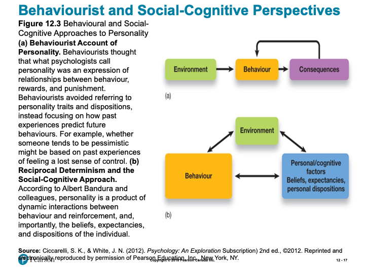
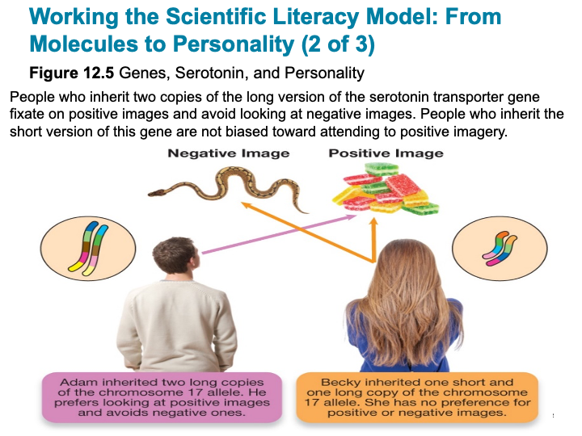
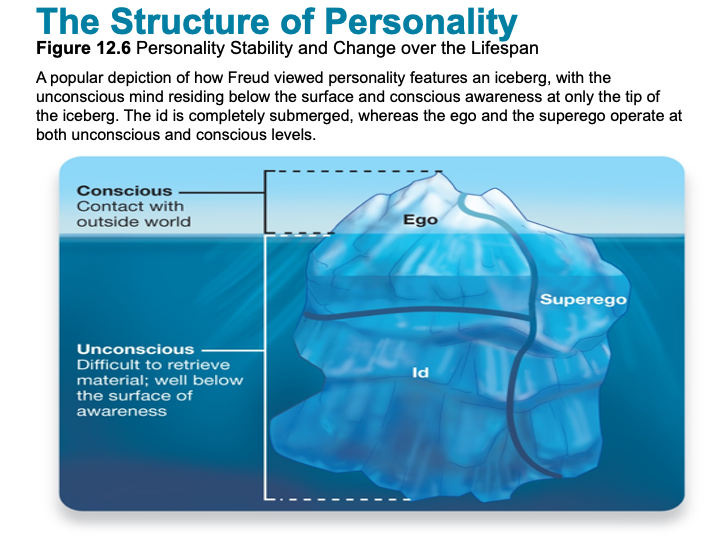
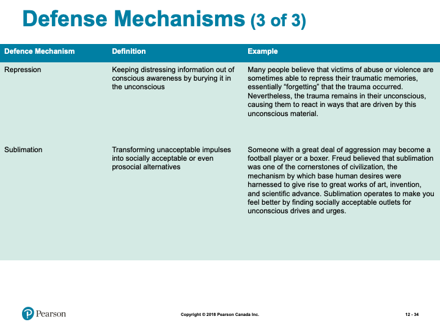
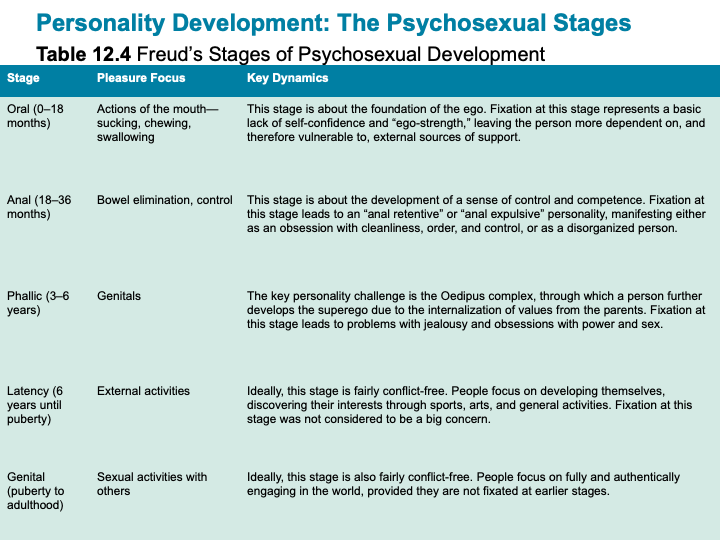
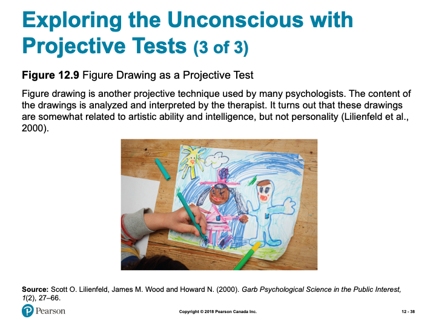
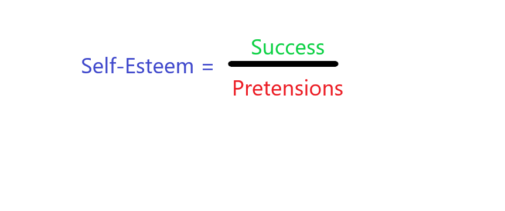

# Personality

## Overview {-}

In Unit 5 of the course, our attention will focus on personality. The study of personality attempts to answer the questions: *Who are you?* and, *How did you become who you are?* As human’s are astoundingly complex, there is not any one theory that can capture, in totality, a description of who you are; hence, there are numerous approaches and theories that attempt to address these questions. In this unit, you will learn about some of the contemporary approaches to the study of Personality, and examine and review cultural, biological, Psychodynamic and Humanistic approaches to Personality.

### Topics {-}

This unit is divided into the following topics:

1. Psychoanalytic View  
2. Humanistic View  
3. Trait View  
4. Social-Cognitive View  

### Learning Outcomes {-}

By the end of this unit, student's will be able to:

- Define the key terminology associated with contemporary approaches, cultural and biological approaches, and psychodynamic and humanistic approaches to personality.  
- Describe the behaviourist and social-cognitive views, evolutionary theories, and Freudian developmental and defensive explanations of personality.  
- Apply the "Big Five" personality traits, psychodynamic, and humanistic perspectives to understand personality.  
- Analyze the roots of violence and prejudice, roles of personality traits and psychological and physical states, and the genetic basis of personality in determining behaviour.  
- Assess claims that males and females have fundamentally different personalities and whether projective tests are valid measures of personality.  

### Activity Checklist {-}

Here is a checklist of learning activities you will benefit from in completing this unit. You may find it useful for planning your work:

<!-- [plugin:content-inject](_schedule) -->

```{block2, type='reflect'}

<span class="blockhead">Read and Reflect</span>

- Read *Krause et al. (2021). Revel for An Introduction to Psychological Science, 3rd Canadian Edition*  
- Review **Unit 5- Slides**

<details> <summary>CLICK HERE</summary>

<h5>An Introduction to Psychological Science - Chapter 12 - Personality</h5>

<h5>True or False?</h5>

1. Freud believed that boys develop sexual desires for their mother when they are between 3 and 6 years of age.  
2. One of the most reliable and valid measures of personality is the Rorschach inkblot test.  
3. Dreams are disguised wish fulfillments that can be interpreted by skilled analysts.  
4. Psychologists generally agree that painful experiences commonly get pushed out of awareness and into the unconscious.  
5. Most Americans believe that self-esteem is very important for motivating a person to work hard and succeed.  
6. Personality differences among dogs are as evident and as consistently judged as personality differences among humans.  
7. Most people recognize that personality descriptions based on horoscopes are invalid.  
8. From a few minutes’ inspection of our living and working spaces, someone can, with reasonable accuracy, assess our emotional stability.  
9. Older people are happiest when they do not have to take responsibility for everyday decisions that affect their lives.  
10. The majority of people suffer from low self-esteem.  

<h5>Modules</h5>

- Contemporary Approaches to Personality  
- Cultural and Biological Approaches to Personality  
- Psychodynamic and Humanistic Approaches to Personality  

<h5>Learning Objectives</h5>

- Know the key terminology associated with contemporary approaches to personality.  
- Understand the behaviourist and social-cognitive views of personality.  
- Apply self-report methods to understand your own personality.  
- Analyze the personality roots of violence and prejudice.  
- Analyze the relative roles of personality traits and psychological and physical states in determining behaviour.  

<h5>Personality Exercise: Who am I?</h5>

- Describe your own personality by simply answering the question “Who am I?” on a piece of paper. Write at the top of the page “I am . . .” and then list about 20 characteristics that describe you. List what you consider to be some of your own positive and negative personality qualities.  

<h5>Personality Exercise: Some Terms</h5>

- Sincere, honest, faithful, loyal, modest/unassuming, fair-minded, sly, greedy, pretentious, hypocritical, boastful, pompous, emotional, oversensitive, sentimental, fearful, anxious, vulnerable,  brave, tough, independent, self-assured, stable, intellectual, creative, unconventional, innovative, shallow, absentminded  
- Outgoing, lively, extraverted, sociable, talkative, cheerful, active, shy, passive, withdrawn, introverted, quiet, reserved, patient, tolerant, peaceful, mild, agreeable, lenient, gentle, ill-tempered, stubborn, quarrelsome, choleric (easily angered), organized, disciplined, diligent, careful, thorough, precise, sloppy, negligent, reckless, lazy, irresponsible  

<h5>Approaches to Studying Personality</h5>

- Personality (p. 458)  
- Idiographic approach (p. 458)  
- Serial killer  
- Person-centred  
- Nomothetic approach (p. 458)  
- Descriptive labels  

<h5>The Trait Perspective</h5>

- Personality traits (p. 459)  
- Allport and Odbert  
- 18,000 descriptors  
- Factor analysis (p. 459)  


*Slide showing - The Big Five Personality Dimensions*

<h5>Beyond the Big Five: The Personality of Evil?</h5>

- Authoritarian Personality
- HEXACO (p. 462)
- Honesty-Humility
- Right-wing authoritarianism (p. 463)
- The Dark Triad (p. 462)
- Machiavellianism
- Psychopathy
- Narcissism

<h5>Working the Scientific Literacy Model: Right-Wing Authoritarianism at the Group Level </h5>

- What do we know about RWA?  
- More RWA in society – leads to prejudice, aggression  
- How can science determine how RWA affects groups?  
- Global Change Game  
- Can we critically evaluate this research?  
- External validity  
- Chance  
- Student participants  
- Why is this relevant?  
- 21st century warning bell  


*Slide showing - Personality Stability and Change over the Lifespan*

<h5>Personality Traits and States</h5>

- State (p. 466)  
- Four general aspects of situations  
  - Locations  
  - Associations  
  - Activities  
  - Subjective states  



*Slide showing - Behavioural and Social-Cognitive Approaches to Personality*

<h5>Learning Objectives</h5>

- Know key terminology associated with cultural and biological approaches to personality.  
- Understand how evolutionary theories explain personality.  
- Apply your knowledge to arrive at accurate conclusions about the influences of biological and cultural factors on personality.  
- Analyze claims that males and females have fundamentally different personalities.  
- Analyze the genetic basis of personality.  

<h5>Culture and Personality</h5>

- Personality structures in different cultures  
- Comparing personality traits between nations  
- Challenges in cross-cultural research  
- Response styles (p. 472)  


*Slide showing - How Genes affect Personality*

<h5>Working the Scientific Literacy Model: From Molecules to Personality </h5>

- What do we know about specific genes and personality?  
  - Genes code for brain chemicals related to personality  
    - Serotonin  
- How do scientists study genes and personality?  



*Slide showing - Genes, Serotonin, and Personality*

- Can we critically evaluate this evidence?  
  - Multiple genes interact with environment  
  - Should not infer causality  
- Why is this relevant?  
  - Understanding of biological basis of disorders  
  - Better treatments  

<h5>The Role of Evolution in Personality: Animal Behaviour</h5>

- Big Five traits found in a number of species  
  - Parus major  
    - Some bold, others shy  
- Chimpanzees  
  - Extraversion, conscientiousness, and agreeableness  
- Octopuses  
  - Activity, reactivity, and avoidance  

<h5>Why There Are So Many Different Personalities: The Evolutionary Explanation</h5>

- Core personality traits across cultures  
- Individuals select environments that match personality characteristics  

<h5>MYTHS IN MIND: Men are from Mars, Women are from Venus</h5>

- Gender differences greatly exaggerated  
  - Influenced by resource availability  

<h5>The Brain and Personality</h5>

- Four Humours (400 BC)
- Phrenology (1700s)
- Extraversion and arousal: brain regions (1967)
- Approach/Inhibition model of motivation (1991)

<h5>Learning Objectives</h5>

- Know the key terminology related to psychodynamic and humanistic approaches to personality.  
- Understand how people use defense mechanisms to cope with conflicting thoughts and feelings.  
- Understand the developmental stages Freud used to explain the origins of personality.  
- Apply both psychodynamic and humanistic perspectives to explain personality.  
- Analyze whether projective tests are valid measures of personality.  
- Analyze the strengths and weaknesses of psychodynamic perspectives.  

<h5>The Psychodynamic Perspective</h5>

- Unconscious processes and psychodynamics  
  - Sigmund Freud (1800s)  
  - Key observations  
    - Unconscious influences behaviour  
    - Personality forms in early childhood  
    - Mental representations shape behaviours  

<h5>Unconscious Processes and Psychodynamics</h5>

- Unconscious mind (p. 483)  
  - Impulses and drives  
- Conscious mind (p. 483)  
  - Aware of these  



*Slide showing - Personality Stability and Change over the Lifespan*


*Slide showing - Examples of Some Major Defence Mechanisms*






*Slide showing - Freud’s Stages of Psychosexual Development*


*Slide showing - The Rorschach Inkblot Test*


*Slide showing - The Thematic Apperception Test*



*Slide showing - Figure Drawing as a Projective Test*

<h5>Working the Scientific Literacy Model: Perceiving Others as a Projective Test</h5>

- What do we know about the way people perceive others?  
  - We make assumptions of others  
    - May reflect our personality  
- How can scientists study how projection relates to personality?  
  - Self-ratings on Big Five can been seen in perceptions of others  
- Can we critically evaluate this research?  
  - Small correlations  
  - Only with positive and negative attributions  
- Why is this relevant?  
  - Problems and controversy with projective tests  
    - Need more objective measures  

<h5>Alternatives to the Psychodynamic Approach</h5>

- Carl Jung (1875-1961)  
  - Analytical psychology (p. 490)  
  - Personal, Collective unconscious (p. 490)  
  - Archetypes (p. 490)  
- Alfred Adler (1870-1937) and Karen Horney (1885-1952)  
  - Inferiority complex (p. 490)  

<h5>Humanistic Perspectives</h5>

- Carl Rogers, Abraham Maslow  
  - Self-actualization (p. 491)  
  - Person-centred perspective (p. 491)  

</details>

*Please note, the slides are intended to supplement the information found in your textbook. If you are having trouble viewing them, they can also be downloaded by scrolling to the bottom of the screen and clicking on the "Unit 5- Slides" link.*

- This Learning Activity is an opportunity to explore dreams and birth order, two of the constructs that help shape and reflect who we are as individuals. Keep in mind, though, there are many different theories and interpretations on the role dreams and birth order play.  
- The humanistic view, as it relates to personality, sees self-esteem as key ingredient for success in life. The articles in this activity illuminate how a healthy self-esteem can benefit personality development. It will also be helpful for preparation for discussion this week.  
- In this activity you will have the opportunity to analyze the power of the environment in influencing your perceived options. The concepts of Learned Helplessness vs. Learned Optimism will be used to highlight how important environmental factors are.  

<span class="blockhead">Practice, Read, and Reflect</span>

- In this activity you will have the opportunity to take a personality test (from a list of options). I would encourage you to interact with the results and ponder whether or not you think the test is accurate or inaccurate and whether or not the information provided seems unique to you or could it be applied to anyone given the right situation.  

<span class="blockhead">Key Terms Quiz</span>

- Practice quiz to assess how well you know key terms from Chapter 12.  
- Not for formal evaluation.  

<span class="blockhead">Learning Lab Preparation</span>

- Each topic will provide a question or scenario for you to consider prior to attending your Learning Lab. Be sure to carefully consider each prompt as you will be expected to contribute to the group discussion.  

```

### Resources {-}

Here are some additional resources that will help you complete this unit:

- Krause, M., Corts, D., Smith, S. C., & Dolderman, D. (2018). *Revel for An Introduction to Psychological Science, 2nd Canadian Edition.* Pearson Ed.  
- Other resources will be provided online.  

## Psychoanalytic View

"We are sent into this world to acquire a personality and a character to take with us that can never be taken from us." *(In a letter from a WW II Royal Air Force pilot to his mother)*

### Personality Theories {-}

In this chapter we consider the topic of personality theories. In doing this we examine several major perspectives. Within each of these there are many variations (e.g., Adler, Jung, and Freud within the psychoanalytic perspective). If you would like to know more about this area, you might be interested in taking the course “Theories of Personality” *(Psychology 301 at TWU).*

Aside from all these more formal theories, each of us has an implicit personality theory. This is our personal idea of what people are like, including which personality characteristics go together. For example, we think of people who are attractive and intelligent as likable rather than unlikable. Our socialization leads us to assume certain traits go together. As you go through this chapter, you may find some approaches are closer to your own assumptions (implicit theory), and you may prefer these approaches to others. You may also find your implicit theory becomes more explicit. Finally, you may even modify your own theory in the face of new information.

### Dreams {-}

“And afterward, I will pour out my Spirit on all people. Your sons and daughters will prophesy, your old men will dream dreams, your young men will see visions” *(Joel 2:28)*.

God apparently spoke through dreams many times in the bible, and in Joel 2:28 He promised to do so in the future. Does God still (or again) speak through dreams? Are we missing out on a possible leading from God when we ignore our dreams? If you would like to read more on this subject you might be interested in books by Christians on this subject. For example, see John A. Sanford's Dreams, God's Forgotten Language, or Morton T. Kelsey's God, Dreams, and Revelation, or Abraham Schmitt’s Before I Wake. The website below (cf. Online Resources) contains some balanced advice. Also, voice your opinion or give your experience in the online discussion.

### Birth Order {-}

You may be familiar with Adler's concept of the family constellation, which implies that position in the family has a powerful effect on goals, self-concept, and ways of relating to others.

As a test of this concept, think of a three-child family, all of whom were born within a few years (using larger families makes things too complicated). Try applying Adler's theory to predict which child in the family is likely to be:

- the best student  
- the most shy  
- the most helpful around the house  
- the most outgoing  
- the "hell raiser"  
- the most "helpless"  
- the charmer  
- the "baby" of the family  

You will not always be right—but neither was Adler. The important thing is to note that Adler made psychology aware of the different expectations and social influences on different children in the same family. In some respects, children in the same position in different families are more alike than are children in differ­ent positions in the same family


<!-- [plugin:content-inject](_activities) -->

### Activity: Read and Reflect {-}

```{block2, type='reflect'}

Having just introduced Personality Theories to the course, we begin to explore psychoanalytic views of human development. Dreams and birth order are but two of the constructs that help shape and reflect who we are as individuals- there are many different theories and interpretations on the role dreams and birth order play. Take a moment to consider the following articles:

- [**Christian Perspective on Dreams**](https://www.cgg.org/index.cfm/fuseaction/Library.sr/CT/BQA/k/96/What-Is-Proper-Christian-Perspective-on-Dreams-Visions.htm){target="_blank”}  
- [**Birth Order and Your Personality**](https://www.scientificamerican.com/article/ruled-by-birth-order/){target="_blank”}  


<span class="blockhead">Learning Lab Preparation</span>

Prior to your Learning Lab, take some time to think about the following questions. You will be asked to share your thoughts in this week's Learning Lab:

- ***Does God speak through dreams?***  
- ***What reasons do you have for your opinion? Can you give an example?***  

```

## Humanistic View

### Self-Esteem {-}

In 1890, William James gave a simple formula for self-esteem:




*James explained:*

Such a fraction may be increased as well by diminishing the denominator as by increasing the numerator. To give up pretensions is as blessed a relief as to get them gratified; and where disappointment is incessant and the struggle unending, this is what men will always do. . . . How pleasant is the day we give up striving to be young—or slenderThank Godwe say, those illusions are gone. *(James, 1890) (Quoted from Invitation to Social Psychology by Ron Philipchalk)*

In his textbook, David Myers discusses the pros and cons of promoting self-esteem. Consider also the following:

### Self-Esteem: A Contrary View {-}

Self-esteem is a popular topic in North American society and researchers have expended a vast amount of effort studying it. Approximately 10,000 studies have explored the possible relationship between self-esteem and various human problems (Scheff et al., 1989). The assumption that low self-esteem is at the root of many personal and social problems has reached the level of a cultural truism. The California legislature (1990) has even established a task force to promote self-esteem, believing that enhanced self-esteem is a vaccine against drug abuse, teen-age pregnancy, welfare dependency, and other social ills. Sharon Neuman (1992) suggests that the need to enhance self-esteem has become a "motherhood issue"—meaning that belief in its value is so widely accepted it goes unquestioned.

Recently, however, several authors have begun to challenge this focus on raising self-esteem. They point out that high self-esteem can sometimes be detrimental, if, for example, it leads people to set inappropriate, risky goals that are beyond their capabilities (Baumeister, et al., 1993a). In addition, the relationship between self-esteem and other measures of well-being is often weak or nonexistent (Burr & Christensen, 1992; Hermans, 1992; Jackson, 1984). Perhaps most importantly, high self-esteem may be the result and not the cause of other positive tendencies (Alexander & Baker, 1992).

Sharon Neuman (1992) argues that self-esteem must follow, not precede, real achievement. She claims that no number of self-esteem programs can replace the genuine satisfaction of a job well done. Wesley Burr and Clark Christensen (1992) suggest that the idea that we must esteem ourselves highly before we can value and love others is a "Western myth." They add:

We would improve our thinking if we were to take the idea that "we cannot love others until we love ourself" and turn it 180 degrees to be: "We cannot love ourself until we love others." We would further improve our thinking if we then concluded that this is a fairly irrelevant and unimportant idea anyway because it still implies that loving ourself is what is important. (p. 464)

Burr and Christensen suggest that self-esteem is a fruit and not a root of healthy emotional connections between people. *(From Invitation to Social Psychology by Ron Philipchalk)*

## Christianity & Humanism

Some Christians object to the humanistic perspective because of its unqualified affirmation of human goodness and its apparent promotion of self-love. It is important to note, however, that humanistic psychology is not to be equated with the philosophy and social movement called humanism. Although it focuses on humans, so too do other approaches to personality. (The behavioral psychologist B.F. Skinner was a signatory to the Humanist Manifesto but a major opponent of humanistic psychology.) In his authoritative work on the history of psychology, Ernest Hilgard writes, “Humanistic psychology as something contemporary is not to be confused with other forms of humanism, such as humanistic studies which refer to classical or liberal arts topics, or that form of humanism which sets itself against theological beliefs (1987, p. 504). In fact, J.I. Packer and Thomas Howard in their book Christianity: The true humanism (1985) argue that only Christianity gives a valid basis for assuming humans have value.

<!-- [plugin:content-inject](_activities) -->

### Activity: Read and Reflect {-}

```{block2, type='reflect'}

As we explore a humanistic view, as it relates to personality, we start to see the development of self-esteem. This will be the focus of this unit's Learning Lab. In order to prepare for discussion this week, take a moment to consider the following resources:

- [**Kids Health: Self Esteem**](https://kidshealth.org/en/kids/self-esteem.html){target="_blank”}  
- [**National Association for Self-Esteem**](http://healthyselfesteem.org/){target="_blank”}  
- [**Society for Humanistic Psychology**](https://www.apa.org/about/division/div32){target="_blank”}  

*The purpose of these resources is to help you assess your self-esteem, help to build a healthy self-esteem, and to provide you with a credible site for learning more about Humanistic Psychology.*

<span class="blockhead">Learning Lab Preparation</span>

Prior to your Learning Lab, take some time to think about the following questions. You will be asked to share your thoughts in this week's Learning Lab:

- ***If you wanted to study the psychologically healthiest individuals, whom would you study? How would you decide?***  

```

## Trait View

### Trait Theory {-}

In the previous lesson we discussed implicit theories of personality. Many people’s implicit theories include elements of trait theory. They believe that personality is made up of traits. For example, popular ideas of leadership and success often rest on this assumption (e.g., Traits for success).

Actually this view is quite old, going back to the ancient Greeks:

Almost 2,000 years ago a Greek physician named Galen suggested that there were four basic types of personality, based on four different "humors," or fluids, in the body. Galen called these personality types sanguine, phlegmatic, choleric, and melancholic. When Eysenck combined his two basic personality scales, he found that he had a "less humorous" version of a classic theory. *(from Understanding Human Behavior by Ron Philipchalk & James McConnell)*

In psychology today there is a growing effort towards accurate measurement of personality traits, and investigation of the ways in which traits interact with the environment.

One of the most popular applications of trait theory is in the prediction of employee success. After looking at the “Big 5,” which trait do you think is the most important? Imagine you own a business and you have to make a quick decision to hire one of 5 very similar applicants. The only trait measure you have is each applicant’s score on the “Big 5.” The only problem is that each one scores high on a different factor. Which one would you hire?

### Measuring Personality {-}

The trait approach to personality is closely linked to the matter of psychological testing. The strength of this approach is that it provides quantifiable data for analysis and comparison. The weakness is the difficulty in measuring traits accurately. Remember our discussion of *standardization, validity,* and *reliability* of intelligence tests? Personality tests must also meet the same criteria. (An additional problem is that our situations guide us as well as our traits.) This is an important point to remember when you encounter the many so-called personality tests in the popular media.

### Barnum Effect {-}

Do you have a desire to know what “kind” of person you are? This common desire can be used to manipulate you in a variety of ways. As discussed in the textbook, sometimes it is easier to make people believe that you are measuring their personality than it is to actually measure it. In fact, it is remarkably easy for people to be convinced that a personality profile describes them well. This phenomena is known as “the Barnum effect,” after the circus showman P. T. Barnum. The Barnum effect hearkens back to the late 1940s, when psychologist Bertram Forer gave research participants a personality test and then generated a personality description that subjects believed was based on their test responses. Even though all participants were given exactly the same personality description, they found the profile to be highly convincing and descriptive of them as an individual. When asked to rate how well the profile described them, on a scale ranging from 0 (very poor) to 5 (excellent), the average rating was an impressive 4.26 (Forer, 1949)You, too, can try this experiment. Read the personality description below and rate, on a scale ranging from 0 (very poor) to 5 (excellent), how well this description describes you:

*You have a strong need for other people to like you and for them to ad­mire you. You have a tendency to be critical of yourself. You have a great deal of unused energy which you have not turned to your advantage. While you have personality weaknesses, you are generally able to compensate for them. Your sexual adjustment has presented some problems for you. Dis­ci­plined and controlled on the outside, you tend to be worrisome and in­se­cure inside. At times you have serious doubts as to whether you have made the right decision or done the right thing. You prefer a certain amount of change and variety and become dissatisfied when hemmed-in by restrictions and limitations. You pride yourself as being an independent thinker and do not accept other opinions without satisfactory proof. You have found it un­wise to be too frank in revealing yourself to others. At times you are extro­verted, affable, sociable, while at other times you are introverted, wary, and reserved. Some of your aspirations tend to be pretty unrealistic.*

<!-- [plugin:content-inject](_activities) -->

### Activity: Practice, Read, and Reflect {-}

```{block2, type='reflect'}

In this topic we have continued to develop our understanding of personality. This will be the focus of this unit's Learning Lab. In order to prepare for discussion this week, take a moment to consider the following resource:

- [**Queendom.com**](https://www.queendom.com/){target="_blank”}  

*Queendom.com* is a great resource for different kinds of tests. You will be looking specifically at Personality tests on this site. When you go to www.queendom.com, click on the ***"TESTS, QUIZZES & POLLS"*** tab and select **TESTS.** From the ***PERSONALITY TESTS*** list select ONE of the following personality tests:

- DISC Personality Test  
- Big Five Personality Test  
- Self-Control & Self-Monitoring Test  
- Happiness Test  
- Locus Of Control & Attributional Style Test  

Then interact with the results and ponder whether or not you think the test is accurate or inaccurate and whether or not the information provided seems unique to you or could it be applied to anyone given the right situation.


<span class="blockhead">Learning Lab Preparation</span>

Prior to your Learning Lab, take some time to think about the following questions. 
You will be asked to share your thoughts in this week's Learning Lab:

- ***What is the role of heredity in personality?***  
- ***Is our personality inherited and set for life? Can it be modified?***  

Author Tim LaHaye has taken the Greek idea of types and body humors and adapted it to a Christian perspective incorporating the concept of spiritual gifts.

- ***Does the bible support an approach to personality that links individual differences to inherited traits?***  
- ***What is the role of the Holy Spirit in relationship to traits?  - Are these different “gifts” (I Cor. 12)? Different “fruit (Gal 5:22)? Can they be changed?***  

```

## Social-Cognitive View

### You + Your Environment {-}

Social-Cognitive Theory (SCT) was originally formulated by Albert Bandura at Stanford University. The fundamental premise of SCT is that models serve as the basis for learning new behaviours and that learning occurs in a social context with a dynamic and reciprocal interaction of the person, environment, and behavior; this is known as reciprocal determinism. Its emphasis is on external and internal social reinforcement and how these factors shape and maintain behavior in different environments. The theory also recognizes the influence of a person's past experiences, which factor into whether behavioral action will occur. These past experiences serve as the primary reinforcements and expectancies, shaping whether or not a person will engage in a specific behavior and answering why a person engages in that behaviour.

In summary, the Social-Cognitive view recognizes the mutual interdependence (“reciprocal determinism”) of individual qualities and situations. While we do have individual patterns of behaviour, we exhibit these according to the way we perceive our situation.

<!-- [plugin:content-inject](_activities) -->

### Activity: Read and Reflect {-}

```{block2, type='reflect'}

Who we are is, in large part, shaped by the environment in which live. This will be the focus of this unit's Learning Lab. In order to prepare for discussion this week, take a moment to consider the following resources:

- [**Learned Helplessness**](http://www.ldonline.org/article/6154/){target="_blank”}  
- [**Learned Optimism Test**](https://web.stanford.edu/class/msande271/onlinetools/LearnedOpt.html){target="_blank”}  

The above resources will help you to think about how your environment can impact your sense of agency (the ability to choose your behaviours to impact the environment) and how your sense of agency can influence your environment. This demonstrates the key idea of Social-Cognitive Theory, that you are in a constant, dynamic relationship with your environment and each factor is shaped by the other.

<span class="blockhead">Key Terms Quiz</span>

In order to review some of the major terms from Chapter 12 in your textbook, take the following unmarked quiz. Although you will not be evaluated on these terms, they will assist you in the assessments for this course:

[h5p id="81"]

<span class="blockhead">Learning Lab Preparation</span>

Prior to your Learning Lab, take some time to think about the following questions. You will be asked to share your thoughts in this week's Learning Lab:

*Research indicates that an internal locus of control is associated with more positive psychological outcomes than an external locus of control.*

- ***Does this mean that Christians (and others who believe in God) are less psychologically healthy because they believe an external force (God) is in control?***  

```

## Assessment {-}

```{block2, type='assessment'}

While there is no "formal" assignment that you will be responsible for submitting for Unit 5, you will be expected to participate in discussion during your Learning Lab. Your facilitator will be providing a participation mark based on your contributions. 

Below is some information to consider prior to attending your Learning Lab:

<span class="blockhead">Learning Lab</span>

Your facilitator will be providing a participation mark based on your contributions for this unit. Below is some information to consider prior to attending your Learning Lab:

*Active participation in group exercises, reflection, and critical discourse is an essential component of this course. You are expected to show respect for all members of the course, both in your speech and actions. Contribute by actively observing and listening, raising thoughtful questions, examining relevant issues, building on others’ ideas, analyzing and evaluating the group’s thinking, synthesizing key points, and expanding the group’s perspectives. Take care not to dominate a conversation, giving space for others to speak. When in small groups help maintain the focus, flow, and quality of conversations, and take the initiative to invite others (particularly those who are quiet) to speak.*

**Rubric for Participation in Learning Labs**

| Emerging (0-64%) | Developing (65-89%) | Mastering (90-100%)|
|-|-|-|
Nvr to almost never: Demonstrates active listening (as indicated by disengaged body language and no to rare comments that build on others’ remarks),Initiates any contributions in class or small groups, Makes insightful or constructive comments, Helps maintain a supportive space for others to speak.|Sometimes to fairly often: Demonstrates active listening (as indicated by somewhat to often engaged body language and comments that build on others’ remarks), Initiates a contribution at least once in a class or small group discussion; Makes insightful or constructive comments, Helps maintain a supportive space for others to speak.|Very often to nearly always: Demonstrates active listening (as indicated by fully engaged body language and comments that build on others’ remarks), Initiates more than one contribution in a class or small group discussion, Makes insightful or constructive comments, Creates a space for others to speak and takes initiative to include others.|

```

## Checking your Learning {-}

```{block2, type='progress'}

Before you move on to the next unit, check that you are able to:

- Know the key terminology associated with contemporary approaches, cultural and biological approaches, and psychodynamic and humanistic approaches to personality.  
- Describe the behaviourist and social-cognitive views, evolutionary theories, and Freudian developmental and defensive explanations of personality.  
- Apply the Big Five personality traits, psychodynamic, and humanistic perspectives to understand personality.  
- Analyze the roots of violence and prejudice, roles of personality traits and psychological and physical states, and the genetic basis of personality in determining behaviour.  
- Analyze claims that males and females have fundamentally different personalities and whether projective tests are valid measures of personality.  

```
