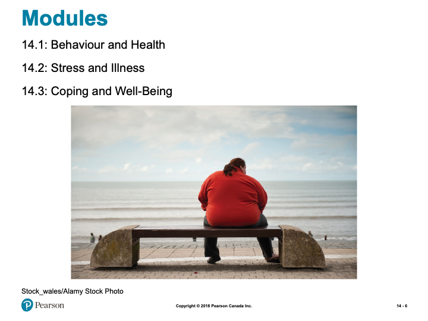
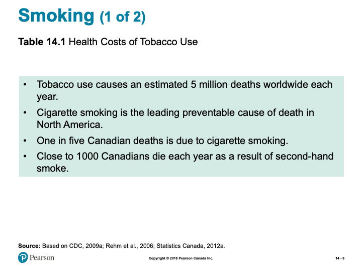
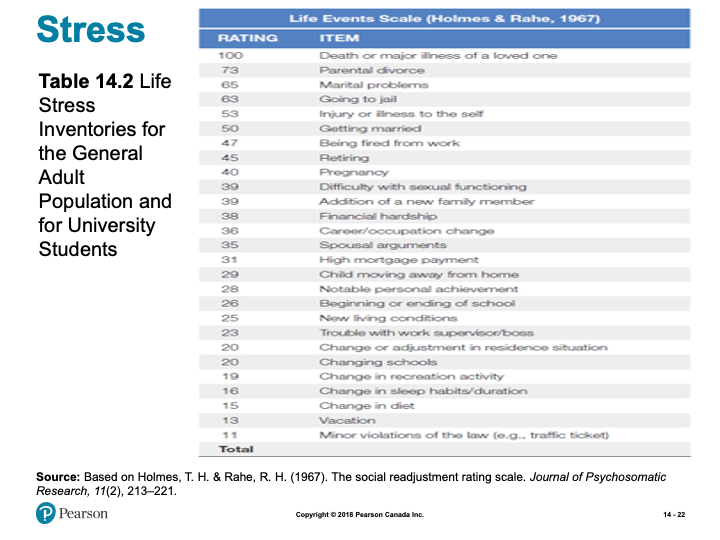
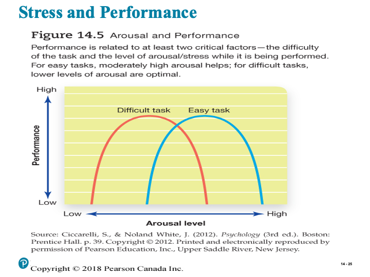

# Health

## Overview {-}

In Unit 8, you will examine what factors contribute to one’s general health. In Unit 9 you will gain more insight into stress and coping. Together, Units 8 and 9 span information from Chapter14 in your textbook, giving you a broad overview of the field of health psychology.

Health psychologists study both positive and negative impacts that humans’ behaviour and decisions have on their health, survival, and well-being. The need for this field has increased considerably over the 20th century, as most premature deaths are attributable to lifestyle factors. Over this chapter you will gain knowledge about the interaction of all the levels of analysis (biological, psychological, sociocultural, and spiritual) with regards to your health. You will learn about the biological/physiological responses to stress and how a poor response to stress leaves a person more vulnerable to illness and slowing recovery time from illness and injury. How having at least some degree of control helps people with coping and outlook. When control is threatened, people use compensatory responses, such as detecting order within random images. You will also be informed that coping using a positive or negative style is related to personality (e.g., optimism versus pessimism). And, that positive coping increases resilience—the ability to recover from adversity, and even benefit from the experience, as is the case with post-traumatic growth. Whereas, coping via negative affectivity and pessimism can have both psychological and physiological disadvantages. Lastly, you’ll be advised as to how religion/spirituality, relaxation techniques, meditation, and biofeedback actually help people cope with stress and problems which can lead to human flourishing.

### Topics {-}

This unit is divided into the following topics:

1. Biology of Emotion  
2. Communicating Emotion  
3. Experiencing Emotion  

### Learning Outcomes {-}

By the end of this unit, student's will be able to:

- Define, and apply, the key terminology related to health psychology, stress and illness, and coping and well-being.  
- Explain how genetic and environmental factors influence obesity, how physiological reactions that occur under stress, and how the immune system is connected to stress responses.  
- Apply your knowledge of persuasion and health to examine the effectiveness of different types of cigarette warnings, and of the beneficial effects of optimism to help you reframe stressful situations as positive opportunities.  
- Analyze whether media depictions of smoking affect smoking in adolescents, the claim that ulcers are caused by stress, and whether activities such as relaxation techniques, meditation, and biofeedback actually help people cope with stress and problems.  
- Describe how control over the environment and positive and negative styles of coping influences well-being.  

### Activity Checklist {-}

```{block2, type='reflect'}

Here is a checklist of learning activities you will benefit from in completing this unit. You may find it useful for planning your work:

<!-- [plugin:content-inject](_schedule)-->

**Read and Reflect**

- Read *Krause et al. (2021). Revel for An Introduction to Psychological Science, 3rd Canadian Edition*  
- Review *Unit 8- Slides*

<details> <summary>CLICK HERE</summary>

<h5>An Introduction to Psychological Science - Chapter 14 - Health, Stress, and Coping</h5> 

<h5>Spiritual Orientations</h5> 

- Performance-Based  
  - I must do right to be accepted  
  - If people knew what I was really like they wouldn’t like me  
  - Life is based in fear  
  - Need external praise  
  - Can’t accept criticism  
  - Always have to be busy  
  - Have to be in control and have it together  
  - Always wants rules  
- Trust-Based  
  - I am accepted because of who I am  
  - I know that I’m a good person, if people knew me they’d like me  
  - Life is based in love  
  - Internally secure  
  - Welcome criticism  
  - Enjoys rest  
  - Observes and appreciates the use of multiple talents  
  - Delights in freedom  

<h5>True or False?</h5>

- T F 1. The polygraph has proved to be extremely effective in detecting lies.  
- T F 2. Some emotional responses involve no conscious thinking.  
- T F 3. Introverts are superior to extraverts at reading others’ emotions.  
- T F 4. Facial expressions associated with emotions such as happiness and fear are the same the world over.  
- T F 5. Occasionally blowing off steam seems to reduce anger and aggression in the long run.  
- T F 6. Kidney dialysis patients report being just as happy as healthy non-patients.  
- T F 7. Compared with others, pessimists are more than twice as likely to develop heart disease.  
- T F 8. Writing about personal traumas in a diary reduces stress and the likelihood of health problems during ensuing months.  
- T F 9. Those who do not exercise are twice as likely as exercisers to report being not “too happy.”  
- T F 10. Religious faith and health show a strong positive correlation.  




<h5>Learning Objectives</h5>

- Know the key terminology related to health psychology.  
- Understand how genetic and environmental factors influence obesity.  
- Apply your beliefs about obesity to better understand sources of prejudice and stereotyping.  
- Analyze whether media depictions of smoking affect smoking in adolescents.  

<h5>Health Psychology</h5>

- Health psychologists  
- Tobacco use, alcohol, obesity, inactivity  



*Slide showing - Health Costs of Tobacco Use*

<h5>Smoking</h5>

- Efforts to prevent smoking  
  - Non-smoking laws  
  - Warnings on packages  

<h5>Working the Scientific Literacy Model: Media Exposure and Smoking</h5>

- What do we know about media influences on smoking?  
  - Smoking in movies has declined, but still present  
- How can science help us analyze the effects of smoking in the movies?  
- Can we critically evaluate this evidence?  
  - Correlations exist  
    - Number of explanations  
- Why is this relevant?  
  - Cigarette-related illnesses  

<h5>Obesity</h5>

- “Freshman 15”  
- 24% of Canadians are obese  
- Defining healthy weights and obesity  
  - Body mass index (BMI) (p. 534)  
  - Weight gain  
    - Positive energy balance  

<h5>Genetics and Body Weight</h5>

- Genetic contribution to weight  
  - 50-90%  
- Set point (p. 534)  
  - 10-20% range in weight  
  - Theory challenged  

<h5>The Sedentary Lifestyle</h5>

- How we spend our time  
  - Television  
  - Home entertainment = sitting and snacking  
  - Children indoctrinated into this lifestyle  

<h5>Social Factors</h5>

- Children influenced by parents  
- Media  

<h5>Psychology and Weight Loss</h5>

- Positive emotion  
- Challenges for maintaining weight loss  
  - Cues  
  - Dieting reinforces cravings  

<h5>Poverty and Discrimination</h5>

- Less access to healthcare  
- Lack of control  
- Magnified by stress  
- Poorer diets  
- Discrimination  
  - Uncontrollable and unpredictable  
  - Increased blood pressure  
  - Unhealthy behaviours  

<h5>Family and Social Environment</h5>

- Interpersonal relationships  
  - Social Resilience (p. 537)  
  - Social isolation  
    - As great a risk as smoking, obesity, and high blood pressure  
- Married couples tend to live longer  
  - Men enjoy more health benefits  
- Marriage is also a large source of stress  
  - Children  

<h5>Social Contagion</h5>

- Social contagion (p. 538)  
  - Food consumption  
  - Weight loss  
  - Smoking  
- National Heart Institute  
  - 1948 study tracking 15,000  

<h5>Learning Objectives</h5>

- Know the key terminology associated with stress and illness.  
- Understand the physiological reactions that occur under stress.  
- Understand how the immune system is connected to stress responses.  
- Apply a measure of stressful events to your own experiences.  
- Analyze the claim that ulcers are caused by stress.  



*Slide showing - Life Stress Inventories for the General Adult Population and for University Students*

<h5>What Causes Stress?</h5>

- Individual differences in stress response  
- Appraisal (p. 541)  
- Primary appraisal  
- Secondary appraisal  


*Slide showing - The Cognitive Appraisal Theory of Stress*




*Slide showing - Arousal and Performance of Stress*

<h5>Physiology of Stress</h5>

- Fight-or-flight response (p. 543)  
- General adaptation syndrome (GAS) (p. 543)  
  - Alarm reaction  
  - Resistance  
  - Exhaustion  


*Slide showing - Stress Pathways of the Body*
 
<h5>Oxytocin: To Tend and Befriend</h5>

- Tend-and-befriend response  
  - Oxytocin (p. 595)  
  - More women than men  

<h5>Working the Scientific Literacy Model: Hormones, Relationships and Health</h5>

- What do we know about hormones, relationships and health?  
  - Social events and relationships can bring joy, but also be very stressful  
    - Oxytocin and vasopressin  
- How can scientists explains connections between hormones, relationships and health?  


*Slide showing - Relationship Quality Is Related to Physiological Responses*

- Can we critically evaluate this evidence?  
  - Need better understanding of oxytocin and vasopressin  
- Why is this relevant?  
  - Psychological stress involved with healing  

<h5>Stress, Immunity, and Illnessd</h5>

- Psychoneuroimmunology (p. 547) 
  - Final exams and illness

<h5>Stress, Personality, and Heart Disease</h5>

- Coronary heart disease (p. 547)  
  - Chronic stress  
  - Damage to arteries  
    - Trigger inflammation  
    - Stress increases inflammation  
- Type A and Type B personalities (p. 548)  
  - Hostility and anger  
  - Anxiety and depression  

<h5>Stress, Food, and Drugs</h5>

- Preference for sweet and fatty foods when stressed  
  - Link to cortisol  
  - Other species  
  - Dopamine reward system  
  - Anticipatory?  

<h5>Stress, the Brain, and Diseases</h5>

- Acquired-immune deficiency syndrome (AIDS)  
  - Stress impedes medicine  
   - Can worsen conditions  
- Cancer  
  - Stress affects progression  

<h5>MYTHS IN MIND: Stress and Ulcers</h5>

- Most ulcers caused by  
  - Bacterium called Helicobacter pylori  
  - Stress worsens symptoms  
    - Slows healing  

<h5>Learning Objectives</h5>

- Know the key terminology associated with coping and well-being.  
- Understand how control over the environment influences coping and outlook.  
- Understand positive and negative styles of coping.  
- Apply your knowledge of the beneficial effects of optimism to help you reframe stressful situations as positive opportunities.  
- Analyze whether activities such as relaxation techniques and meditation actually help people cope with stress and problems.  

<h5>Coping</h5>

- Coping (p. 552)  
  - Coping approaches  
   - Problem-focused  
   - Emotion-focused  

<h5>Positive Coping Strategies</h5>

- Positive psychology (p. 552)  
  - Effects of positive emotions  
    - Broaden attention  
    - Autonomic nervous system  

<h5>Optimism and Pessimism</h5>

- Optimism (p. 552)  
- Pessimism (p. 552-553)  
- Pessimistic explanatory style (p. 553)  
- Negative affectivity (p. 553)  
- Correlations with health  

<h5>Resilience</h5>

- Resilience (p. 554)  
- Viktor Frankl  
- Post-traumatic growth (p. 554)  

<h5>Meditation and Relaxation</h5>

- Meditation (p. 554)  
  - Focused attention/open-monitoring  
  - Mindfulness-based stress reduction (p. 555)  
  - Integrated mind-body training  

<h5>PSYCH @ Church</h5>

- Religious practice and life expectancy  
  - Correlational  
  - Many explanations  
  - Coping and well-being  

<h5>Exercise</h5>

- Short-term effects on cognition  
  - Brain-derived neurotrophic factor (BDNF) (p. 557)  
  - Cardiovascular exercise  
- Long-term effects  


*Slide showing - The Learned Helplessness Procedure*

<h5>Working Scientific Literacy Model: Compensatory Control and Health</h5>

- What do we know about how people cope with seemingly random events?  
  - Randomness can create anxiety  
  - Compensatory control (p. 558)  
- How can scientists explain compensatory control?  


*Slide showing - Seeing Images Where There Are None*

- Can we critically evaluate this evidence?  
  - Real-world lack of control has greater consequences  
- Why is this relevant?  
  - Sense of control affects outlook on world and affects well-being  
  - OCD  

</details>
***Note :** The slides are intended to supplement the information found in your textbook. If you are having trouble viewing them, they can also be downloaded by scrolling to the bottom of the screen and clicking on the "Unit 8- Slides" link.

- What do you think, could you beat a lie detector device? This activity will allow you to delve more deeply into the physiological aspects of human emotion (though, cognitions and behaviours do influence physiological processes) and how they can be monitored using a polygraph machine.
- In this activity you will learn about the many ways you communicate non-verbally. The first article talks about how much communication happens non-verbally (also known as body-language), and becoming aware of your and others non-verbal expressions can make you a much better  communicator. Along with becoming a better communicator you can also become more aware of when people are not being honest with you. The second article in this activity reveals how you can train to be a human lie-detector. Lastly, you can discover the various smiles that exist and the myriad benefits that can be enjoyed by increasing the amount you smile.  
- In life you will experience challenging situations and circumstances and have to manage your emotional response to these events. In day to day life, how you handle your emotions can be the difference between having a healthy self-concept and satisfying relationships and work opportunities, or finding yourself left wanting in each of these areas. In this activity you will have the opportunity to learn about helpful emotions and how to cope emotionally in the wake of a disaster.  

**Learning Lab Preparation**

- Each topic will provide a question or scenario for you to consider prior to attending your Learning Lab. Be sure to carefully consider each prompt as you will be expected to contribute to the group discussion.  

```

### Resources {-}

Here are the resources you will need to complete this unit:

- Krause, M., Corts, D., Smith, S. C., & Dolderman, D. (2018). *Revel for An Introduction to Psychological Science, 2nd Canadian Edition.* Pearson Ed.  
- Other resources will be provided online.  

## Biology of Emotion

Have you ever been embarrassed? *Of course, we all have Embarrassment is a good example for trying to sepa­rate biological, psychological, and social elements of an emotion. These correspond to blushing (biological)*, feeling embarrassed *(psychological)*, and violation of a social norm *(social)*. Now back to your embarrassing moment: Which came first, blushing, feeling embarrassed, awareness of your faux pas? Which followed next? Last?

The close connection between our minds and our bodies usually makes it difficult to tell whether our bodily emotional response comes before or after our psychological emotional response. This is why even psychologists have disagreed on whether you run from danger because you are afraid, or are afraid because you are running from danger.

### Lie Detectors {-}

The close connection between mind and body is the basis for so-called “lie-detectors.” Of course, they do not detect lies but physical responses to cognitive information. While their "hit" rate is better than a coin toss, lie detectors can accuse the in­nocent and vindicate the guilty. Moreover, some experts claim there are simple techniques for beating the ma­chine.

<!-- [plugin:content-inject](_activities) -->
### Learning Activities {-}

```{block2, type='reflect'}

#### Read and Reflect {-}

What do you think...*could you beat a lie detector device?* This activity will allow you to delve more deeply into the physiological aspects of human emotion (though, cognitions and behaviours do influence physiological processes) and how they can be monitored using a polygraph machine. To learn more about Lie Detectors, follow the link below:

- [**How Lie Detectors Work**](https://people.howstuffworks.com/lie-detector.htm){target="_blank”}
The reason polygraph machines can work better than flipping a coin is because they are measuring responses that often occur automatically and can be difficult, though not impossible, to bring under voluntary control.

#### Learning Lab Preparation {-}

Prior to your Learning Lab, take some time to think about the following questions. You will be asked to share your thoughts in this week's Learning Lab:

- ***How many ancient or old-fashioned methods for telling if someone is lying can you find on the internet?***

*Often a person’s life depended on these highly questionable methods.*

```

## Communicating Emotion

By now you know something about the physical responses involved in emotions, and you have given some thought to our responses to our emotions. However, a very important part of the study of emotions is the way that we *communicate* them. “I feel angry,” we say. But the way we say it also carries a message. Just stop for a minute and think about how many different ways ("channels" communication experts call them) we use to communicate emotions. We use our faces, our bodies, the tone and volume of our voice; in writing we use words but we also use punctuation marks (). And what about e-mail? How many ways can you find that we use to show our emotions in e-mail? *(Hint: What are emoticons?)*

### How Many Facial Expressions? {-}

The study of emotion has long been linked with the study of facial expressions. Psychologists have been interested in the way in which people express emotion and whether these facial expressions reliably convey the emotional message. Stud­ies by Ekman and others have raised a contemporary interest in emotional expression. It appears that there are some universal aspects of emotion across a number of cul­tures. Seven emotions have been consistently identified: happi­ness, sadness, anger, disgust, contempt, fear, and surprise. However, questions remain about whether this is a complete spectrum of emotion and whether there are cul­ture-specific aspects of facial emotion expression. What can you find on the internet concerning the number of possible facial emotional expressions?

<!-- [plugin:content-inject](_activities) -->

### Learning Activities {-}

```{block2, type='reflect'}

#### Read and Reflect {-}

Is there a practical use to understanding how we communicate emotions? Yes, actually there are several possible uses. One very interesting use is in the understanding of deception. For as long as we have records, we know that people have understood that liars don’t seem to be able to control all of their communication channels. Verbally, they deny they are lying, but the truth screams out from eye movements; *a slightly irregular smile, a faint blush....* This activity provides additional information for your consideration:

- [**Body Language Speaks Volumes**](http://www.positive-way.com/body.htm){target="_blank”}  
- [**Catching a Liar**](http://www.sciencedaily.com/releases/1999/05/990528003127.htm){target="_blank”}  
- [**10 Reasons Why You Should Smile**](https://www.lifehack.org/358476/10-reasons-you-should-smile-more-often){target="_blank”}  

Another possible use of understanding emotional communication better is the development of computers that can read human emotions from speech or facial expressions. This would enable far better communication between computers and their human masters.

#### Learning Lab Preparation {-}

Prior to your Learning Lab, take some time to think about the following questions. You will be asked to share your thoughts in this week's Learning Lab:

- ***Do you think that people make distinctive facial expressions when they lie? Give your answer, and an example if you can.***  

```

## Experiencing Emotion

Now that you understand what’s happening inside your body when you are angry or embarrassed, or experiencing some other emotion, maybe you can see why we often find it so hard to control our emotions. Of course this leads to the question “Should we try to control our emotions?” Or should we just accept them as natural and inevitable? What is the proper role of emotions in our life? For example, imagine you are angry, very angry. Should you suppress and deny your anger out of fear of what you might do? Or should you “blow off steam” and freely express your true feelings?

Consider the following arguments *(adapted from Philipchalk,1988, p.114 ff):*

### What is the Proper Role of Emotion? {-}

#### No Role {-}

It is not hard to see that emotions are not only frequently unpleasant, but are also a source of conflict. *Anger* causes us to say things we later regret; *fear* of others inhibits our honesty; and even anticipated *happiness* may blind us to the harmful effects of our actions. We speak of being “swayed by our emotions,” indicating they caused us to do or say something we wouldn’t have done otherwise. Emotions are often unpredictable, making it difficult to arm ourselves against them. They vary with our physical and mental condition, with the amount of sleep we’ve had, our blood sugar level, and a host of environmental factors. They have a clear physiological “animal-like” component. And they are part of our fallen nature. Paul warns us, *“Now those who belong to Christ Jesus have crucified the flesh with its passions and desires” (Gal. 5:24)*. No doubt Paul recognized that emotions arising from our physical bodies frequently play an important role in leading us to *“practice the very evil that I (we) do not wish” (Rom. 7:19).* Surely such an unpredictable and potentially dangerous influence should be discounted in favor of our more God-like rational faculties; isn’t the “cool intellect” superior to the “hot-head?”

Furthermore, since emotions are such an elusive and private matter, the direction they give to behavior is easily misinterpreted, sometimes with disastrous results. For example, we might misinterpret physiological arousal as attraction. *(Psychologists Dutton and Aron (1970) found that male subjects meeting an attractive woman on a high bridge felt more attracted to her than subjects meeting her on a lower bridge).* Or we might misinterpret our physical attraction as love. *(Psychiatrist Scott Peck (1978) argues that the experience of “falling in love” is inevitably sexual).* Particularly important for Christians is the danger of misinterpreting an emotional response as the voice of God. Some Christians frequently attempt to determine God’s will by looking for an inner feeling. They may even base life-changing decisions on fleeting inner impressions of peace, unsettledness, or excitement. This can be extremely dangerous. Such feeling may be little more than expressions of their own inner wishes or fears, or simply physiological arousal that has been mislabeled.

To summarize, emotions are unreliable, easily misinterpreted, and a tool for possible manipulation. They are deeply rooted in our animal-likeness—our physical bodies. As such they should be brought into subjection and perhaps ignored or entirely minimized. In short, it would appear from these considerations that emotions should have no legitimate role in the regulation of behavior.

#### Important Role {-}

The first thing to note with regard to the importance of emotion is that they appear to be part of God’s design for us. God has chosen to form us as emotional beings as well as rational and volitional ones. Although we are fallen, and therefore our capacities of thought and will, as well as our emotional responses, are imperfect, we are created in God’s image nevertheless. The bible ascribes emotions to God. Although some people may dismiss these references as anthropomorphisms, God certainly acts as thought He felt emotions like anger, sadness, and joy. Furthermore, Jesus took on an emotion-feeling body, and expressed a full range of emotions (possibly more than most men in contemporary Western culture). In addition, the fruit of the Spirit (Gal. 5:22-23) includes several blessings with strong emotional components (e.g., joy, peace). Whatever their weaknesses, emotions cannot be dismissed as wholly sinful.

One of the important early findings of modern psychology was the discovery that emotions must not be completely ignored. To deny and suppress them is to court harm. This does not mean that we should give free expression to every feeling we have. Psychological health doesn’t require that we blowup in anger every time that someone crosses us. But neither should we deny, especially to ourselves, that we are angry. Anger can be redirected to constructive ends; it can be controlled through cognitive strategies such as refusing to dwell on the situation that produced it. The Apostle Paul seems to take a similar position when he says, *“Be angry and yet do not sin” (Eph. 4:26)*, indicating that while anger is probably inevitable, the sinful response in thought or behavior is not.

Of course there is a positive side to emotions. They provide the flavor, the resonance, the texture, and the color in an otherwise dull existence. One of the main features that distinguish a person from a machine, which might be capable of many human feats, is the person’s sentient or feeling ability, the person’s capacity to experience emotion. Emotions are the source of much that is pleasant and good in life. Christians find joy and peace in serving God. Even so-called negative emotions have their value. We can direct hatred towards evil; anger can motivate us to overcome injustice; and fear can drive us to God.

Thus emotions are an inevitable part of the God-ordained human condition. They provide the highs as well as the lows in our experience, and their recognition (although not necessarily their uncontrolled expression) is necessary for our health. Although they may frequently lead us astray, and may potentially be the source of unwanted influence, we are fallen creatures, and our other faculties, rational and volitional, are also imperfect. Emotions must be trained. As C.S. Lewis noted, we must be educated to *“feel pleasure, liking, disgust, and hatred at those things which really are pleasant, likable, disgusting, and hateful” (The Abolition of Man, [1943] 1978, p.15)*. For Lewis, trained emotion not the lack of emotion is the essential mark of the virtuous person. The maturing person will show greater and greater appropriate emotionality.

Despite controversy at the theoretical level concerning the exact relationship between our thoughts and other components of emotions, the work of Stanley Schacter and Jerome Singer (see [*Schachter-Singer Theory of Emotion*](https://www.thoughtco.com/schachter-singer-theory-4691140){target="_blank”}) has clearly indicated the importance of mental responses. We probably have the potential for a great deal more control over our emotions than we usually admit.

<!-- [plugin:content-inject](_activities)-->

### Learning Activities {-}

```{block2, type='reflect'}

#### Read and Reflect {-}

How well do you handle your emotions? If you are finding that you are being led emotionally in directions that are not the best for your life or you find that you’re avoiding your emotions, it may be time to find out how to make your emotions work for you. The following resources can help you discern between helpful vs. harmful ways of dealing with emotions. The second link is a resource that offers help for emotionally dealing with disaster in your life.

- [**Ways to Handle Emotion**](https://www.mhanational.org/helpful-vs-harmful-ways-manage-emotions){target="_blank”}
- [**Recovering Emotionally from a Disaster**](https://www.apa.org/helpcenter/recovering-disasters){target="_blank”}

#### Learning Lab Preparation {-}

Prior to your Learning Lab, take some time to think about the following questions. You will be asked to share your thoughts in this week's Learning Lab:

- ***Do you think that we can “put on a happy face” and really feel different?***  
- ***Can we make ourselves happy or sad by what we think?***  
```

## Assessment {-}

```{block2, type='assessment'}

While there is no "formal" assignment that you will be responsible for submitting for Unit 8, you will be expected to participate in discussion during your Learning Lab. Your facilitator will be providing a participation mark based on your contributions. Below is some information to consider prior to attending your Learning Lab:

#### Learning Lab {-}

Your facilitator will be providing a participation mark based on your contributions for this unit. Below is some information to consider prior to attending your Learning Lab:

*Active participation in group exercises, reflection, and critical discourse is an essential component of this course. You are expected to show respect for all members of the course, both in your speech and actions. Contribute by actively observing and listening, raising thoughtful questions, examining relevant issues, building on others’ ideas, analyzing and evaluating the group’s thinking, synthesizing key points, and expanding the group’s perspectives. Take care not to dominate a conversation, giving space for others to speak. When in small groups help maintain the focus, flow, and quality of conversations, and take the initiative to invite others (particularly those who are quiet) to speak.*

**Rubric for Participation in Learning Labs**

| Emerging (0-64%) | Developing (65-89%) | Mastering (90-100%)|
|-|-|-|
|Never to almost never: Demonstrates active listening (as indicated by disengaged body language and no to rare comments that build on others’ remarks),Initiates any contributions in class or small groups, Makes insightful or constructive comments,  Helps maintain a supportive space for others to speak.| Sometimes to fairly often: Demonstrates active listening (as indicated by somewhat to often engaged body language and comments that build on others’ remarks), Initiates a contribution at least once in a class or small group discussion; Makes insightful or constructive comments, Helps maintain a supportive space for others to speak.| Very often to nearly always: Demonstrates active listening (as indicated by fully engaged body language and comments that build on others’ remarks), Initiates more than one contribution in a class or small group discussion, Makes insightful or constructive comments, Creates a space for others to speak and takes initiative to include others.|

```
## Checking your Learning {-}

```{block2, type='progress'}

Before you move on to the next unit, check that you are able to:

- Define the key terminology related to health psychology, stress and illness, and coping and well-being.  

- Describe how genetic and environmental factors influence obesity, how physiological reactions that occur under stress, and how the immune system is connected to stress responses.  

- Apply your knowledge of persuasion and health to examine the effectiveness of different types of cigarette warnings, and of the beneficial effects of optimism to help you reframe stressful situations as positive opportunities.  

- Analyze whether media depictions of smoking affect smoking in adolescents, the claim that ulcers are caused by stress, and whether activities such as relaxation techniques, meditation, and biofeedback actually help people cope with stress and problems.  

- Describe how control over the environment and positive and negative styles of coping influences well-being.  

```
