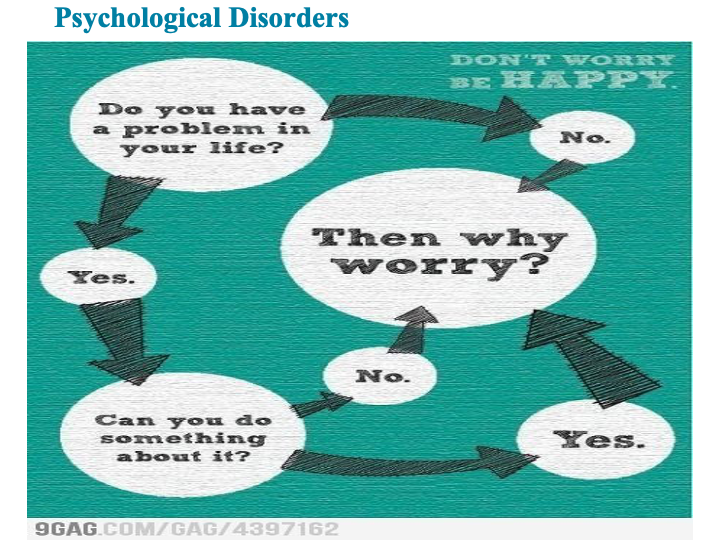
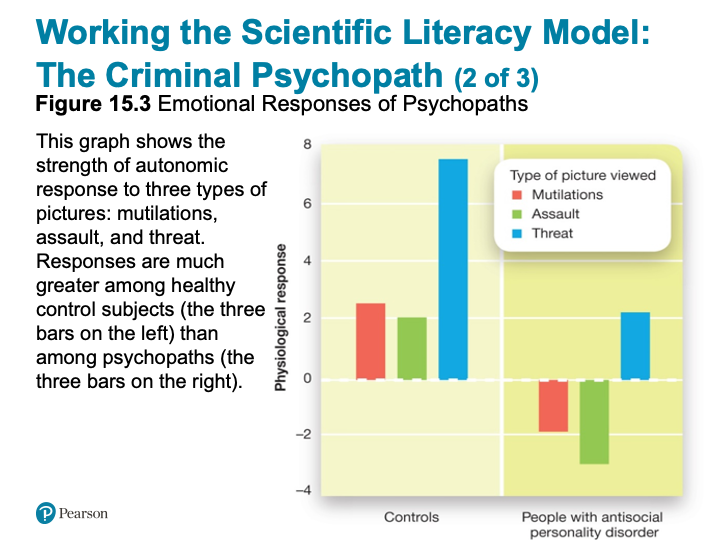
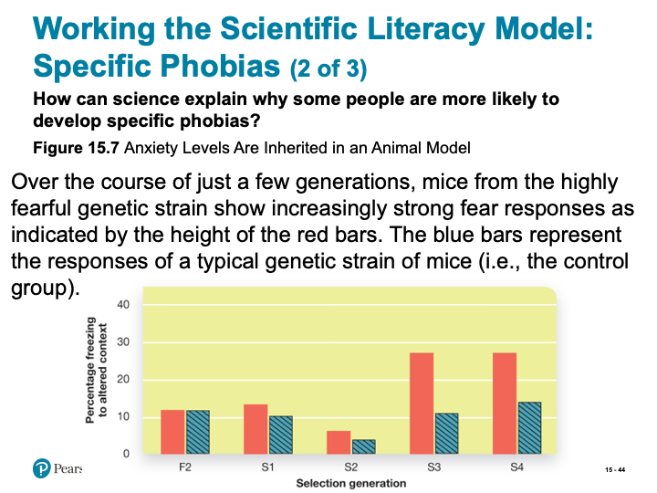
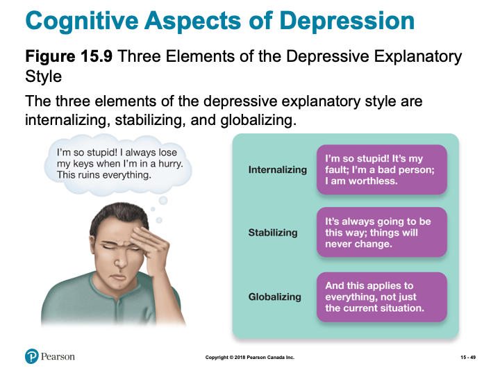
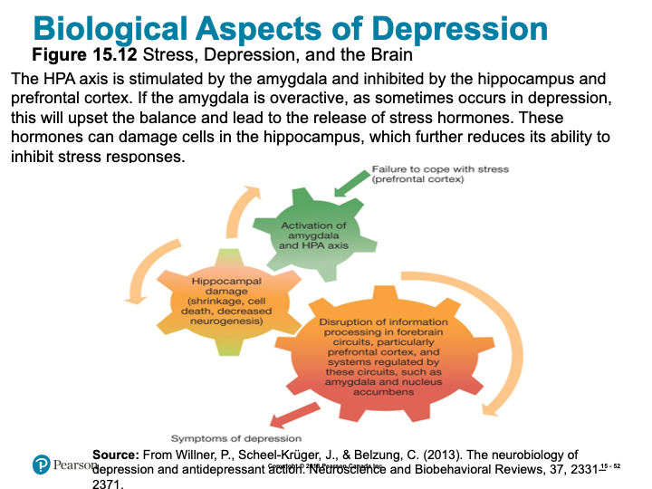
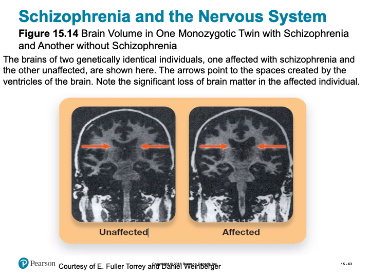
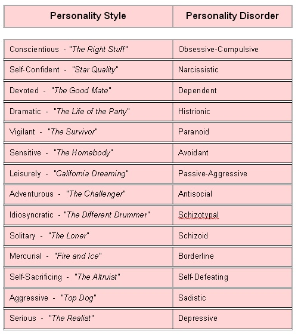

# Psychological Disorders

## Overview {-}

Whether due to sheer fascination with the unusual, or perhaps just personal curiosity, many introductory psychology students look forward to learning about psychological disorders. Abnormal human behavior is a universal part of human history. In this unit you will learn about past and current perspectives on how to recognize and understand various psychopathologies and the numerous challenges that often accompany disorders. I would encourage you to refrain from diagnosing yourself, or others, while you are covering the information involved with this chapter. It will be tempting, especially with the checklist style presentation of some of the material, however; to offer an appropriate diagnosis of someone, you will need to obtain a minimum of a master’s degree in clinical or counselling psychology.  

### Topics {-}

This unit will be divided into the following topics:

1. Looking at What is Normal and Anxiety Disorders  
2. Mood Disorders  
3. Schizophrenia  
4. Personality Disorders  

### Learning Outcomes {-}

By the end of this unit, student's will be able to:

- Define the key terminology associated with classifying psychological disorders, personality and dissociative disorders, anxiety, obsessive-compulsive, and depressive disorders, and schizophrenia.  
- Describe advantages and criticisms associated with the Diagnostic and Statistical Manual of Mental Disorders (DSM-5).  
- Apply your knowledge of the mental disorders defense to decide if defendants are criminally responsible for their actions.  
- Analyze whether the benefits of labelling psychological disorders outweigh the disadvantages, the status of dissociative identity disorder as a legitimate diagnosis, and whether maladaptive aspects of specific phobias might arise from perfectly normal, healthy behaviours.  
- Apply your knowledge of antisocial personality disorder to explain how it could help people succeed in certain professions.  
- Describe the different types of anxiety disorders and how anxiety or depressive disorders can be self-perpetuating.  
- Apply your knowledge of anxiety, obsessive-compulsive, and depressive disorders, to be alert to people who might benefit from some help, and to be able to identify different forms of schizophrenia.  
- Describe how different neurotransmitters affect individuals with schizophrenia and the genetic and environmental contributions to this disorder.
- Analyze claims that schizophrenia is related to genius or violent behaviour.  

### Activity Checklist {-}

Here is a checklist of learning activities you will benefit from in completing this unit. You may find it useful for planning your work:

```{block2, type='reflect'}

<!-- [plugin:content-inject](_schedule) -->

**Read and Reflect**

- Read *Krause et al. (2021). Revel for An Introduction to Psychological Science, 3rd Canadian Edition*  
- Review **Unit 10- Slides**

<details> <summary>CLICK HERE</summary>

<h5>An Introduction to Psychological Science - Chapter 15 - Psychological Disorders</h5>

<h5>Biblical Word Study</h5>

- Anxiety/Worry – i.e., Matthew 6:25 (NIV)  
^25^ "Therefore I tell you, do not worry (be anxious) about your life, what you will eat or drink; or about your body, what you will wear. Is not life more important than food, and the body more important than clothes?”  
- Gr. $\mu\epsilon\rho\iota\mu\nu\alpha\omega$ (Merimnau) – to be anxious or solicitous (uneasy, bothered, apprehensive); to expend careful thought; to concern one’s self; to have the thoughts occupied with.  

- Evil – i.e., 1 Thessalonians 5:21-22 (NIV)  
^21^ Test everything. Hold on to the good.  
^22^ Avoid every kind of evil.  

- Gr. $\pi o \nu \eta \rho o \varsigma$ (Poneros) – bad (terrible, dreadful, shocking, ruthless), unsound; evil (hateful), afflictive; wrongful, malignant (nasty, cruel), malevolent; wicked(ness) (depraved, immoral, atrocious, appalling), impious; slothful, inactive; the evil one, the devil; can also imply covetousness.  



*Slide showing - Cycle for Worry*

<h5>True or False?</h5> 

- T F 1. In some cultures, depression and schizophrenia are nonexistent.  
- T F 2. Many people are curious about the cause of mental disorders.  
- T F 3. About 30 percent of psychologically disordered people are dangerous; that is, they are more likely than other people to commit a crime.  
- T F 4. Research indicates that in the United States there are more prison inmates with severe mental disorders than there are psychiatric inpatients in all the country’s hospitals.  
- T F 5. Identical twins who have been raised separately sometimes develop the same phobias.  
- T F 6. Dissociative identity disorder is a type of schizophrenia.  
- T F 7. In North America, today’s young adults are three times as likely as their grandparents to report having experienced depression.  
- T F 8. White Americans commit suicide nearly twice as often as Black Americans do.  
- T F 9. There is strong evidence for a genetic predisposition to schizophrenia.  
- T F 10. About 1 in 4 adult Americans suffer from a diagnosable mental disorder in a given year.  


*Slide showing - Learning Modules*

<h5>Learning Objectives</h5>

- Know the key terminology associated with defining and classifying psychological disorders.  
- Understand advantages and criticisms associated with the Diagnostic and Statistical Manual of Mental Disorders (DSM-5).  
- Apply your knowledge of the mental disorders defence to decide if defendants are criminally responsible for their actions.  
- Analyze whether the benefits of labelling psychological disorders outweigh the disadvantages.  

<h5>Defining Abnormal Behaviour</h5>

- Abnormal psychology (p. 564)  
- What is “abnormal” behaviour?  
  - Maladaptive behaviour (p. 564)  

<h5>Early Understanding and Treatment</h5>

- Possession by evil  
- Asylums (p. 564)  
- William Battie  
- Phillippe Pinel  

<h5>Early Classification Systems</h5>

- Mania, Melancholia  
- Medical model (p. 564)  
- Emil Kraepelin  

<h5>Psychology’s Puzzle: How to Diagnose Psychological Disorders</h5>

- Diagnostic and Statistical Manual for Mental Disorders (D S M) (p. 565)  
- First edition (D S M-I)  
  - Imperfect document  
- Fifth edition (D S M-5)  
  - Work in progress  


*Slide showing - The Number of Disorders in the D S M over Time *

<h5>Critiquing the D S M & The Power of a Diagnosis</h5>

- D S M is imprecise  
  - “Symptom” or normal experience?  
  - Disorders share symptoms  
  - “Disorder” or not?  
- Diagnostic labels  
  - Possible drawbacks  

<h5>Working the Scientific Literacy Model: Culture and Diagnosing Mental Disorders</h5>

- What do we know about culture and diagnosing mental disorders?  
  - Culture-bound syndromes (p. 568)  
    - Ataque de nervios  
    - Shenjing shuairuo  
- How can science explain the effect of culture on diagnosing mental disorders?  
- Can we critically evaluate this information?  
  - Cultural Formulation Interview  
- Why is this relevant?  
  - Improving accuracy of diagnosis  

<h5>Psychological Diagnoses in the Classroom: A D H D</h5>

- Attention-deficit hyperactivity disorder (A D H D) (p. 569)  
- Over-diagnosed?  

<h5>Psychological Diagnoses in the Courtroom: The Mental Disorder Defence</h5>

- Mental disorder defence (p. 570)
  - Used in less than 1% of Canadian court cases; success rate of less than 25%  
  - M’Naghten rule  

<h5>Learning Objectives</h5>

- Know the key terminology associated with personality and dissociative disorders.  
- Understand how different types of personality disorders can affect interpersonal relationships.  
- Apply your knowledge of antisocial personality disorder to identify which maladaptive behaviour is consistent with each disorder.  
- Analyze the status of dissociative identity disorder as a legitimate diagnosis.  

<h5>Activity: Acting out a Disorder</h5>

- Your group will receive one of the ten disorders outlined in your notes. You will have 25 minutes to put together a short 5 minute skit that demonstrates the main features of the disorder. You have creative freedom in how you want to put this skit together, however everyone in the group must play a part.  
- After all the skits are done we’ll take a vote as to who had the best skit, the team with the most votes will receive 2 bonus marks that will be applied to their next quiz.  

<h5>Defining and Classifying Personality Disorders</h5>

- Cluster A Disorders
  - Odd or eccentric behaviour  
  - Paranoid Personality Disorder, Schizoid Personality Disorder, and Schizotypal Personality Disorder  
- Cluster B Disorders
  - Dramatic, emotional, and erratic behaviour  
  - Antisocial Personality Disorder, Borderline Personality Disorder, Histrionic Personality Disorder, and Narcissistic Personality Disorder  
- Cluster C Disorders  
  - Anxious, fearful, and inhibited behaviour  
  - Avoidant Personality Disorder, Dependent Personality Disorder, and Obsessive-Compulsive Personality Disorder  
- Personality Disorder Not Otherwise Specified  
  - A diagnosis given to individuals who exhibit patterns of behaviour consistent with that of a personality disorder, but which does not fit into any of the personality disorder categories described above  

<h5>Paranoid Personality</h5>

- Paranoid personality disorder (P D P) (p. 573)  
  - Difficulty forming close relationships  
  - 2-4% of the population  
  - Threat vigilance  

<h5>Schizoid Personality</h5>

- Schizoid personality disorder (S P D) (p. 573-574)  
  - Cold and aloof  
  - Less intense emotional expressions  
  - Indifferent to praise or criticism  

<h5>Schizotypal Personality</h5>

- Schizotypal personality disorder (p. 574)  
  - Suspicious and superstitious  
  - Imagined connections between thoughts and events  
  - Associations  
    - Superior temporal gyrus  
    - COMT gene  
    - Pregnancy complications  
    - Psychological trauma and chronic stress  

<h5>Borderline Personality</h5>

- Borderline personality disorder (B P D) (p. 575)  
  - All-or-nothing thinking  
  - Troubled relationships  
  - Self-injury  

<h5>Narcissistic Personality</h5>

- Narcissistic personality disorder (N P D) (p. 575)  
  - Manipulative  
  - Lack empathy  
  - Cheating  

<h5>Histrionic Personality</h5>

- Histrionic personality disorder (H P D) (p. 575)  
  - Term has Latin origin  
    - “like an actor”  
- Use flirtation and flattery  
- Indulgent and risky behaviours  
- Sensitive to criticism; manipulative in relationships  

<h5>Antisocial Personality</h5>

- Antisocial personality disorder (A P D) (p. 576)  
  - Resistant to treatment  
  - Link to frontal lobes  
  - Connection to trauma and abuse  

<h5>Working the Scientific Literacy Model: The Criminal Psychopath</h5>

- What do we know about psychopaths?  
  - A P D vs. Psychopathy  
  - Hare Psychopathy Checklist-Revised  
- How can science explain antisocial personality disorder?  
  - Under-reactive to stress  
  - Brain differences  



*Slide showing - Emotional Responses of Psychopaths *

- Can we critically evaluate this information?  
  - Differences in neural activity – planning instead of empathizing?  
- Why is this relevant?  
  - Early diagnosis and treatment  

<h5>Avoidant Personality</h5>

- Antisocial personality disorder (A v P D) (p. 578)  
  - Afraid of embarrassment  
  - Focus on criticism  
  - Avoid forming social bonds  
  - Amygdala response  

<h5>Dependent Personality</h5>

- Dependent personality disorder (D P D) (p. 578)  
  - Lack confidence  
  - Fear of abandonment, rejection  

<h5>Obsessive-Compulsive Personality</h5>

- Obsessive-Compulsive personality disorder (O C P D) (p. 578)  
  - Distressing, maladaptive focus on details and control  
  - Link to Parkinson’s disease, dopamine  


*Slide showing - Personality Disorders in Patients with Parkinson’s Disease *

<h5>Dissociative Identity Disorder</h5>

- Dissociative disorder (p. 579)  
- Dissociative identity disorder (D I D) (p. 579)  
  - 1% of patients  
  - Brought on by extreme stress  
  - Difficult to test for  

<h5>Learning Objectives</h5>

- Know the key terminology related to anxiety, obsessive-compulsive, and depressive disorders.  
- Understand the different types of anxiety disorders.  
- Understand how anxiety or depressive disorders can be self-perpetuating.  
- Apply your knowledge of anxiety, obsessive-compulsive, and depressive disorders in order to identify which behavioural symptoms are associated with each disorder.  
- Analyze whether maladaptive aspects of specific phobias might arise from perfectly normal, healthy behaviours.  

<h5>Anxiety Disorders</h5>

- Anxiety disorders (p. 583)  
  - Normal stress  
    - Fight-or-flight response  
- Maladaptive responses  

<h5>Varieties of Anxiety Disorders</h5>

- Generalized anxiety disorder (GAD) (p. 583)  
  - Trouble identifying cause of stress  
  - Major life changes  
- Panic disorder (p. 584)  
  - Panic attacks (p. 584)  
- Agoraphobia (p. 584)  
  - Avoid public settings  


*Slide showing - Prevalence of Symptoms in a Survey of 293 Individuals with Obsessive–Compulsive Disorder*



*Slide showing - Anxiety Levels Are Inherited in an Animal Model*

<h5>Working the Scientific Literacy Model: Specific Phobias</h5>

- Can we critically evaluate this information?  
  - Humans are not mice  
  - Genetics could only partially explain phobias  
- Why is this relevant?  
  - Treatment of phobias  

<h5>Anxiety Disorders</h5>

- Social anxiety disorder (p. 586)  
  - Prefer familiar places and routines  
- Obsessive-compulsive disorder (O C D) (p. 586)  


*Slide showing - Obsessive–Compulsive Disorder and the Brain*

<h5>Mood Disorders</h5>

- Major depression (p. 587)  
  - Depressed cognition  
  - Lethargic and sleep  
    - Insomnia  
  - Appetite change  
  - Digestive problems  



*Slide showing - Three Elements of the Depressive Explanatory Style*


*Slide showing - Genetic Relatedness and Major Depression*


*Slide showing - Gene and Environment Interactions in Depression*



*Slide showing - Biological Aspects to Stress, Depression, and Brain*

<h5>Sociocultural and Environmental Influences on Depression</h5>

- Substandard housing, crime rates, economic stressors  
- Social factors  
- Social Media  

<h5>Bipolar Disorder</h5>

- Bipolar disorder (p. 592)  
  - 1/3 as often as depression  
  - Episodes vary in length and duration  
  - Mania can take several forms  
  - Difficult to treat  
  - High rates of suicide  


*Slide showing - Warning Signs of Suicide*

<h5>PSYCH @ The Suicide Helpline</h5>

- Originally religious-based  
  - Empathy and active listening  
  - Problem-solving approach  
- Best crisis responders use both resources  

[988 Suicide & Crisis Lifeline](http://www.suicidepreventionlifeline.org/){target="_blank”}
[Canadian Association for Suicide Prvention](http://suicideprevention.ca/need-help/){target="_blank”}

<h5>Learning Objectives</h5>

- Know the key terminology associated with schizophrenia.  
- Understand how different neurotransmitters affect individuals with schizophrenia.  
- Understand the genetic and environmental contributions to schizophrenia.  
- Apply your knowledge to identify different forms of schizophrenia.  
- Analyze claims that schizophrenia is related to genius or violent behaviour.  

<h5>Symptoms and Types of Schizophrenia</h5>

- Schizophrenia (p. 596)  
- Stages (p. 596)  
  - Prodromal phase  
  - Active phase  
  - Residual phase  
- Positive symptoms (p. 596)  
  - Hallucinations  
  - Delusions  
- Negative symptoms (p. 596)  
- Disorganized behaviour (p. 597)  
- Cognitive functioning  
  - Working memory  
- Social interaction  
- Subtypes (p.598)  
  - Paranoid  
  - Disorganized  
  - Catatonic  

<h5>Myths in Mind: Schizophrenia is Not a Sign of Violence or Genius</h5>

- Myths  
  - Split personality  
  - Madness goes with genius  
  - Dangerous  
- High-profile cases  
  - Ted Kaczynski  
  - John Nash  
    - A Beautiful Mind  


*Slide showing - Genetic Influences for Schizophrenia*



*Slide showing - Brain Volume in One Monozygotic Twin with Schizophrenia and Another without Schizophrenia*

<h5>Working the Scientific Literacy Model: The Neurodevelopmental Hypothesis</h5>

- What do we know about the neurodevelopmental hypothesis?  
  - Neurodevelopmental hypothesis (p. 600)  
    - Growth vs. development  
- How can science test the neurodevelopmental hypothesis?  
  - “Warning signs” in home videos  
  - Schizophrenia prodrome  
- Can we critically evaluate this information?  
  - Growth spurts in the prefrontal cortex  
  - Excessive synaptic pruning  
- Why is this relevant?  
  - Alter progression of disease  

<h5>Environmental Influences on Schizophrenia</h5>

- Environmental and Prenatal Factors  
  - Maternal exposure to influenza virus  
  - Fetal exposure to stress  
  - Marijuana use  
  - Head injuries  
  - Urban environment  

<h5>Cultural Influences on Schizophrenia</h5>

- Anglo-Americans  
  - Mental experiences  
- Mexican Americans  
  - Effects on body  
- Swahili of Tanzania  
  - Spirit invasion of the body  


*Slide showing - Vulnerabilities and Protective Factors for Mental Disorders*

</details> 

*Please note, the slides are intended to supplement the information found in your textbook. If you are having trouble viewing them, they can also be downloaded by scrolling to the bottom of the screen and clicking on the "Unit 10- Slides" link.*

**Read and Reflect**

- This activity offers additional descriptions of the disorders discussed in the textbook and provides opportunity to understand more about anxiety disorders. There is also an excellent write up on the many valid criticisms of being overly dependent on the DSM as a resource.  
- In this activity, you are given an overview of depression  that explains the causes, describes the diagnostic criteria, and offers some treatment options. The second resource provides an overview of recognizing the signs that a child is struggling due to a disorder.  
- This activity presents current in-depth research and general information concerning schizophrenia that will illuminate the complexity of the development and treatment of this disorder.  
- Our personalities allow others to predict and anticipate our responses to situations; a person with a “healthy” personality demonstrates a range of coping responses and styles when placed in a stressful situation. However, a disordered personality does not have this kind of adaptability and flexibility. The lack of adaptability and the limited repertoire of coping responses can result in distress for the person and for those around him or her. In this activity, you can gain more insight into defined patterns of personality disorders.  

**Key Terms Quiz**

- Practice quiz to assess how well you know key terms from Chapter 15.  
- Not for formal evaluation.  

***Learning Lab Preparation***

- Each topic will provide a question or scenario for you to consider prior to attending your Learning Lab. Be sure to carefully consider each prompt as you will be expected to contribute to the group discussion.  

```

### Resources {-}

Here are the resources you will need to complete this unit:

- Krause, M., Corts, D., Smith, S. C., & Dolderman, D. (2018). *Revel for An Introduction to Psychological Science, 2nd Canadian Edition.* Pearson Ed.  
- Other resources will be provided online.  

## Looking at What is Normal and Anxiety Disorders

We begin this topic by considering the following excerpt:

*I avoid it whenever I can. In fact, I fear those days in which I have to experience it—going to the dentist. I know this is a common fear, but the reason for my fear is different from most people’s. When I go to the dentist, I pace back and forth in the waiting room, my heart races, I start to sweat and I have some trouble breathing. I know some people have problems with needles, or drills—not so for me. You see, my problem is with X-rays. I know, you are probably thinking, "what could be the problem with x-rays—this guy must really be a baby". Well, the problem is that I have one of the strongest gag reflexes that my dentist has ever seen (at least so he tells me). When the dentist puts the lead backing in my mouth (you know the cardboard thing that makes sure you don’t get cancer, or brain damage, or produce deformed children--at least this is what my dentist tells me), I choke on the piece and gag it up. In addition to being terribly uncomfortable, it is highly embarrassing—not to mention a little scary for all those children in the waiting room listening to the guy "dying" in the dentist’s chair. My dentist has tried everything—cutting the backing so it is smaller, having a nurse talk to me to distract my attention, having a nurse down the hall flip the X-ray switch as soon as the backing is in my mouth. Nothing seems to work, and over the past 20 years of going to the dentist, I have become more and more anxious with the experience. Only one solution has seemed to work—letting me put the backing in my mouth myself and taking the picture really fast.* (TWU psychology professor, personal communication)*

### What is Normal? {-}

As the textbook points out, the definition of what is normal varies depending on culture and circumstances. As you read about various disorders, you may be struck by how similar “disordered” behavior is to normal behavior. (You should also beware of the “medical student syndrome;” the tendency to feel you have the problem you are studying.) In fact, disordered thought and behavior is usually just exaggerated normal behavior perhaps displayed at inappropriate times. For example, how would you diagnose someone who walks back and forth waving his arms and shouting one minute, and sits down and weeps uncontrollably the next? You might think he had a serious mental problem...*that is until you found out he was a basketball coach on the sidelines of a big game

Here is a list of comparisons between normal personality characteristics on the left, and the same type of behavior classified as a personality disorder on the right *(originally published in Harper’s, February 1997, by L.J. Davis).* You will learn more about personality disorders in a later section, but for now, you can probably see that the right, “disordered” column could just represent a different perspective on the left, “normal” column:



*image of chart listing of personality style and personality disorder*

***This is not to say that psychological diagnoses have no validity. The point is that diagnosis is difficult and sometimes controversial.***

<!-- [plugin:content-inject](_activities) -->

### Learning Activities {-}

```{block2, type='reflect'}

#### Read and Reflect {-}

The following articles augment your understanding of the descriptions of the disorders discussed in the textbook and provide opportunity to understand more about anxiety disorders. Due to the pervasiveness of disorders, especially anxiety related problems, this information could prove invaluable in helping yourself and others find hope and help in challenging circumstances. There is also an excellent write up on the many valid criticisms of being overly dependent on the DSM as a resource.

- [**Psychological Problems and Disorders**](http://www.psychologyinfo.com/problems/){target="_blank”}
- [**Anxiety Disorders**](http://www.psychologyinfo.com/problems/anxiety.html){target="_blank”}
- [**Criticism of America's Diagnostic Bible- The DSM**](http://www.oregoncounseling.org/Diagnosis/CriticismOfDSM.htm){target="_blank”}

#### Learning Lab Preparation {-}

Prior to your Learning Lab, take some time to think about the following questions. You will be asked to share your thoughts in this week's Learning Lab:

- ***Would you expect Christians to be more mentally healthy than non-Christians? Why or why not?***  
- ***What about people with other religious/spiritual beliefs?***  
- ***What about people with no religious/spiritual beliefs?***  

```

## Mood Disorders

Before we consider mood disorders, take moment to read through the following case:

*Jane (not her real name) was a married church-going woman. She seemed to live a normal, uneventful life. Her family, however, was living a private hell. At times, Jane would be so depressed that she didn’t want to get out of bed. She would mope around the house. She didn’t want to see anyone or visit anyone. Her children and husband tried to lift her spirits, but their efforts were all in vain. She believed she was worthless, useless, and her life was meaningless. At other times, Jane was the life of the party. She would make great plans to change the world. She would give huge sums of money to charity and she would go on pointless, spending frenzies. Her husband was forced to cancel their credit cards for fear of personal bankruptcy. When Jane found out about the cards being cancelled she reacted violently. She told her husband that he was old, ugly and worthless, and that she could be with anyone she wanted. In fact, she stated that all the young men are staring at her—"If I wasn’t a committed Christian, I’d be leave you to be with one of those young men, they all want me." Her family could no longer stand Jane’s mood swings—she was either "pathetic" or "unbearable". After years of mood fluctuations, Jane was finally diagnosed as suffering from Bipolar Mood Disorder. Following medical treatment and counselling, Jane’s moods stabilized and the family was again able to live peacefully.*

## Depression

Depression is one of the most common psychological problems of all—striking Christians and non-Christians alike. Mental health workers sometimes refer to it as “the common cold” of psychological disorders.

In depression we once again see the link between normal and abnormal behavior. We all feel sad or down sometimes. A diagnosis of depression, however, is an extreme and continuing sadness. You will see more about the criteria for this diagnosis in the textbook and the online resources.

## Heartsick

*Depression Hurts the Heart

Experts have long thought depression could be bad for your heart. A new study demonstrates just how dangerous it can be. Brenda Penninx, a gerontologist at Wake Forest University in Winston-Salem, N.C., and colleagues followed 2,847 people over 55—both with and without heart disease—for four years to trace the effects of depression.

In the end, people with major depression were at least three times as likely as patients who were not depressed to die of heart disease. Even subjects with mild depression experienced a fatality rate that was 50 percent higher than normal.

*Penninx isn’t sure exactly what the connection is, but since depression can raise stress, and stress triggers an outpouring of the hormone cortisol, this could cause heart rate and blood pressure to rise. Other factors could play a part: Depressed people are less likely to exercise or eat right than those who don’t suffer from the malady. “Depression deserves a lot more attention than it usually gets,” Penninx warns. "It’s a huge cardiac risk factor, so it’s crucial to take care of your emotions.""* —Health (Quoted in Readers Digest, Feb. 2002, p. 27)*

<!-- [plugin:content-inject](_activities) -->

### Learning Activity {-}

```{block2, type='reflect'}

#### Read and Reflect {-}

How do you know the difference between depression and normal sadness? In this activity, you are given an overview of depression  that explains the causes, describes the diagnostic criteria, and offers some treatment options. Additionally, though children may suffer from a disorder, there are additional challenges in noticing it in them due to their immature language, cognitive, and emotion processing abilities and developmental stage. The second resource provides an overview of recognizing the signs that a child is struggling due to a disorder.

- [**Information about Depression**](http://www.psychologyinfo.com/problems/depression.html)
- [**Mental Illness in Children**](https://www.mayoclinic.org/healthy-lifestyle/childrens-health/in-depth/mental-illness-in-children/art-20046577)

#### Learning Lab Preparation {-}

Prior to your Learning Lab, take some time to think about the following questions. You will be asked to share your thoughts in this week's Learning Lab:

- ***Can you think of some examples of biblical characters that apparently suffered from a mood disorder? Describe their behavior?***  
- ***What do their examples suggest about possible causes? (Hint: Elijah, David, Saul, others?)***  

*If you are not familiar with biblical personages, give an example from literature or contemporary public life.*

```

## Schizophrenia

Schizophrenia is one of the more devastating psychological illnesses. Schizophrenia is not common, however, it seems to be universal, appearing in cultures all over the world and across history. Some of our earliest writings describe people who seem to have lost touch with reality, who “hear voices,” and who produce bizarre speech and behaviours. At some earlier times in history, a person experiencing such symptoms may have been suspected of demon possession or some form of witchcraft. At other times and places, such people might be revered as shamans or as having special connections to the spirit world, and may well have played important roles in the community. Importantly, spiritual contributions to schizophrenia’s symptoms are still considered in some religious and cultural interpretations of this disorder.

### Schizophrenia in the Bible {-}

*But when his heart was lifted up, and his mind hardened in pride, he was deposed from his kingly throne, and they took his glory from him. And he was driven from the sons of men, and his heart was made like the beasts, and his dwelling was with the wild asses; they fed him with grass like oxen, and his body was wet with the dew of heaven, till he knew that the Most High God ruled in the kingdom of men, and that he appointeth over it whomsoever he will.* Daniel 5:20-21

The bible gives relatively few accounts of people troubled by mental illness as we would call it today. The above account is of Belshazar, son of Nebuchadnezzar who was killed after losing his metal faculties. Interestingly, his father, Nebuchadnezzzar seemed to suffer from a similar loss of functioning:

*O King Nebuchadnezzar, to thee it is spoken, The kingdom is departed from thee. And they shall drive thee from men, and thy dwelling shall be with the beasts of the field; they shall make thee to eat grass like oxen, and seven times shall pass over thee, until thou know that the Most High ruleth in the kngdom of men, and giveth it to whomsoever he will. The same hour was the thing fulfilled upon Nebuchadnezzar, and he was driven from men, and did eat grass like oxen, and his body was wet with the dew of heaven, till his hairs were grown like eagles’ feathers, and his nails like birds’ claws.* Daniel, 4:31b-33

### The Split in Schizophrenia {-}

This strange behavior and apparent loss of contact with reality we would probably consider schizophrenia today. Schizophrenia appears in all cultures at about the same rate. Schizophrenia is one of the most serious and debilitating of the psychological disorders. As mentioned in the textbook, schizophrenia is often confused with dissociative identity disorder (multiple personality disorder, popularly known as split personality). ***Schizophrenics do not have a split personality. And it is not correct to refer to someone with a “split personality” as schizophrenic.*** The “split” (schism) that schizophrenics experience is a split from reality. Schizophrenics may suffer from disorganized thought, paranoid delusions, hallucinations, and many other unusual thought patterns.

<!-- [plugin:content-inject](_activities) -->


### Learning Activity {-}

```{block2, type='reflect'}

#### Read and Reflect {-}

Schizophrenia is a truly fascinating condition that continues to draw much attention. This activity presents current in-depth research and general information concerning schizophrenia that will illuminate the complexity of the development and treatment of this disorder.

- [**Schizophrenia**](http://schizophrenia.com/){target="_blank”}

#### Learning Lab Preparation {-}

Prior to your Learning Lab, take some time to think about the following questions. You will be asked to share your thoughts in this week's Learning Lab:

- ***Before the development of modern psychology, how do you think people suffering from schizophrenia were treated? How much better is treatment today?***  

```

## Personality Disorders

Personality disorders are relatively common disorders where the person can function normally, but shows evidence of some difficulty or abnormality in social functioning. Unlike other disorders, the person does not seem to feel there is a difficulty.

### Antisocial Personality {-}

Antisocial Personality Disorder (APD) is a pattern of disregard for, and violation of, the rights of others. It can be seen in individuals who have a profound lack of empathy or emotional connection with others, a disregard for others’ rights or preferences, and a tendency toward imposing their own desires, often violently, onto others regardless of the consequences for other people or, often when younger, other animals. APD (sometimes referred to as psychopathy) tends to be highly resistant to treatment, in part because individuals with APD are not alarmed or distressed by their actions (although others frequently are), and they are thus rarely, if ever, motivated to change. The following is a short example to illustrate how some people who suffer from APD might present themselves:

A former professor at UBC, Dr. Robert Hare (an internationally known expert on antisocial personality disorders) often conducted research with prisoners diagnosed with antisocial personality disorder. He frequently took graduate students with him to prison to assist in this research. To illustrate the ability of the prisoners to “con” even bright graduate students, he told them that on the way back from prison inevitably the students would tell him that the prisoner they had been dealing with was innocent. They were sure there had been a mistake, and the prisoner had been falsely convicted. Such is the charm and persuasive power of the antisocial personality.

<!-- [plugin:content-inject](_activities) -->

### Learning Activities {-}

```{block2, type='reflect'}

#### Read and Reflect {-}

Recall from Chapter 12 that our personalities allow others to predict and anticipate our responses to situations. A person with a “healthy” personality demonstrates a range of coping responses and styles when placed in a stressful situation. However, a disordered personality does not have this kind of adaptability and flexibility. At times, the person doesn’t feel they like they have any problems, at other times, the lack of adaptability and the limited repertoire of coping responses can result in distress for the person and for those around him or her. In this activity, you can gain more insight into defined patterns of personality disorders.

- [**Personality Disorders**](https://www.camh.ca/en/health-info/mental-illness-and-addiction-index/personality-disorders){target="_blank”}

#### Key Terms Quiz {-}

In order to review some of the major terms from Chapter 15 in your textbook, take the following unmarked quiz. Although you will not be evaluated on these terms, they will assist you in the assessments for this course.

//todo #7

<!-- [h5p id="84"] -->

<iframe src="https://create.twu.ca/h5p/wp-admin/admin-ajax.php?action=h5p_embed&id=84" width="622" height="822" frameborder="0" allowfullscreen="allowfullscreen" title="Psych 106 - Unit 10 Quiz"></iframe><script src="https://create.twu.ca/h5p/wp-content/plugins/h5p/h5p-php-library/js/h5p-resizer.js" charset="UTF-8"></script>

#### Learning Lab Preparation {-}

Prior to your Learning Lab, take some time to think about the following questions. You will be asked to share your thoughts in this week's Learning Lab:

- ***Do you ever wonder if someone you know seems to have a personality disorder? What are some indications that you have seen that make you curious if there may be a problem? (If you don’t know anyone personally, you can describe someone you know about or have seen in a movie/TV show.)***  

```

## Assessment {-}

```{block2, type='assessment'}

While there is no "formal" assignment that you will be responsible for submitting for Unit 10, you will be expected to participate in discussion during your Learning Lab. Your facilitator will be providing a participation mark based on your contributions. Below is some information to consider prior to attending your Learning Lab:

### Learning Lab {-}

Your facilitator will be providing a participation mark based on your contributions for this unit. Below is some information to consider prior to attending your Learning Lab:

*Active participation in group exercises, reflection, and critical discourse is an essential component of this course. You are expected to show respect for all members of the course, both in your speech and actions. Contribute by actively observing and listening, raising thoughtful questions, examining relevant issues, building on others’ ideas, analyzing and evaluating the group’s thinking, synthesizing key points, and expanding the group’s perspectives. Take care not to dominate a conversation, giving space for others to speak. When in small groups help maintain the focus, flow, and quality of conversations, and take the initiative to invite others (particularly those who are quiet) to speak.*

**Rubric for Participation in Learning Labs**

| Emerging (0-64%) | Developing (65-89%) | Mastering (90-100%)|
|-|-|-|
|Never to almost never: Demonstrates active listening (as indicated by disengaged body language and no to rare comments that build on others’ remarks), Initiates any contributions in class or small groups, Makes insightful or constructive comments,  Helps maintain a supportive space for others to speak.| Sometimes to fairly often:  Demonstrates active listening (as indicated by somewhat to often engaged body language and comments that build on others’ remarks), Initiates a contribution at least once in a class or small group discussion;  Makes insightful or constructive comments,  Helps maintain a supportive space for others to speak.| Very often to nearly always:  Demonstrates active listening (as indicated by fully engaged body language and comments that build on others’ remarks), Initiates more than one contribution in a class or small group discussion,  Makes insightful or constructive comments,  Creates a space for others to speak and takes initiative to include others.|

```

## Checking your Learning {-}

```{block2, type='progress'}

Before you move on to the next unit, check that you are able to:

- Define the key terminology associated with defining and classifying psychological disorders, personality and dissociative disorders, anxiety, obsessive-compulsive, and depressive disorders, and schizophrenia.  

- Describe advantages and criticisms associated with the Diagnostic and Statistical Manual of Mental Disorders (DSM-5).  

- Apply your knowledge of the mental disorders defense to decide if defendants are criminally responsible for their actions.  

- Analyze whether the benefits of labelling psychological disorders outweigh the disadvantages, the status of dissociative identity disorder as a legitimate diagnosis, and whether maladaptive aspects of specific phobias might arise from perfectly normal, healthy behaviours.  

- Apply your knowledge of antisocial personality disorder to explain how it could help people succeed in certain professions.  

- Describe the different types of anxiety disorders and how anxiety or depressive disorders can be self-perpetuating.  

- Apply your knowledge of anxiety, obsessive-compulsive, and depressive disorders, to be alert to people who might benefit from some help, and to be able to identify different forms of schizophrenia.  

- Describe how different neurotransmitters affect individuals with schizophrenia and the genetic and environmental contributions to this disorder.  

- Analyze claims that schizophrenia is related to genius or violent behaviour.  

```
