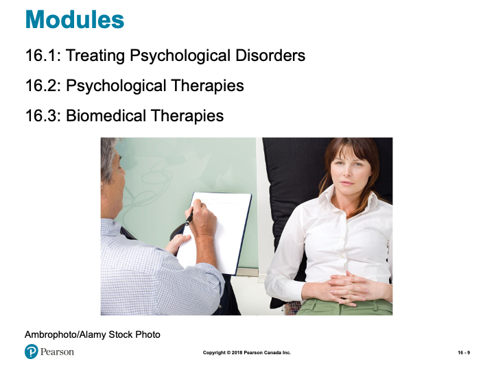
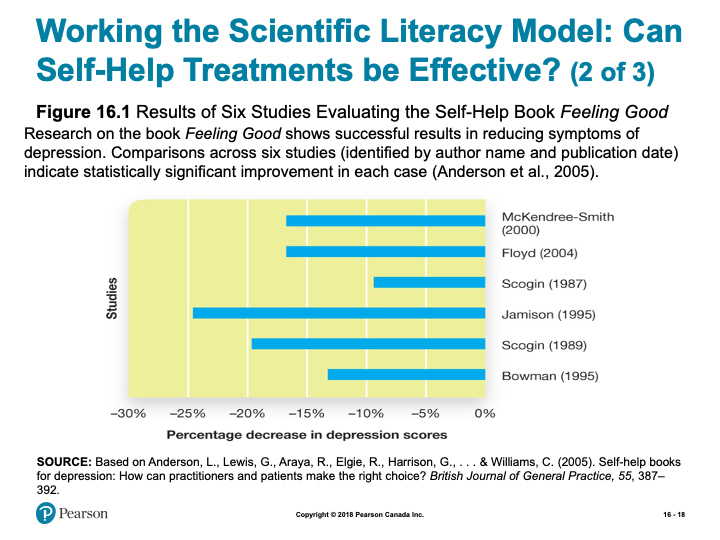
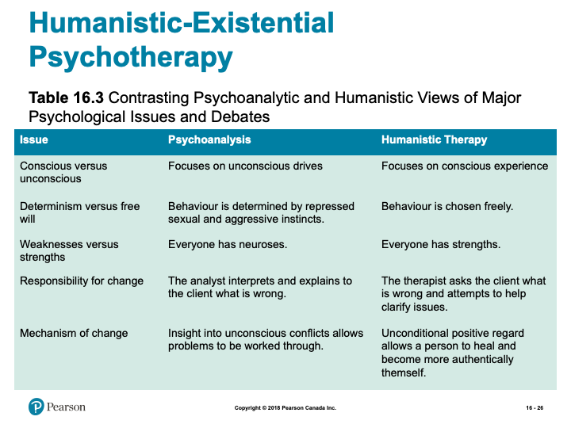
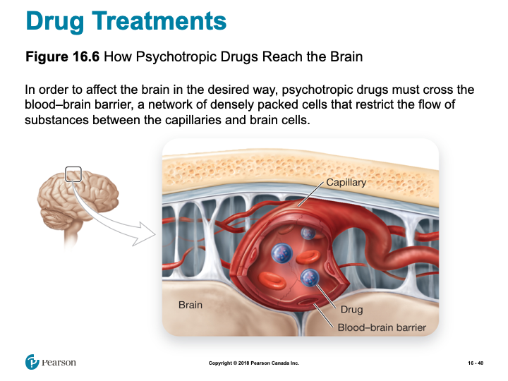
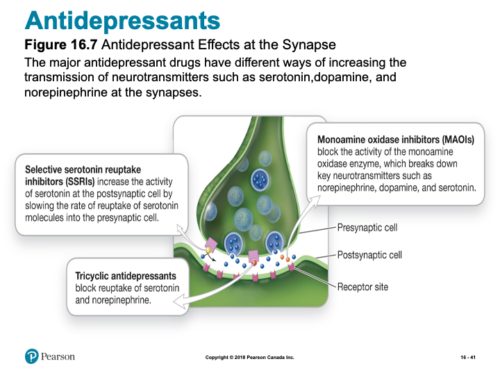

# Therapy- Part 1

## Overview {-}

Units 11 and 12 introduce the exciting, and ever expanding, world of therapy. Today, psychotherapeutic techniques are used to address a range of human conditions- from helping people find hope in overwhelmingly challenging circumstances to people exploring ways to optimize their potentials. Having a therapeutic relationship can be tremendously valuable in a person’s life as a therapist should be non-judgmental and have no other agenda than to help a person reach their therapeutic goals. The focus of this unit will be to provide some overview and perspectives on therapy.

### Topics {-}

This unit is will delve into the topic of :

- Therapies  

### Learning Outcomes {-}

By the end of this unit, student's will be able to:

- Define the key terminology associated with mental health treatment, psychological therapies, and biological treatments.  
- Describe the major barriers to seeking help for psychological disorders, arguments for and against involuntary treatment, and general approaches to conducting major types of psychotherapy.  
- Apply your knowledge to suggest what approach to therapy is likely most appropriate for a given situation, to identify major therapeutic techniques, and which drug therapies could be used for different psychological conditions.  
- Analyze whether self-help options, such as popular books, are a useful therapy option, the pros and cons of the major types of psychotherapy and whether St. John’s Wort, a popular herbal remedy for depression, works.  
- Describe how the drugs described in this module, and the other major medical approaches to therapy, affect brain functioning.  

### Activity Checklist {-}

Here is a checklist of learning activities you will benefit from in
completing this unit. You may find it useful for planning your work:

```{block2, type='reflect'}

<!-- [plugin:content-inject](_schedule) -->

**Read and Reflect**

- Read *Krause et al. (2021). Revel for An Introduction to Psychological Science, 3rd Canadian Edition*  
- Review *Unit 11- Slides*  

<details> <summary>CLICK HERE</summary>

<h5>An Introduction to Psychological Science - Chapter 16 - Therapies</h5>

<h5>Biblical Word Study</h5>

- Therapy – Gr. $\Theta \epsilon \rho \alpha \pi \epsilon u \omega$ (therapeuō)- to heal, cure; to receive service; to serve, minister to, render service and attendance; to render divine service, worship.  
- Save/Rescue – Gr. $\Sigma w \zeta \omega$ (sōzō) - to save, rescue; to preserve safe and unharmed; to bring safely to; to cure, heal, restore to health; to save, preserve from being lost; to deliver from, set free from; in N.T. To rescue from unbelief, convert; to bring within the pale of saving privilege; to save from final ruin; to be in the way of salvation  
- Strength/Strong/Healthy – Gr. $\iota \sigma \chi u \omega$ (ischuō) – to be strong, be well, be in good health; to have power, be able; to have power or efficiency, avail, be valid; to be of service, be serviceable; to prevail  
- Comfort – Gr. $\pi \alpha \rho \alpha \kappa \alpha \lambda e \omega$ (parakaleō) to animate (to fill with breath, to make alive, to give life to, to inspirit, to rouse), encourage, comfort, console; to be cheered, comforted  
- Proverbs 14:10 (NIV):
  - ^10^ Each heart knows its own bitterness, and no one else can share its joy.  
- Proverbs 13:12 (NIV):
  - ^12^ Hope deferred makes the heart sick, but a longing fulfilled is a tree of life.  

<h5>True or False?</h5>

- T F 1. “Psychoanalysis” is another word for “psychotherapy.”  
- T F 2. Regardless of their theoretical orientation, therapists agree that self-awareness is the key to overcoming psychological problems.  
- T F 3. The most effective treatment for alcoholism is to associate alcoholic drinks with a nausea-producing drug.  
- T F 4. Most people who suffer psychological problems become worse without therapy.  
- T F 5. Daily exposure to bright light successfully counteracts winter depression.  
- T F 6. The various therapies are so different that it is impossible to find any commonalities.  
- T F 7. The training and experience of the therapist are crucial factors in determining therapeutic success.  
- T F 8. The use of drugs has liberated hundreds of thousands of people with severe psychological disorders from hospital confinement.  
- T F 9. Many people have found relief from manic-depressive mood swings with a daily dose of a cheap salt.  
- T F 10. Electroconvulsive therapy is no longer used in the treatment of psychological disorders.  

<h5>Therapist Role-Play Activity</h5>

- Get into groups of two (or three) preferably with someone whom you do not know or do not know well  
- To start, choose who in your group will be the counsellor, the client, and (if 3 people) the observer  
- What will be discussed is a current struggle you are having with university life  
- About 5 mins of interaction each  



*Slide showing - Modules for this chapter*

<h5>Learning Objectives</h5>

- Know the key terminology associated with mental health treatment.  
- Understand the major barriers to seeking help for psychological disorders.  
- Understand the arguments for and against involuntary treatment.  
- Apply your knowledge to suggest what approach to therapy is likely most appropriate for a given situation.  
- Analyze whether self-help options, such as popular books, are a useful therapy option.  

<h5>Mental Health Providers</h5>

- Clinical psychologists (p. 606)  
- Counselling psychologists (p. 606)  
- Clinical social workers  
- Psychiatric nurses  
- Psychiatrists (p. 606)  

<h5>Inpatient Treatment and Deinstitutionalization</h5>

- 1400s  
  - First institutions built; brutal conditions  
- End of the 1800s  
- Overcrowded asylums, ineffective treatments  
- 1960s  
  - Deinstitutionalization (p. 607)  
  - Residential treatment centres (p. 607)  

<h5>Involuntary Treatment</h5>

- May be compelled to enter treatment  
- Highly erratic or disturbing behaviour  
- Controversial issue  
- More common for some ethnic groups and socioeconomic classes  

<h5>The Importance of Community Psychology</h5>

- Community psychology (p. 608)  
  - Meeting needs of those with less severe problems  
    - Homelessness  
    - Substance abuse  
    - Financial barriers  
    - Stigma  

<h5>PSYCH @ The University Mental Health Counselling Centre</h5>

- 15-20% of college students showing symptoms  
  - 50% increase in past 2 decades  
- Counselling centres  
  - Vary by size of school and funding  
  - Waiting list  

<h5>Evaluating Treatments</h5>

- Empirically supported treatments (p. 609)
  - Random assignment  
  - Double-blind  
  - Limitations  
    - No double-blind  
    - Therapeutic alliance (p. 609)  

<h5>Working the Scientific Literacy Model: Can Self-Help Treatments be Effective?</h5>

- What do we know about the availability of self-help treatments?  
- How can science test the effectiveness of self-help treatments?  
  - Bibliotherapy (p. 610)  



*Slide showing - Results of Six Studies Evaluating the Self-Help Book Feeling Good*

- Can we critically evaluate this evidence?  
  - Important to check sources  
- Why is this relevant?  
  - Convenient, low-cost options  
  - Professional help may be needed  

<h5>Barriers to Psychological Treatment: Expense and Availability</h5>

- Disorders are ambiguous  
- Stigma about mental illness  
- Attitudes toward treatment  
- Gender roles  
- Culture  
- Geographical barriers  
- Financial barriers  

<h5>Learning Objectives</h5>

- Know the key terminology related to psychological therapies.  
- Understand the general approaches to conducting major types of psychotherapy.  
- Apply your knowledge to identify major therapeutic techniques.  
- Analyze the pros and cons of the major types of psychotherapy.  

<h5>Insight Therapies</h5>

- Insight therapies (p. 615)  
- Psychodynamic therapies (p. 615)  


*Slide showing - Core Ideas Forming the Basis of Psychoanalysis*

<h5>Psychoanalysis: Exploring the Unconscious</h5>

- Accessing the unconscious  
  - Free association (p. 615)  
  - Dream analysis (p. 615)  
- Can lead to:  
  - Resistance (p. 615-616)  
  - Transference (p. 616)  

<h5>Modern Psychodynamic Therapies</h5>

- Object relations therapy (p. 616)  
  - Influenced by Freud’s work  
  - Gain insight into early relationships issues  



*Slide showing - Contrasting Psychoanalytic and Humanistic Views of Major Psychological Issues and Debates*

<h5>Evaluating Insight Therapies</h5>

- Psychodynamic therapies have some empirical support  
  - Lack of proper design and control conditions  
  - Promise for panic disorder, dependence on opiate drugs, and BPD  
- Person-centred therapy  
  - Importance of therapeutic relationship supported  
  - Emotion-focused therapy  

<h5>Behavioural, Cognitive, and Group Therapies</h5>

- Behavioural therapies (p. 618)  
  - Behaviours are learned  
    - Adaptive and maladaptive  


*Slide showing - Applying Steps of Systematic Desensitization to Fear of Public Speaking*


*Slide showing - Applying Steps of Systematic Desensitization to Fear of Public Speaking*

<h5>Working the Scientific Literacy Model: Virtual Reality Therapies</h5>

- What do we know about virtual reality exposure?  
  - Virtual reality exposure (VRE) (p. 619)  
    - Imagery  
    - Real-time approximation  
    - Treating PTSD  
- How can scientists study virtual reality exposure?  
- Can we critically evaluate this evidence?  
  - VRE can outperform standard approaches  
  - More effective for some groups of patients  
- Why is this relevant?  
  - Treating veterans  
  - Close control over exposure  

<h5>Aversive Conditioning</h5>

- Aversive conditioning (p. 620)  
  - Antabuse  
    - Reduce problem drinking  
    - Causes nausea and vomiting  
    - Requires motivation and willpower  

<h5>Cognitive-Behavioural Therapies</h5>

- Cognitive-behavioural therapy (p. 621)  
  - Feelings involved with exposure  
  - Cognitive restructuring  
    - Shift in beliefs and interpretations  
- Relaxation techniques  
  - Stress inoculation training  
- Applying Cognitive-Behavioural Therapy to the Cognitive Symptoms of Depression  
  - Internal attributions  
  - Stable attributions  
  - Global events  

<h5>Mindfulness-Based Cognitive Therapy</h5>

- Integration of meditation and CBT  
- Mindfulness-Based Cognitive Therapy (p. 622)  
- Decentring (p. 623)  

<h5>Group and Family Therapies</h5>

- Group Therapy  
  - Less expensive  
  - Organized to fit needs  
  - Systems approach (p. 624)  

<h5>Evaluating Cognitive-Behavioural Therapies</h5>

- Behavioural therapies effective for:  
  - Anxiety disorders  
  - Certain problematic behaviours  
- Cognitive-behavioural therapy effective for:  
  - Depression  
  - Anxiety and eating disorders  

<h5>Learning Objectives</h5>

- Know the key terminology associated with biological treatments.  
- Understand how the drugs described in this module affect brain functioning.  
- Understand the other major medical approaches to therapy.  
- Apply your knowledge of drug therapies to different psychological conditions.  
- Analyze whether MDMA (Ecstasy) is an effective treatment for posttraumatic stress disorder (PTSD).  



*Slide showing - How Psychotropic Drugs Reach the Brain*



*Slide showing - Antidepressant Effects at the Synapse*

<h5>MYTHS IN MIND: Antidepressant Drugs are Happiness Pills</h5>

- Antidepressants alleviate depression  
  - Do not make people happier  
  - High doses do not produce a high  
    - Weeks to work  

<h5>Working the Scientific Literacy Model: Using MDMA (Ecstasy) to Treat Posttraumatic Stress Disorder (PTSD)</h5>

- What do we know about using MDMA to treat PTSD?  
  - Treatment program has 3 components  
- What have scientific studies found about MDMA and PTSD?  
  - Effective and long-lasting  
  - Effects on neurotranmitters  
- Can we critically evaluate this evidence?  
  - Safety?  
  - Addiction?  
- Why is this relevant?  
  - Another option for treatment  

<h5>Antianxiety Drugs and Antipsychotic Drugs</h5>

- Antianxiety drugs (p. 630)  
  - Xanax, Valium, and Ativan  
  - Affect activity of GABA  
- Antipsychotic drugs (p. 632)  
  - Original medicines blocked dopamine receptors  
  - Tardive Dyskinesia (p. 632)  
  - Atypical antipsychotics (p. 632)  

<h5>Evaluating Drug Therapies</h5>

- Drugs most effective with other types of therapy  
- Antidepressants increasingly accepted  
  - 50-60% benefit  
    - 30% improvement with placebo  
- Psychotherapy  
  - 50-60% benefit  

<h5>Technological and Surgical Methods</h5>

- Neurologists in 1800s and early 1900s  
  - Experimented with removing regions  
    - Frontal Lobotomy (p. 633)  
- Antonio Moniz  
  - Leucotomy (p. 633)  
- Walter Freeman  
  - Ice pick  
- Dwindling popularity of frontal lobotomies in 1950s  

<h5>Focal Lesions</h5>

- Severe psychiatric problems  
  - All other methods failed  
  - Focal lesions (p. 634)  
    - Anterior cingulate cortex  

<h5>Electroconvulsive Therapy</h5>

- Electroconvulsive therapy (ECT) (p. 635)  
  - Introduced in 1930s  
  - Severe cases  
  - Mild side effects  
- Why does it work?  

<h5>Transcranial Magnetic Stimulation and Deep Brain Stimulation</h5>

- Repetitive transcranial magnetic stimulation (rTMS) (p. 635)  
  - Reduces depressive symptoms  
  - No anaesthesia, seizure, or cognitive impairments  
  - May help for symptoms of schizophrenia  
- Deep brain stimulation (DBS) (p. 636)  
  - Thin electrode-tipped wires  
  - Instantaneous results on depression  
  - Side effects  

</details>

*Please note, the slides are intended to supplement the information found in your textbook. If you are having trouble viewing them, they can also be downloaded by scrolling to the bottom of the screen and clicking on the "Unit 11- Slides" link.*

- For many people unfamiliar with the journey of counselling, finding suitable resources may feel daunting. It is important to know that there are many different approaches designed to help you accomplish the growth goals you have for your life. In this activity, you will have the opportunity to see some treatment options for a wide variety of conditions. Additionally, there is a resource on different theoretical approaches to behavior change, and a link to some information concerning the integration of Christianity and psychotherapy.  

***Learning Lab Preparation***

- Each topic will provide a question or scenario for you to consider prior to attending your Learning Lab. Be sure to carefully consider each prompt as you will be expected to contribute to the group discussion.  

```

### Resources {-}

Here are the resources you will need to complete this unit:

- Krause, M., Corts, D., Smith, S. C., & Dolderman, D. (2018). *Revel for An Introduction to Psychological Science, 2nd Canadian Edition.* Pearson Ed.  
- Other resources will be provided online.  


## Therapies- Part 1

### Psychological Therapies {-}

Psychological therapies, or psychotherapies, are a general class of therapies that deal with the psychological (mental/behavioural) world of people with disorders.

These therapies are generally contrasted with biomedical approaches, which deal more with the biological world of the individual. Biomedical therapies focus on altering a person's biology to effect a change in the person's psychology.

### Eclectic Approach {-}

The eclectic approach is an approach that values the diversity of treatment approaches. Eclectic approaches deal with psychology and biology. In addition, various types of psychotherapies may be employed. Eclectic therapy approaches are becoming very popular.

### A Sin Problem? {-}

*“Many Christians are not satisfied with viewing psychological disorders as either illnesses or nothing but thought and behavior problems. They feel that both of these approaches are inadequate because they omit very important moral and spiritual questions. Consequently, the important issue of moral responsibility is not dealt with adequately.

They feel that since humanity's most basic problem is alienation from God as a result of sin, no other difficulty can be dealt with until the relationship with God has been restored. Thus the first goal of therapy is to bring the client to the place of acknowledging his or her need, and asking for divine forgiveness through Jesus Christ. Once the client has placed his or her trust in God, and is operating within the same religious conceptual framework as the therapist, therapy can then proceed to the identification of specific disturbances of thought and behavior. These are seen as examples of sin in that the individual is either acting in a sinful way towards others, or is harboring sinful thoughts and attitudes within. The therapist will assist the individual to identify, confess, and forsake these sins. The goal of therapy is seen primarily in terms of spiritual growth and a "closer walk with God."*

### Sin Only? {-}

In a work for Christian counselors, Koteskey (1983) gives the example of his eighteen month old son who developed an intense fear of dogs after two unpleasant experiences with them. Even the fact that the child was too young to talk did not prevent a fellow Christian psychologist from concluding that he had a spiritual problem. We should recognize that not every problem is necessarily a spiritual one. Just as a disturbance may have a purely biological cause, so too it may have a simple psychological (learning) explanation. Information gained from the study of animals may be helpful in the understanding of psychological problems as it is often vital in understanding biological problems. *(Both excerpts from Psychology and Christianity by Ronald Philipchalk)*

<!-- [plugin:content-inject](_activities) -->

### Learning Activities {-}

```{block2, type='reflect'}

#### Read and Reflect {-}

For many people unfamiliar with the journey of counselling, finding suitable resources may feel daunting. It is important to know that there are many different approaches designed to help you accomplish the growth goals you have for your life. In this activity, the first resource, Psych Central is the oldest peer-reviewed psychology and mental health network on the Internet. Established in 1992, originally it was an index to mental health. Now it gives you the opportunity to see some treatment options for a wide variety of conditions. Additionally, there is a resource on different theoretical approaches to behavior change, and a link to some information concerning the integration of Christianity and psychotherapy.

- [**PsychCentral**](https://psychcentral.com/){target="_blank”}  
- [**Behaviour Online**](http://www.behavior.net){target="_blank”}  
- [**Integration Models**](http://www.psyche.gr/lpsycrel.htm){target="_blank”}  

#### Learning Lab Preparation {-}

Prior to your Learning Lab, take some time to think about the following questions. You will be asked to share your thoughts in this week's Learning Lab:

- ***What is your view of the role of sin (or questionable moral behaviours) or other religious/spiritual beliefs in the treatment of psychological disorders?***  
- ***What kinds of religious/spiritual beliefs could lead to greater feelings of guilt/shame and increased psychological disorder?***  

***As we approach our final unit, please take a moment to look ahead to the "Term Paper" tab. Here you will find important information that ties to completing the course. It is important to begin preparing now, for these final assessments, in order to manage your time and avoid being overwhelmed. Not only will you have to complete your Quiz #3 at the end of Unit 12, but you will also be responsible for submitting a Term Paper and writing a Final Exam- it is strongly recommended that you begin planning now!***

```

## Assessment {-}

```{block2, type='assessment'}

While there is no "formal" assignment that you will be responsible for submitting for Unit 11, you will be expected to participate in discussion during your Learning Lab. Your facilitator will be providing a participation mark based on your contributions. Below is some information to consider prior to attending your Learning Lab:

#### Learning Lab {-}

Your facilitator will be providing a participation mark based on your contributions for this unit. Below is some information to consider prior to attending your Learning Lab:

*Active participation in group exercises, reflection, and critical discourse is an essential component of this course. You are expected to show respect for all members of the course, both in your speech and actions. Contribute by actively observing and listening, raising thoughtful questions, examining relevant issues, building on others’ ideas, analyzing and evaluating the group’s thinking, synthesizing key points, and expanding the group’s perspectives. Take care not to dominate a conversation, giving space for others to speak. When in small groups help maintain the focus, flow, and quality of conversations, and take the initiative to invite others (particularly those who are quiet) to speak.*

**Rubric for Participation in Learning Labs**

| Emerging (0-64%) | Developing (65-89%) | Mastering (90-100%)|
|-|-|-|
|Never to almost never: Demonstrates active listening (as indicated by disengaged body language and no to rare comments that build on others’ remarks),Initiates any contributions in class or small groups, Makes insightful or constructive comments, Helps maintain a supportive space for others to speak.|Sometimes to fairly often: Demonstrates active listening (as indicated by somewhat to often engaged body language and comments that build on others’ remarks), Initiates a contribution at least once in a class or small group discussion; Makes insightful or constructive comments, Helps maintain a supportive space for others to speak.|Very often to nearly always: Demonstrates active listening (as indicated by fully engaged body language and comments that build on others’ remarks), Initiates more than one contribution in a class or small group discussion, Makes insightful or constructive comments, Creates a space for others to speak and takes initiative to include others.|

```

## Checking your Learning {-}

```{block2, type='progress'}

Before you move on to the next unit, check that you are able to:

- Define the key terminology related to health psychology, stress and illness, and coping and well-being.  

- Describe how genetic and environmental factors influence obesity, how physiological reactions that occur under stress, and how the immune system is connected to stress responses.  

- Apply your knowledge of persuasion and health to examine the effectiveness of different types of cigarette warnings, and of the beneficial effects of optimism to help you reframe stressful situations as positive opportunities.  

- Analyze whether media depictions of smoking affect smoking in adolescents, the claim that ulcers are caused by stress, and whether activities such as relaxation techniques, meditation, and biofeedback actually help people cope with stress and problems.  

- Describe how control over the environment and positive and negative styles of coping influences well-being.  

```
