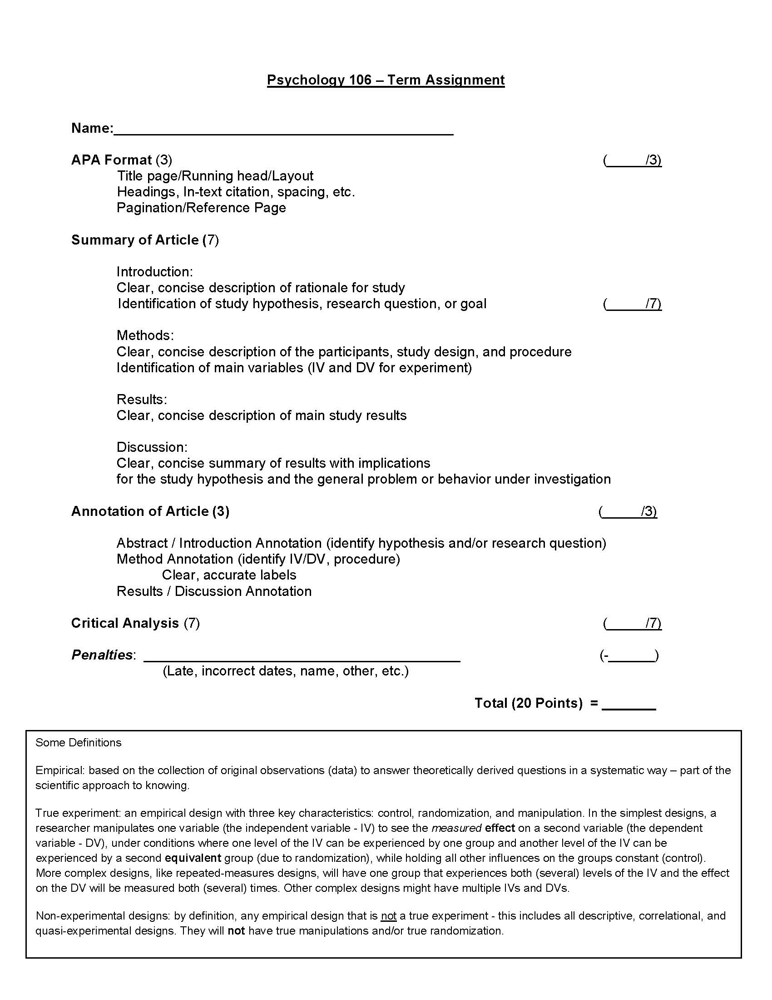

## **Final Assessments**

As mentioned in the previous units, student's will be responsible for completing two final formal assessment. This page will provide an outline of what is expected for your Term Paper.

### **Term Paper**

The first of your final assessments will be to submit a term paper. This term paper will require you to call upon information you have learned throughout the entire course - in particular, this term paper will continue to build upon the skills you applied in writing your **Writing Assignment #1** and **Writing Assignment #2** submissions. Additional resources will be provided at the bottom of this page - they are intended to support the development of your paper.

#### Assignment Overview

As Christians and as psychologists, it is crucial that we are able to critically evaluate psychological research. The main purpose of this assignment is to provide you with an opportunity to utilize your skills in research design and analysis as well as to practice your interpretation and critical analysis skills. You will also begin to utilize formatting guidelines specific to an academic discipline. In this case, you will use those provided by the American Psychological Association (APA).

### ***STEP 1: Choose an Article***

Select one of the following topics from the course. Topics include language development, social roles and obedience, ADHD & Autism, emotional intelligence, and cognitive behavioral therapy. You should familiarize yourself with the topic by browsing through the textbook and lecture notes (if we have already covered it in class).
You should then search for a journal article of interest to you that falls within this topic. You should identify this article as being either a true experiment or a non-experiment. Using *PSYCInfo* via the TWU library website, use keywords to search for articles. More details on how to do this will be provided in class. Choose articles that you find interesting and are able to understand. Some articles can be jargon-filled and complicated, so it is in your best interest to choose one that you will be able to read and write about.

---

### ***STEP 2: Summarize Your Article***

After reading the article, you should begin to summarize the main points. Just as you would describe the study if you were having a casual conversation with someone, you should summarize the study so that it is brief and easy to understand. You should summarize the article in your own words. Copying sections from the article is considered to be plagiarism. A description of each section of an article is provided below:

[plugin:content-inject](_alert)

---

### ***STEP 3: Critical Analysis of Article***

Reflect on your study with particular emphasis on whether or not it fits with your ideas, thoughts, and perceptions of psychology from a Christian perspective. You should also suggest an idea for future research that would either better examine the issue, or would further the investigation of the issue, with particular emphasis on Christian values and principles. **This section will be graded heavily for creativity and insight.**

---

### ***STEP 4: Write Your Paper***

Your paper should be 3 pages in length (excess length will not be read/graded), written by you and you alone, and should include both your summary and your critical analysis. Your paper should include the APA-formatted in-text citation of your article. You will also be required to include an APA-formatted title page, APA-formatted reference page, and a copy of the article.

Your paper should identify your study as being either a true experiment or a non-experiment. Use headings for each section as follows:

**Summary of Article** (approximately 1.5-2 pages)
 - Introduction
 - Methods
 - Results
 - Discussion

**Reflection and Critical Analysis** (1-1.5 pages)

---

### ***STEP 5: Submit Assignment***

You will submit the articles properly annotated (labels and highlighting or underlining) to indicate the evidence supporting your judgment that the article is reporting a true experiment (or non-experimental) design assessing the same general research hypothesis. Your careful and concise annotation will guide the reader to the evidence in support of your claim that you have selected an appropriate article – highlighting or underlining excessive material demonstrates poor understanding of the content.

## **Assignment Grading**

The assignment will be graded based on the appropriateness of the article selected (empirical, true experimental and non-experimental designs, similarity of research hypotheses and goals), the quality of your annotation of the article (accurate, concise, complete), the quality of your critical analysis and reflection, and the conformity of your title and reference pages to APA standards. The grading guide below will be used to assess your submission:

---

#### ***Additional Resources***

In order to help support the development of your paper, please refer to the following resources:

- [**The Hourglass of Writing**](hourglass_structure_papers.pdf)

!!! *This resource is intended to help you structure your paper. It is expected that your submission is in the format of a formal academic paper. This resource can help you develop an understanding of what, exactly, that means.*

- [**Sample Term Paper**](PSYC106_example_Assignment.pdf)

!!! *If you are still struggling with the expectations for this term paper, this resource will provide you with an exemplary sample. Although you WILL BE WRITING YOUR OWN PAPER, the structure/layout of your submission should follow the same principles.*

---

!! ***To submit your Term Paper, scroll to the bottom of the screen and click on the "Assignment - Term Paper" tab.***
