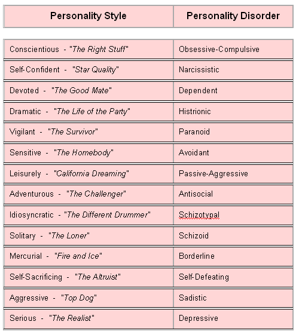

## **Looking at What is Normal and Anxiety Disorders**

We begin this topic by considering the following excerpt:

  ! *I avoid it whenever I can. In fact, I fear those days in which I have to experience it—going to the dentist. I know this is a common fear, but the reason for my fear is different from most people’s. When I go to the dentist, I pace back and forth in the waiting room, my heart races, I start to sweat and I have some trouble breathing. I know some people have problems with needles, or drills—not so for me. You see, my problem is with X-rays. I know, you are probably thinking, "what could be the problem with x-rays—this guy must really be a baby". Well, the problem is that I have one of the strongest gag reflexes that my dentist has ever seen (at least so he tells me). When the dentist puts the lead backing in my mouth (you know the cardboard thing that makes sure you don’t get cancer, or brain damage, or produce deformed children--at least this is what my dentist tells me), I choke on the piece and gag it up. In addition to being terribly uncomfortable, it is highly embarrassing—not to mention a little scary for all those children in the waiting room listening to the guy "dying" in the dentist’s chair. My dentist has tried everything—cutting the backing so it is smaller, having a nurse talk to me to distract my attention, having a nurse down the hall flip the X-ray switch as soon as the backing is in my mouth. Nothing seems to work, and over the past 20 years of going to the dentist, I have become more and more anxious with the experience. Only one solution has seemed to work—letting me put the backing in my mouth myself and taking the picture really fast.* (TWU psychology professor, personal communication)*

## What is Normal?

As the textbook points out, the definition of what is normal varies depending on culture and circumstances. As you read about various disorders, you may be struck by how similar “disordered” behavior is to normal behavior. (You should also beware of the “medical student syndrome;” the tendency to feel you have the problem you are studying.) In fact, disordered thought and behavior is usually just exaggerated normal behavior perhaps displayed at inappropriate times. For example, how would you diagnose someone who walks back and forth waving his arms and shouting one minute, and sits down and weeps uncontrollably the next? You might think he had a serious mental problem...*that is until you found out he was a basketball coach on the sidelines of a big game!*

Here is a list of comparisons between normal personality characteristics on the left, and the same type of behavior classified as a personality disorder on the right *(originally published in Harper’s, February 1997, by L.J. Davis).* You will learn more about personality disorders in a later section, but for now, you can probably see that the right, “disordered” column could just represent a different perspective on the left, “normal” column:

***This is not to say that psychological diagnoses have no validity. The point is that diagnosis is difficult and sometimes controversial.***

---

[plugin:content-inject](_activities)
