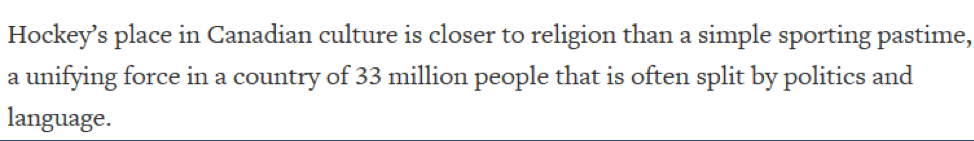

# WRTG 101

## 5 Steps of Effective Paraphrasing

---

This presentation is intended to help you learn how to effectively paraphrase. Recall from the lesson, that paraphrasing is important academic skill that involves presenting the ideas and/or information you have read (from one of your sources), in your own words.

In the following slides, you will find an outline of the 5 Steps of Effective Paraphrasing. In addition, an example has been included so that you can see how to the 5 Steps are applied.

---

## Step 1
### **read** and **understand** the original source FULLY

---

## Step 2
###**Determine the key ideas and key words of the original source that you want to include**

---

## Step 3
### **Do not look at the original source when paraphrasing**

---

### A. **Change** both certain words with synonyms and the order of the ideas.
*Do not copy "4 or more sequential words" from the original source.*

---

### B. **Change** the grammatical structure such as...
- *Words forms*
- *Verb tense and/or voice from active to passive (or passive to active)*
- *Transition Words*
- *Coordinating conjunctions (an/but/or/so)*
- *Subordinating conjunctions (although, even though, if, unless, after, before, while, because, ...)*

### C. **Express** numbers and statistics differently.

---

## Step 4
### **Review** if your paraphrase accurately reflects the meaning of the original source.

---

## Step 5
### **Indicate** a proper citation and list the source in your reference list. text

---
### For example, this is exempt of the newspaper “Reuters” written by Steve Keating and published on January 28, 2010. How can we paraphrase this paragraph below?

  

[Source: Reuters](https://www.reuters.com/article/us-olympics-ice-hockey-canada/hockey-is-more-than-a-game-to-canadians-idUSTRE60S00G20100129)

---

### Let’s follow the five steps.
###**NOTE**: In Step 2 and 3, I used color codes: {c:green}green{/c} for synonyms, {c:blue}blue{/c} for grammatical structure, and {c:purple}purple{/c} for numbers and statistics. These color codes are to help you to see how the words are changed.

---

## Step 1: **Read & Understand**
### “Hockey’s place in Canadian culture is closer to religion than a simple sporting pastime, a unifying force in a country of 33 million people that is often split by politics and language."

---
## Step 2: **Determine Key Ideas**
### “Hockey’s {c:green}place{/c} in Canadian {c:green}culture{/c} is closer to {c:blue}religion{/c} than a simple sporting pastime, a {c:green}unifying force{/c} in {c:purple}a country of 33 million people{/c} that is often {c:blue}split by politics and language{/c}.”

---

## Step 3: **Change**
1.	Synonyms
-	{c:green}place{/c} -> `position`
-	{c:green}culture{/c} -> `society`
-	{c:green}unifying force{/c} -> `harmonizing impetus`
2.	Grammatical structure
-	{c:blue}religion{/c} -> `religious belief`
-	{c:blue}split by politics and language{/c} -> `regardless of their different political inclinations and different first language`.
3.	Express numbers and statistics differently.
(I researched the population of Canada in 2010. It was 34 million.)
-	{c:purple}a country of 33 million people{/c} -> `about 97% of the total Canadian citizens`  

---

## Step 4: Review
### Does this have the same meaning?

`In Canadian` {c:green}society{/c}, `the` {c:green}position{/c} `of` hockey `is considered` {c:blue}religious belief{/c} `rather than just a kind of sport, and a` {c:green}harmonizing impetus{/c} `to` {c:purple}about 97% of the total Canadian citizens{/c} {c:blue}regardless of their different political inclinations and different first language{/c}.

---

## Step 5: Indicate Citation
### In Canadian society, the position of hockey is considered to be religious belief rather than just a kind of sport, and a harmonizing impetus to about 97% of the total Canadian citizens regardless of their different political inclinations and different first language (Keating, 2010).
