# {c:white} WRTG 101 {/c}

### {c:white} Reference Guide to Academic Tone {/c}

---

**{c:white} When writing an essay, it is critical that you understand that your language needs to be specific. This presentation is intended to help bring to your attention some common language errors that student's often make, while providing you with some more appropriate alternatives. In the pages that follow, you will find an outline of some common errors that you should be aware of when writing your essay. You will also find some examples of some language you can use to strengthen your academic tone.{/c}**

---

## {c:white}Contractions{/c}
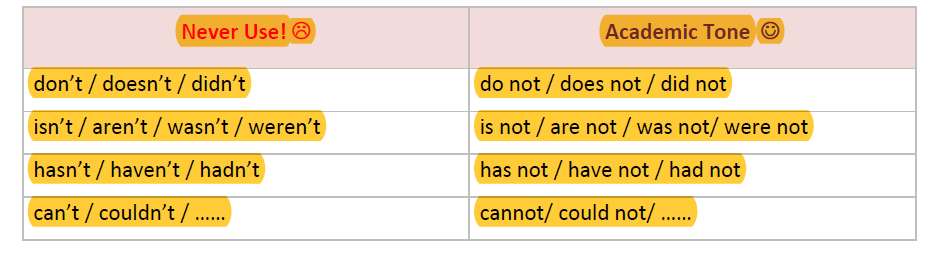

---

## {c:white}Too general Words{/c}

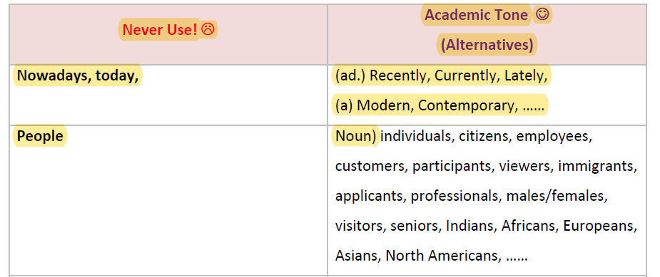

---

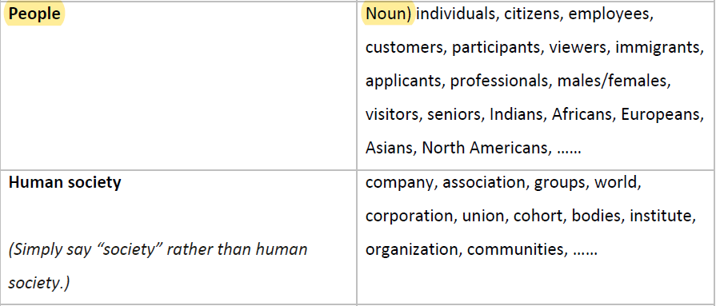

---

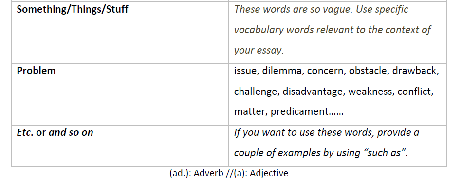

---

## {c:white}First and Second Person Pronouns{/c}

* **{c:red}1st person pronouns{/c}**{c:red}(I, my, me, mine) can be used ONLY in personal response paper (i.e. opinion paper) where you need to show your opinions.{/c} {c:white}If you are not sure of essay type, please ask your professor if you can use the 1st person pronouns in your essay or not.{/c}
* **{c:red}Never use the 2nd person pronouns{/c}**{c:red}(you, your, yours, we, our, us, ours) in any of your academic paper.{/c}

---

## {c:white}Better Choice of Verbs{/c}

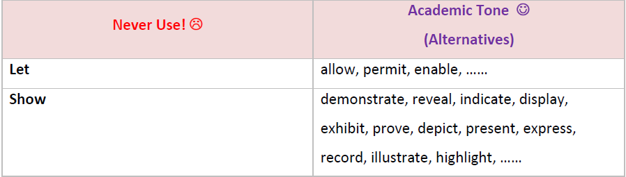

---

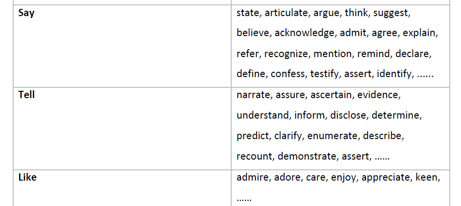

---

## {c:white}Better Choice of Adjectives{/c}

**{c:white}The adjectives below can have various meanings, so you will need to discern which synonym is the most suitable for your writing context{/c}.**

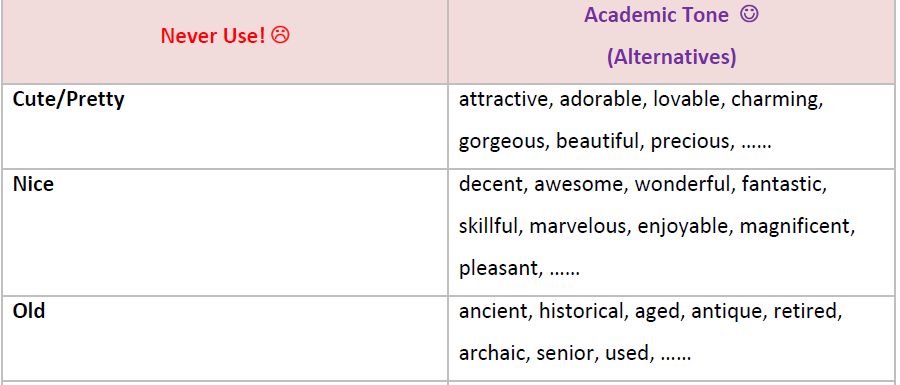

---

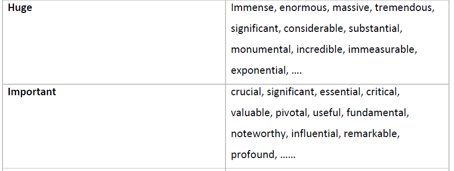

---

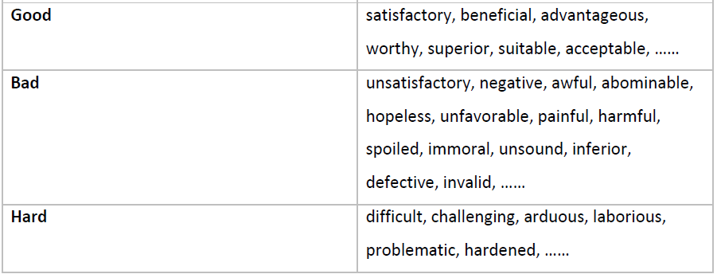

---

## {c:white}Transition words{/c}

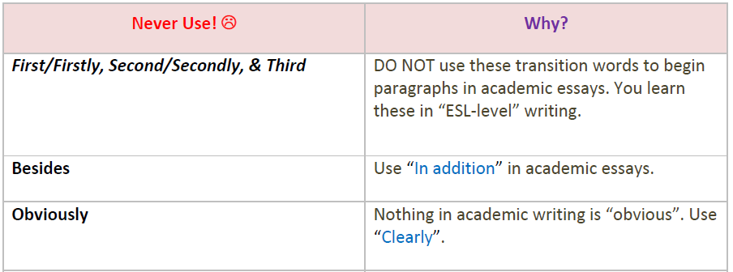

---

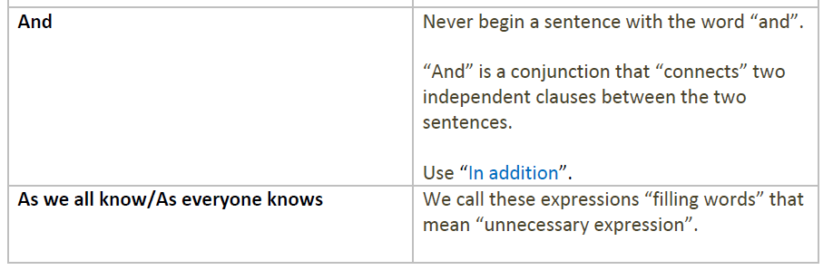
