### How to Create an APA Template
Read the following instructions for how to create your own APA template in Microsoft Word.  

Note that you may practice at home, but you will be required to complete all of the steps in the lab with your Facilitator and send your template to your instructor to be graded. See Lab Activity 1.1 for more details.

---
### Step 1: General Page Setup
6 steps are demonstrated in the next slides. Follow 1) to 6).

---
### Create a New Document
1.	Open a new document.

---

### Windows

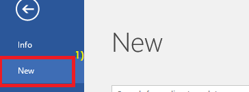  

---
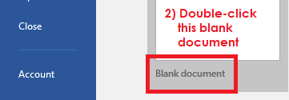

---

### macOS

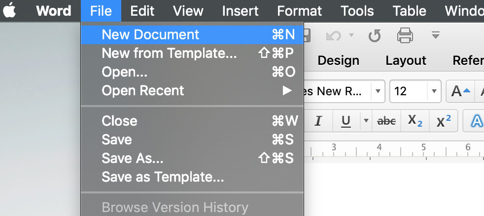  

---
### Save your Document
Save your file as “APA template (Your Official Name)”.

---
### Windows

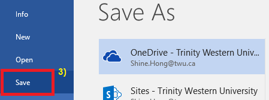

---
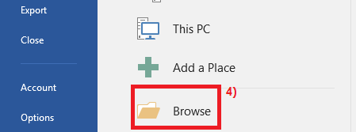

---

### Windows

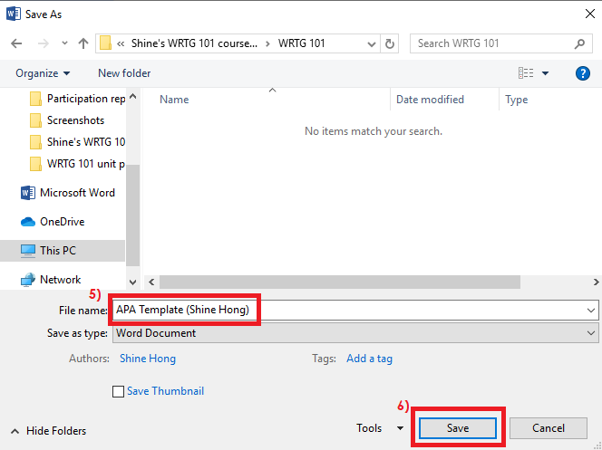    

---

### macOS

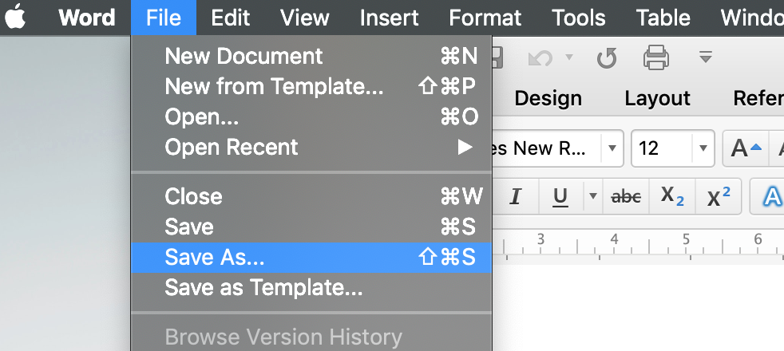

---

### macOS

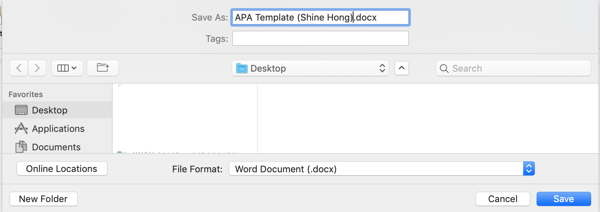

---

Set up the paper size, margin, font style and size, and spacing.

---

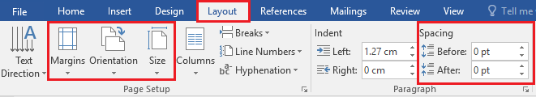

---

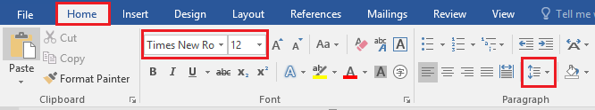

---

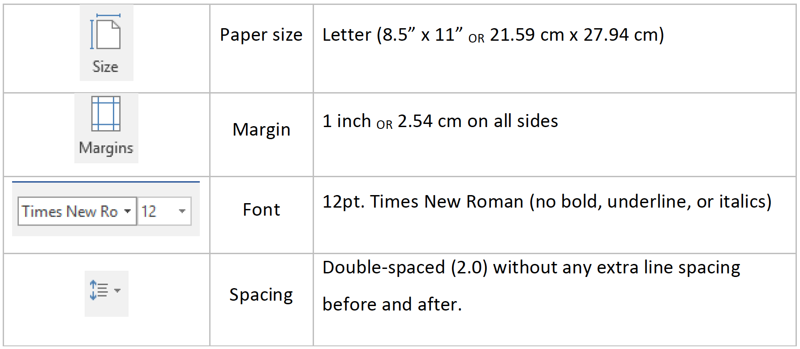

---

### Step 2
# Title Page
##### Page 1

---

Header: The header “Running head: THE TITLE OF YOUR ESSAY” in the left-hand corner of the FIRST page should appear as the following:

---

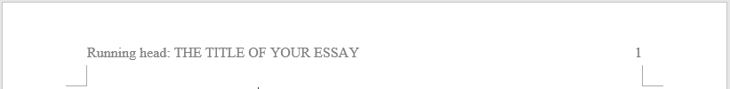

---

### Note:

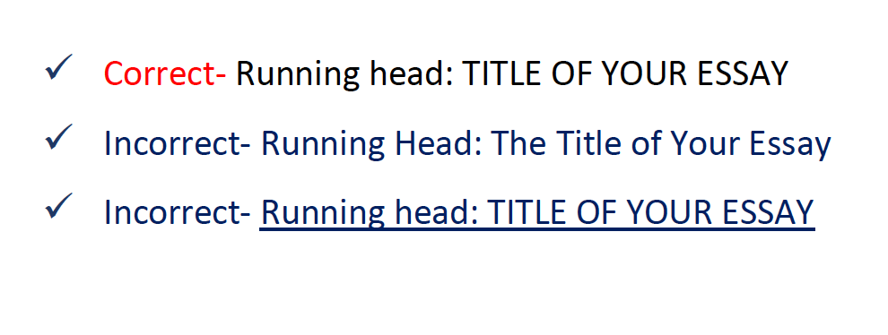

---

The Title of Your Essay: Essay Type,  
Your Official Name (and English Name), and  
University Name  
should appear in the middle of the title page like the following:

---

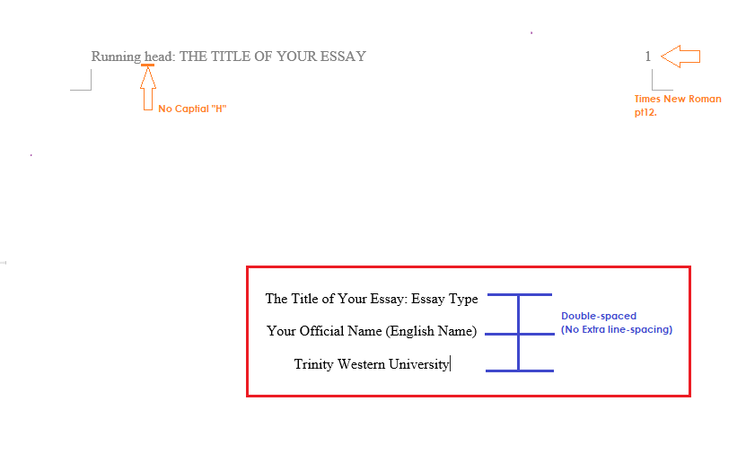

---

NOTE:
- Depending on professors, you are sometimes required to indicate the name of the course instructor, the course name, and the submission date.
- The title page can be varied, so please follow the format that your professor  suggests.

---

- Pagination: The page number should appear in the top right-hand corner.
- Make sure that your page numbers are written in Times New Roman and pt12.
- Note that there shouldn’t be any underlining on the page numbers.

---
### Page numbers

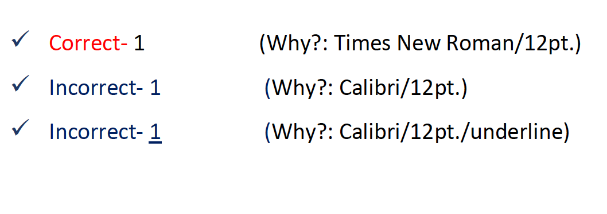

---

### Step 3
# Content pages
##### Page 2 ~

---

[.autoscale: true]

1. Header: A header should be inserted only with the essay title, TITLE OF YOUR ESSAY (i.e. NO “Running head:”), lined up with the left-hand margin.
2. Pagination: A page number should appear on every page (including the title page) on the RIGHT side of the header. The header and page number should be a ½ inch from the top of the page.
3. The Title of Your Paper: The Title of Your Paper should appear on the second page of the essay centered at the top.
  - NOTE: The Title of Your Paper should be short and concise and inline in ONE line of the header.

---

4. Indentation: All new paragraphs should be indented a 1/2 inch (one tab space).
5. Margins: The margins should be “align text left” (not “justified”).
6. Spacing: The ENTIRE essay should be double-spaced only, including references (no extra space between paragraphs or references).

---

### For example  

- The Title of Your Essay is “Canadian Cultural Icon- Beaver”.
- Essay Type is “APA Essay”.
- Then, page 2 of your essay will look like below.

---

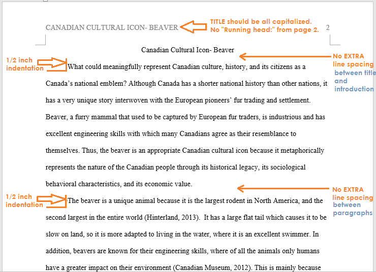

---

### Step 4
# References page
##### LAST page of your essay

---

- Regardless of the remaining space of your last content page, your reference list appears at the end of your essay on a SEPARATE sheet of paper with the title References (not bolded, underlined, or italicized) centered at the top of the paper.
  - Even if you have only ONE source to list, the section title should be “References”.

---

- References should be put in alphabetical order according to the LAST name of each author or the name of the publication.
- Indentation: All lines after the first line of each reference should be indented a 1/2 inch (one tab space) from the left margin. They should also be double spaced like the rest of the paper.
- Cross-referencing: ALL your citations in your essay should be matched with all the references recorded in the references page.

---

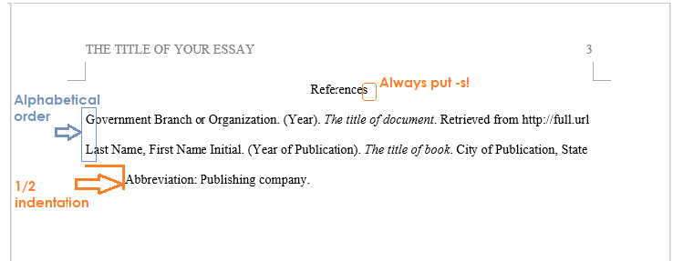
