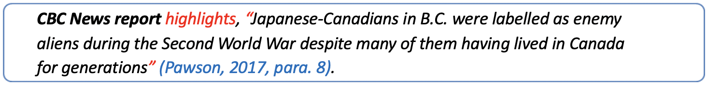
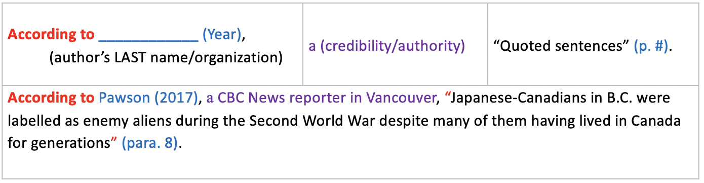
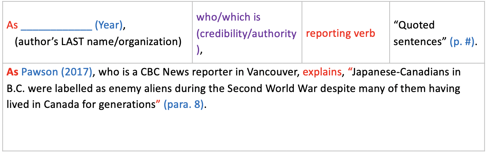
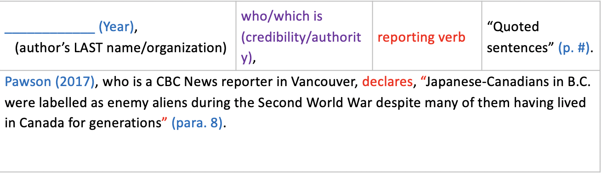

### Introducing Evidence

---
# How to Include Evidence
As you have just learned, when you write your academic essay, it is crucial to provide evidence. This evidence must be credible and relevant to your essay topic and discipline because it will help you to support your ideas and opinions powerfully.

This presentation will out line the difference between **PRIMARY** and **SECONDARY** Sources, as well as how you would introduce this evidence as descriptions or quotations.

---

*For additional understanding and practice, refer to Individual Activity 1.2 [Topic 2- Understanding of Primary/Secondary Sources] (Optional)

AND

Individual Activity 1.3 [Topic 2- Understanding of Evidence]*

---

# Primary Sources

---
**Primary sources** are sources that record **ORIGINAL historical facts/stories from the past or ORIGINAL knowledge, ideas, or theories.** They are recorded at the time of an event/study or right after something happened. For example:

- ***Artifacts:*** art, tool, weapon, costumes/clothes, & furniture……
- ***Documents:*** journal, speech, letter, diary, book, & article, government publications, records of organizations ……
- ***Audio/Video recordings:*** oral stories, speech, interview, film footage, ……
- ***Photographs***
- ***Autobiographies and memoirs***
- Something created at the time of studies such as a ***survey and research data***

---
# The Importance of Primary Sources

When writing an essay, PRIMARY SOURCES are importance because they usually reveal **UNSCREENED information that can witness what REALLY happened during the specific period of time in the past or research.** That is, they are not stories/events or theories created by writers or researchers with their imagination, but they were recorded with real-life events and TRUE facts/data that do not include any lies or exaggeration.

---
# Secondary Sources

**Secondary sources** are also important to include as evidence in your essay but they are different then Primary Sources. Secondary Sources are sources **that EXAMINE and DISCUSS primary sources.** For example, books or articles written by individuals or groups who did NOT see or experience the events being described are secondary sources.  Based on their primary sources, the writers freely report, demonstrate, and interpret the events or facts based on their study of primary sources.

---
# The Importance of Secondary Sources

Secondary sources can point out biased ideas and facts, and errors of primary sources from various viewpoints. Also, they give readers (or viewers) supplementary details about primary sources so that they can understand them better. Thus, when you write about a certain topic or theory about which you do not know well, you can benefit from secondary sources because they can give you some comprehensible background information and their various views. When you search for secondary sources, you need to keep in mind that your secondary sources should be credible, current, and relevant to your essay topic.

---
# Helpful Tips: Primary and Secondary Sources

***When including primary and secondary sources of evidence in your essay, it is important to remember:***
- When you are required to use a primary source as the main evidence of your essay, you must use primary sources only.
- If you checked secondary sources to understand the main ideas of your primary sources, that would be fine **ONLY for your own understanding**. This is because professors often want to check your OWN ideas and opinions, but NOT copied ideas and opinions of the secondary source writer(s).

---

- Some professors may allow you to use secondary sources as your evidence. In that case, they expect that you show your appreciation, agreement or disagreement of the secondary source writers with proper in-text citations. If you missed citations, you would face the consequence(s) of plagiarism.

***For more information and practice, refer to Individual Activity 1.2 [Topic 2- Understanding of Primary/Secondary Sources***

---

# Introducing Evidence

Once you have identified evidence you wish to include in your essay, you will need to incorporate it in one of two ways. Evidence can be included as:

1. **Descriptions**
2. **Quotations**

---

# Descriptions

If you are choosing to use primary sources such as artifacts, photos, and video recordings as evidence in your essay, you need to provide descriptions as part of your evidence.  You will need to describe:

- The appearance of the artifacts
- The images/objects/people/scenery on the photos
- The events/scenes/people’s emotions, body language, verbal expressions, or interactions with others displayed on the videos.

---

# Example: descriptions

Below is an example of a picture that might be used as descriptive evidence. Take a look at the description beside it. Note what is described…

---

BC’s Japanese Internment Camps (Source from Canada Libre)

---

In this photo presented in Canada Libre, one lady wearing a white-long dress is standing in front of one house and pointing out a large sign placed on the top of the front side of the house. The sign highlights “JAPS KEEP MOVING” with an additional warning, “This is A WHITE MAN’S NEIGHBORHOOD” (anonymous, n.d.).

**NOTE:** At the end of your description, do NOT forget to indicate an in-text citation.

---

# Quotations

The second way you can introduce evidence into your essay is by including quotations. You can use quotations when somebody’s idea or speech in your source has a powerful meaning/message. Thus, you can directly quote what the person stated or highlighted in the source with quotation marks with an in-text citation.

In both primary and secondary sources, you may want to directly quote:

- Eyewitness testimony
- Expert testimony
- Agreement or disagreement from others such as news reporters, experts, and scholars.
- Research results from scholarly journal articles
- Statistics/Data
- ...

---

# 3 Basic Ways of Quotations

Recall from Module 1, you learned how to quote and how to indicate a proper citation like below. The example below clearly indicates quotation marks for copied information and a proper in-text citation with the author’s last name, publication year, and a paragraph number right after the end of the quotation.

---

In this example, we can clearly understand that Pawson wrote this information in 2017 via CBC News report. Readers can find this quote in the 8th paragraph of the newspaper.

***There are three more ways that you can present your evidence with direct quotations like above. The next three slides will provide examples for your reference….***

---

# Example #1

**IMPORTANT:** *Before you mention your quoted evidence, you need to introduce who the writer is and the writer’s credibility. In this case, the publication year in brackets appears right after the author’s last name, and then a page or paragraph number in brackets appears after the second quotation mark.*

---

# Example #2

---

# Example #3

[Source: B.C. government recognizes 56 historic Japanese-Canadian places published by CBC News]

---

# Helpful Tips: Including Quotations

When including quotations, it is important to remember:
- At the end of your quotation, do NOT forget to indicate an in-text citation.
- Even if you notice some grammatical errors or spelling mistakes in your source, do NOT correct them. You need to present your quotations in the same way that the information appears in the source.

---

- Provide the context of your evidence fully. If you miss introducing the context of your evidence (i.e. quoted information), it is hard for readers to understand the meaning of your evidence clearly.

---

- You cannot copy more than 3 lines or 40 words. If your quotes are too long, quote short phrases or expressions only, and then paraphrase the rest of the information in your own words. We call this way a mixed quotation.

***For additional information and practice, refer to Individual Activity 1.3 [Topic 2- Understanding of Evidence]***
