# Welcome {-}

This is the course book for [insert]. This book is divided into 6 units of study to help you engage with the materials. The course resources and learning activities are designed not only to help prepare you for the course assessments, but also to give you opportinities to practice various skills.

Below you will find information about how to navigate this book. Please also refer the schedule in Moodle, as well as the Asseessment section in Moodle for instructions on required readings and assignments.

## Course Notes{-}

You should be reading this information in the context of a Trinity Western University course offered via Moodle. If this is not the case, then this may be an unauthorized reproduction of the course. Please contact elearning@twu.ca if you have concerns.

These notes will be your guide through the learning activities and assessment strategies necessary for you to succeed in the course, so it is important for you to engage to the best of your ability and take advantage of the resources available to you through Trinity Western University.

Assessment tasks are managed in other sections of the Moodle course, so be sure to familiarize yourself with those requirements and resources.

## How this Course is Built {-}

This course is primarily designed to be completed asynchronously, meaning that there are no scheduled times or places that you are required to meet, even online. You can work according to your own schedule *within the six weeks you have to complete the course*. That said, this is a full university level course and there are timelines that we strongly recommend that you meet to ensure that you are succeeding in building your knowledge through the course.

It would be to your significant disadvantage to submit everything at the end of the course.

Asynchronous courses require learners to be well-organized and self-motivated, and we have included supports for you to help you develop strong learning habits that will ensure your success.

For example, there are several self-check quizzes throughout the course. These quizzes are not graded, but they can be powerful tools for you to ensure you understand key ideas and concepts. We suggest you take each quiz without the aid of your notes and textbook and multiple times until you have mastered the content. This strategy taps into three powerful learning structures that have been shown to be highly effective.

1. **Effortful recall.** By intentionally trying to recall information without external aids, you are strengthening the neural pathways in your brain that lead to building new connections between ideas. One way to make recall easier is to connect key ideas to other things that you know or have experienced. For example, you might be studying World War II, and you connect the date that Canadians participated in the D-Day operation with something else meaningful to you that happened on June 6, like maybe the date you bought your first car.
2. **Spaced repetition.** By spreading out your attempts on the quiz (leaving a few days between attempts) you can maximize the effects of the first strategy (effortful recall) and ensure that your second or third attempts truly reflect what you know about the topic. We suggest leaving 1-3 days between attempt 1 and 2, then 4-5 days between attempt 2 and 3. You can use a tool like Trello, Notion, or Asana (free versions), or even a task list on your phone to set up a spaced repetition schedule.
3. **Interleaving.** This is the practice of studying a particular topic for a relatively short period of time (maybe 30-40 mins), then switching to a different topic for the same period, before going back to the original topic. We will help build this into your learning by including items from unit 1 in your unit 2-6 quizzes. You can also practice this by taking regular breaks in your work, or even by retaking a unit 1 quiz while you are working in unit 2.

These three strategies are very effective at helping people *remember* key facts about a particular topic, an important first step in learning at the university level. However, you will be asked to do much more than just remember facts. Your ultimate goal is to develop **evaluative judgement**, or the ability for you to judge for yourself the quality of your (or your peers') responses to prompts.

The discussion forums are a key way for you to do this. We have set up the forums in such a way that you will need to present a response to any given prompt before you see other learners' responses. We strongly encourage you to use this structure to formulate your own ideas before you present them in the forum, and then to use the responses of your peers to help you evaluate your own response.

Using these self-check activities in this way is designed to help you to succeed on the course assignments, upon which your final grade will be determined. These assignments will require you to **use** the facts of the course to generate unique responses to the prompts, based on your past experiences, knowledge, and ability to evaluate the quality of your own work. 

### How To Navigate This Book {-}

To move quickly to different portions of the book, click on the appropriate chapter or section in the table of contents on the left. The buttons at the top of the page allow you to show/hide the table of contents, search the book, change font settings, download a pdf or ebook copy of this book, or get hints on various sections of the book.
 

The faint left and right arrows at the sides of each page (or bottom of the page if it’s narrow enough) allow you to step to the next/previous section. Here’s what they look like:
  

You can also download an offline copy of this book in various formats, such as pdf or an ebook. If you are having any accessibility or navigation issues with this book, please reach out to your instructor or our online team at elearning@twu.ca.

### Course Units {-}

This course is organized into 6 units. Each unit of the course will provide you with the following information:

- A general overview of the key concepts that will be addressed during the unit.  
- Specific learning outcomes and topics for the unit.  
- Learning activities to help you engage with the concepts. These often include key readings, videos, and reflective prompts.  
- The Assessment section provides details on assignments you will need to complete throughout the course to demonstrate your understanding of the course learning outcomes.  

\BeginKnitrBlock{caution}
Note that assessments, including assignments and discussion posts will be submitted in Moodle.  See the Assessment tab in Moodle for the assignment dropboxes.
\EndKnitrBlock{caution}

### Course Activities{-}

Below is some key information on features you will see throughout the course. 

\BeginKnitrBlock{reflect}
***Learning Activity***  
This box will prompt you to engage in course concepts, often by viewing resources and reflecting on your experience and/or learning. Most learning activities are ungraded and are designed to help prepare you for the assessment in this course.
\EndKnitrBlock{reflect}

\BeginKnitrBlock{assessment}
***Assessment***  
This box will signify an assignment or discussion post you will submit in Moodle.  Note that these demonstrate your understanding of the course learning outcomes. Be sure to review the grading rubrics for each assignment.
\EndKnitrBlock{assessment}

\BeginKnitrBlock{progress}
***Checking Your Learning***  
This box is for checking your understanding, to make sure you are ready for what follows. Ways to check your learning might include self-check quizzes or questions for discussion. These activities are not graded but are critical for you to be able to begin to develop evaluative judgement in this domain of knowledge.

\EndKnitrBlock{progress}

\BeginKnitrBlock{caution}
***Note***  
This box signifies key notes. It may also warn you of possible problems or pitfalls you may encounter!
\EndKnitrBlock{caution}

<!--chapter:end:index.Rmd-->

# Thought and Language

## Overview {-}

***Welcome to Psych 106***

We begin this course by reviewing some important information on scientific research methodologies. While this review will be self-guided, it is critical that you understand the important elements that constitute valid and reliable scientific research as it is these methodologies that serve as the backbone for psychological studies.

After taking time to review scientific research methodologies, we will turn our attention to the subject of Thought and Language. Developing an understanding of Thought and Language helps us better understand how we think, how we organize our thoughts and our knowledge of the world around us, and how we communicate and act out on this information.

### Topics {-}

This unit is divided into the following topics:

 1. Review- Scientific Research  
 2. Thinking and Problem Solving  
 3. Cognitive Biases  
 4. Language and Thought  
 5. Animal Language  

### Learning Outcomes {-}

When you have completed this unit, you should be able to:

- Define key terminology related to principles of scientific research, research designs, and statistics.  
- Explain the five characteristics of quality scientific research, and the pros and cons of descriptive, correlational, and experimental research designs.  
- Determine how biases might influence the outcome of a study and how experiments help demonstrate cause-and-effect relationships.  
- Apply the concepts of reliability and validity to examples and concepts of experimental methods to research examples.  
- Assess whether anecdotes, authority figures, and common sense are reliably truthful sources of information.  
- Understand what it means for variables to be positively or negatively correlated and how and why psychologists use significance tests.  

### Activity Checklist {-}

Here is a checklist of learning activities you will benefit from in completing this unit. You may find it useful for planning your work.

<!-- [plugin:content-inject](_schedule) -->

### ***Unit 1:*** {-}

**Read and Reflect**  {-}

- Read *Krause et al. (2021). Revel for An Introduction to Psychological Science, 3rd Canadian Edition*  
- Review **UNIT 1 Slides**

 
CLICK HERE

<h5>Learning Objectives</h5>  

- Know the key terminology related to principles of scientific research.  
- Understand the five characteristics of quality scientific research.  
- Understand how biases might influence the outcome of a study.  
- Apply the concepts of reliability and validity to examples.  
- Analyze whether anecdotes, authority figures, and common sense are reliably truthful sources of information.  

<h5>Five Characteristics of Quality Scientific Research </h5>  

- Based on measurements that are objective, valid, and reliable  
- Generalizable  
- Use of techniques that reduce bias  
- Made public  
- Can be replicated  

<h5>Scientific Measurement: Objectivity(1 of 2)</h5>

- Objective measurements (p. 31)  
  - e.g. weight  
- Variable (p. 31)  
- Measuring variables - Examples  
  - Functional magnetic resonance imaging (fMRI)  
  - Blood or saliva  
  - Self-reporting  

<h5>Scientific Measurement: Objectivity(1 of 2)</h5>

*slide showing Operational Definitions*

<h5>Scientific Measurement: Reliability and Validity</h5>

- Reliability (p. 32)  
  - Consistent and stable  
- Validity (p. 32)  
  - True measurements  
  
<h5>Generalizability of Results (1 of 2)</h5>

- Generalizability (p. 33)  
  - Outside the laboratory  
- Study large groups  
  - Population (p. 33)  
    - Sample (p. 33)  

<h5>Generalizability of Results (2 of 2)</h5>

- Best reflection of population  
  - Random sample (p. 33)  
- Settle for easier sample  
  - Convenience sample (p. 33)  
- Location of study  
  - Laboratory research  
  - Naturalistic research  
  - Ecological validity (p. 33)  

<h5>Sources of Bias in Psychological</h5>

- Research  
- Researcher Bias  
- Subject/Participant Bias  
- Hawthorne effect (p. 35)  
- Social Desirability (p. 35)  

<h5>Working the Scientific Literacy Model: Demand Characteristics and
Participant Behaviour (1 of 2)</h5>

- What do we know about how bias affects research participants?  
  - Demand characteristics (p. 36)  
- How can science test the effects of demand characteristics on behaviour?  
  - Backpack scenario  

<h5>Working the Scientific Literacy Model: Demand Characteristics and Participant Behaviour (2 of 2)</h5>

- How can we critically evaluate the issue of bias in research?  
  - Researcher bias  
    - Bright rats vs. dull rats  
- Why is this relevant?  
  - Bias compromises studies  
  - Placebo effect (p. 35)  

<h5>Psych @ The Hospital: The Placebo Effect</h5>

- Debate about placebo effect  
  - "All in their head"  
  - Actual physiological response  
- Brain activity in regions involved in pain  
  - Multiple ways for placebos to affect our responses to pain  

<h5>Techniques That Reduce Bias</h5>

- Anonymity  
- Confidentiality  
- Inform participants  
- Single-blind study (p. 37)  
- Double-blind study (p. 37)  

<h5>Sharing the Results</h5>

- Academic journals  
  - Peer review (p. 37)  
  - Replication (p. 38)  

<h5>Five Characteristics of Poor Research (1 of 2)</h5>

- Lack of falsifiable hypotheses (p. 38)  
  - Testability requires faisifiability  
- Anecdotal evidence (p. 38)  
  - weight loss commercials  
- Biased selection of data  
  
<h5>Five Characteristics of Poor Research (2 of 2)</h5>

- Appeal to authority (p. 39)  
  - Corresponding data?  
  - Biased expert?  
- Appeal to common sense (p. 39)  
  - Earth is centre of universe  

<h5>2.2 Learning Objectives</h5>

- Know the key terminology related to research designs.  
- Understand what it means when variables are positively or negatively correlated.  
- Understand how experiments help demonstrate cause-and-effect relationships.  
- Apply the terms and concepts of experimental methods to research examples.  
- Analyze the pros and cons of descriptive, correlational, and experimental research designs.  

<h5>Descriptive Research (1 of 2)</h5>

- Descriptive data  
  - From observations  
  - No attempt to explain why  
- Qualitative Research (p. 42)  

<h5>Descriptive Research (2 of 2)</h5>

- Case study (p. 42)  
  - Extensive details  
  - Lacks generalizability  
- Naturalistic observation (p. 44)  
- Self-reporting (p. 45)  
  - Participant makes the observations  

*Slide showing correlations depicted in scatterplots*

<h5>Myths in Mind: Beware of Illusory Correlations</h5>

- Illusory correlations (p. 47)  
  - Crime increases when the moon is full  
  - Opposites attract  
  - Gamblers on a "hot streak"  
  - Stereotypes  

*Slide showing - Elements of an Experiment*

<h5>Experimental Research: The Quasi-Experimental Method</h5>

- Quasi-experimental research (p. 49)  
  - Random assignment not always possible  
    - Comparing men and women  
  - Cannot determine cause-and-effect  

<h5>2.4 Learning Objectives</h5>

- Know the key terminology of statistics.  
- Understand how and why psychologists use significance tests.  
- Apply your knowledge to interpret the most frequently used types of graphs.  
- Analyze the choice of central tendency statistics based on the shape of the distribution.  

<h5>Descriptive Statistics</h5>

- Descriptive statistics (p. 60)  
  - Frequency  
  - Central tendency  
  - Variability  

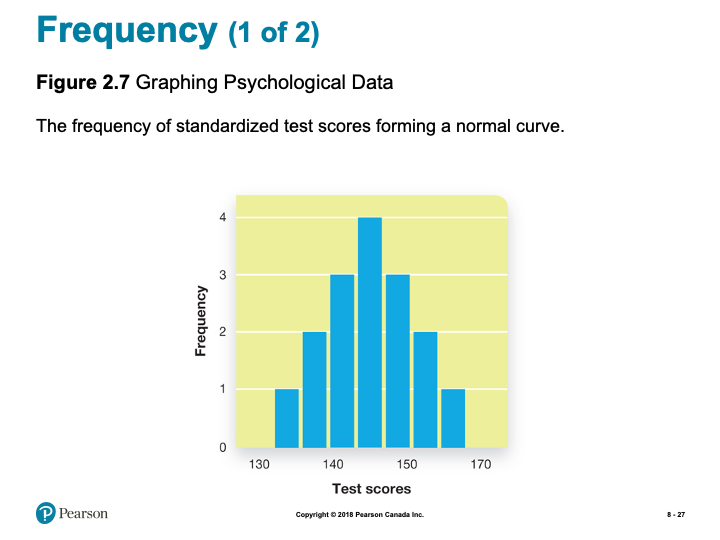

*Slide showing - Graphing Psychological Data*

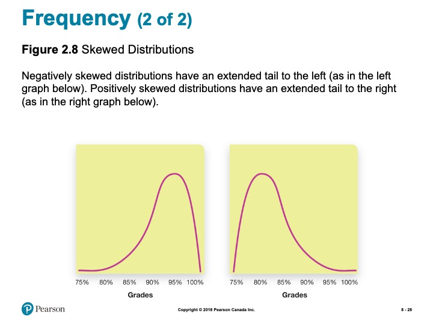

*Slide showing - Skewed Distributions*

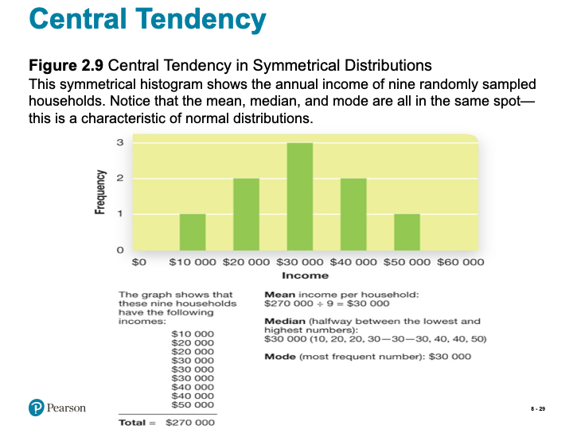

*Slide showing - Central Tendency in Symmetrical Distributions*

*Slide showing - Visualizing Variability*

*Slide showing - Testing a Simple Hypothesis*

*Slide showing - How Variability Affects Hypothesis Testing*

<h5>True or False?</h5>

- T F 1. People more easily detect male prejudice against females than female against males or female against females.  
- T F 2. In general, people underestimate how much they really know.  
- T F 3. It takes less compelling evidence to change our beliefs than it did to create them in the first place.  
- T F 4. The babbling of an infant at 4 months of age makes it clear whether the infant is French, Korean, or Ethiopian.  
- T F 5. Some people can write but not read.  
- T F 6. Many bilinguals report that they have different senses of self, depending on which language they are using.  
- T F 7. Imagining a physical activity triggers action in the same brain areas that are triggered when actually performing that activity.  
- T F 8. Only human beings seem capable of insight (the sudden realization of a problem's solution).  
- T F 9. Honeybees do a dance to communicate the direction and distance of a new food source to other bees.  
- T F 10. Apes are capable of communicating meaning by using symbols.  

<h5>Thinking</h5>

- Thinking, or *cognition*, refers to a process that involves knowing, understanding, remembering, and communicating.  
- Gr. $\Phi\rho\omega\nu\epsilon\omega$ (pr. phrones) - to think, to mind; to be of opinion; to take thought, be considerate; to entertain sentiments or inclinations of a specific kind, to be minded; to be in a certain frame of mind; to imagine; to heed, pay regard to; to incline to; be set upon, mind  

<h5>A little more Greek</h5>

- Mind (Gr. $\Nu\omicron\upsilon\varsigma$) - the mind, intellect; understanding, intelligent faculty; intellect, judgment; opinion, sentiment; mind, thought, conception; settled state of mind; frame of mind.  

<h5>The limits of intuition</h5>

- A bat and a ball cost $1.10 in total. The bat costs $1 more than the ball. How much does the ball cost?  
- A man bought a horse for $60 and sold it for $70. Then he bought the same horse back for $80 and again sold it, for $90. How much money did he make in the horse business?  

*Slide showing - Modules*

<h5>8.1 Learning Objectives</h5>

- Know the key terminology associated with concepts and categories.  
- Understand theories of how people organize their knowledge about the world.  
- Understand how experience and culture can shape the way we organize our knowledge.  
- Apply your knowledge to identify prototypical examples.  
- Analyze the claim that the language we speak determines how we think.  

<h5>Concepts and Categories</h5>

- Concept (p. 294)  
  - Divided into smaller groups  
- Categories (p. 294)  

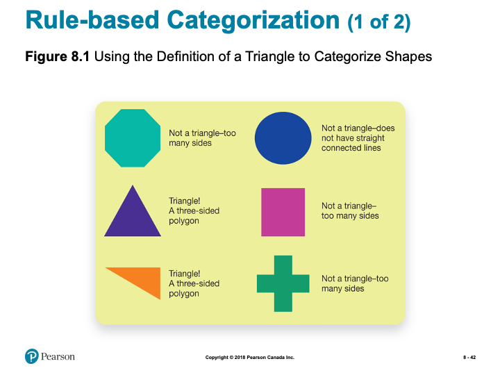

*Slide showing - Using the Definition of a Triangle to Categorize Shapes*

*Slide showing - Categorizing Objects According to the Definition of Bird*

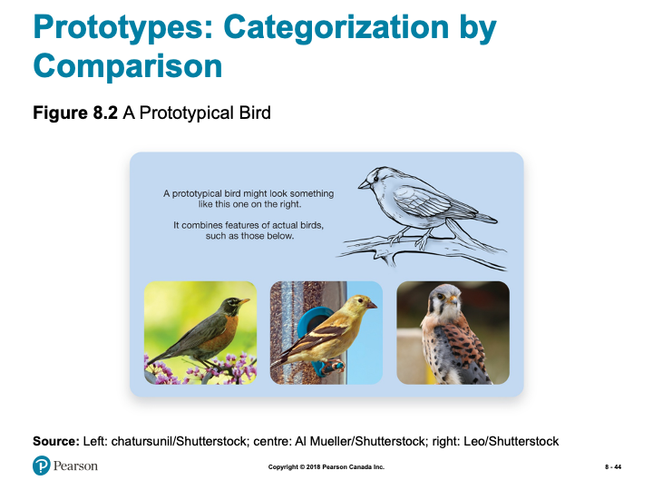

*Slide showing - A Prototypical Bird*

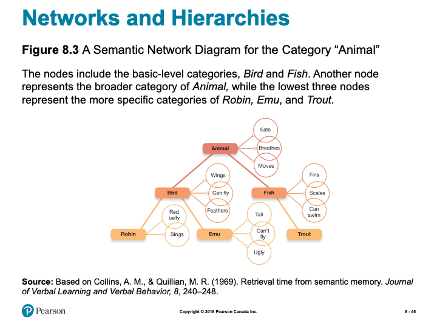

*Slide showing - A Semantic Network Diagram for the Category “Animal”*

<h5>Working the Scientific Literacy Model: Priming and Semantic
Networks (1 of 2)</h5>

- What do we know about semantic networks?  
  - Priming (p. 297)  
- How can scientists explain priming effects?  
  - Lexical Decision Task  

<h5>Working the Scientific Literacy Model: Priming and Semantic
Networks (2 of 2)</h5>

- Can we critically evaluate this information?  
  - Strength of priming varies  
  - Experiments difficult to replicate  
- Why is this relevant?  
  - Advertising  

<h5>Categorization and Experience</h5>

- Categorization is based on experience  
  - Efficient process  
  - But can also result in errors  

<h5>Categories and the Brain (1 of 2)</h5>

- Categories, Memories, and the Brain  
- Category-specific visual agnosia (CSVA)  
  - Living vs. non-living categories  

*Slide showing - Naming Errors for a CSVA Patient*

*Slide showing - Your Culture and Your Point of View*

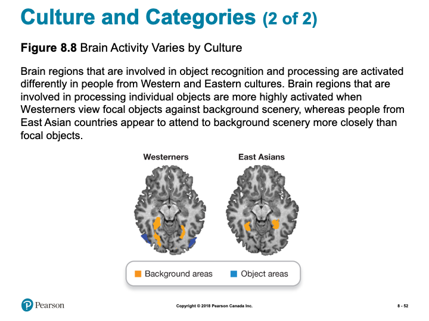

*Slide showing - Brain Activity Varies by Culture*

<h5>Myths in Mind: How Many Words for Snow?</h5>

- Inuit have many words for snow  
  - Aput = snow on the ground  
  - Gana = falling snow  
  - Exaggerated to dozens of words  
- Canadians have many words for snow  
  - Sticky snow  
  - Drifting snow  
  - Yellow snow  

<h5>8.2 Learning Objectives</h5>

- Know the key terminology of problem solving and decision making.  
- Understand the characteristics that problems have in common.  
- Understand how obstacles to problem solving are often self-imposed.  
- Apply your knowledge to determine if you tend to be a maximizer or a satisficer.  
- Analyze whether human thought is primarily logical or intuitive.  

<h5>Defining and Solving Problems (1 of 2)</h5>

- Problem solving (p. 304)  
  - Algorithms (p. 304)  
  - Heuristics (p. 304)  

*Slide showing - Problem Solving in Hangman*

*Slide showing - The Nine-Dot Problem*

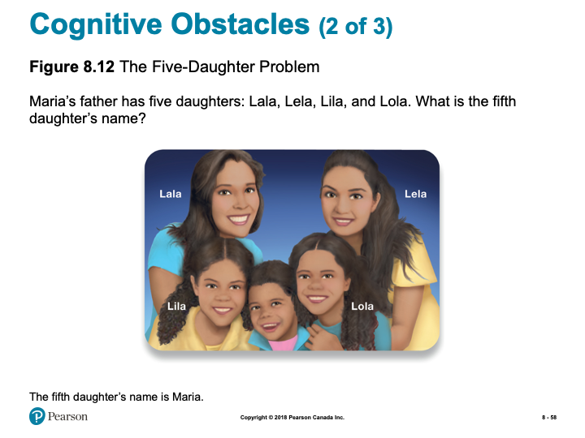

*Slide showing - The Five-Daughter Problem*

*Slide showing - The Two-String Problem*

<h5>Representativeness and Availability</h5>

- Conjunction fallacy (p. 308)  
- Representativeness heuristic (p. 308)  
- Availability heuristic (p. 308)  

<h5>Anchoring Effects</h5>

- Anchoring effect (p. 310)  
  - In what year did British Columbia become part of Canada?  
  - More affected when generated by individual  

<h5>Framing Effects (1 of 2)</h5>

- Decision-making influenced by how problem is framed (p. 310)  
- Example: Vaccine A vs. Vaccine B  

*Slide showing - Framing Effects*

<h5>Belief Perseverance and Confirmation Bias</h5>

- Belief perseverance (p. 310)  
- Confirmation bias (p. 311)  
  
Can dramatically influence beliefs, especially for complex, emotionally-charged issues (e.g. politics)

<h5>What do we know about maximizing and satisficing?</h5>

- Two types of consumers  
  - Satisficers = "good enough*  
  - Maximizers = evaluate every option  
- Paradox of choice  

How can scientists explain maximizing and satisficing?  

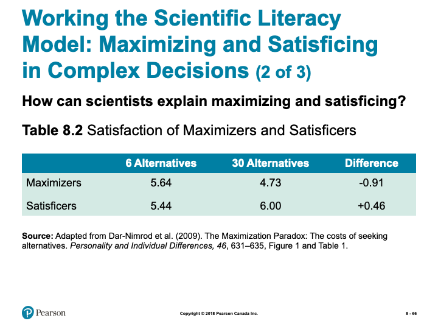

*Slide showing - Satisfaction of Maximizers and Satisficers*

<h5>Working the Scientific Literacy Model: Maximizing and Satisficing in Complex Decisions (3 of 3)</h5>

- Can we critically evaluate this information?  
  - Maximizers might expect more  
  - Correlational research  
  
- Why is this relevant?  
  - Planning for the future  
  
<h5>8.3 Learning Objectives</h5>

- Know the key terminology from the study of language.  
- Understand how language is structured.  
- Understand how genes and the brain are involved in language use.  
- Apply your knowledge to distinguish between units of language such as phonemes and morphemes.  
- Analyze whether species other than humans are able to use language.  

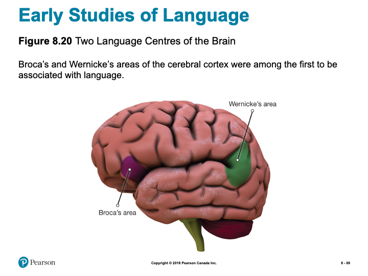

*Slide showing - Two Language Centres of the Brain*

<h5>Properties of Language</h5>

- Language (p. 317)  
- Unique features  
  - Communicate objects and events not in present time and place  
  - Produce new meanings  
  - Passed down naturally to children  

<h5>Phonemes and Morphemes: The Basic Ingredients of Language</h5>

- Phonemes (p. 318)  
  - “T” 

- Morphemes (p. 318)  
  - Pig, ish, or pigish  
  - Productivity  

- Semantics (p. 318)  

*Slide showing - How syntax helps us to understand language*

*Slide showing - Pragmatic Rules Guiding Language Use*

<h5>The Development of Language (1 of 2)</h5>

Infants, sound perception, and language acquisition

- Identifying Sounds  
- Fast mapping (p. 320)  

*Slide showing - Milestones in Language Acquisition and Speech*

<h5>Sensitive Periods for Language</h5>

- Sensitive period  
  - Brains are primed to develop language skills  
  - Ability fades starting seventh year  
  - Same with sign language  

<h5>The Bilingual Brain</h5>

- Costs  
  - Smaller vocabulary  
  - Word access  

- Benefits  
  - Executive functions  
  - Health benefits  

<h5>Working the Scientific Literacy Model: Genes and Language (1 of 4)</h5>

- What do we know about genes and language?  
  - Language evolved to solve problems  
  - Number of genes involved  

- Which scientific evidence supports a genetic basis of language?  
  - FOXP2 gene  

*Slide showing - Inheritance Pattern for the Mutated FOXP2 Gene in the KE Family*

*Slide showing - Brain Scans Taken While Members of the KE Family Completed a Speech Task*

<h5>Working the Scientific Literacy Model: Genes and Language (4 of 4)</h5>

- Can we critically evaluate this evidence?  
  - Many genes work together  
  - FOXP2 not unique to humans  
    - Language is unique to humans  

- Why is this relevant?  
  - Links between genes and language  

<h5>Can Animals Use Language?</h5>

- Chimpanzee Viki  
  - Cross-fostered (p. 324)  
  - Four words  

- Chimpanzee Washoe  
  - ASL  
    - 200 signs  
    - Generalized words  

- Bonobo Kanzi  
  - Lexigrams  
    - 350 symbols  
    - 3,000 spoken words  

\BeginKnitrBlock{caution}

**Note:** the slides are intended to supplement the information found in your textbook. If you are having trouble viewing them, they can also be downloaded by scrolling to the bottom of the screen and clicking on the "Unit 1- Slides" link.*

\EndKnitrBlock{caution}

### Learning Activities: {-}

\BeginKnitrBlock{reflect}

**Chapter 2 Review Quiz**

- Practice Quiz to self-assess your own comprehension of important terms from Chapter 2.  
- Not for formal evaluation.  

**Problem Solving Activity**

- Solve some problems by utilizing some of the cognitive strategies we learned about in this topic.  

**Problem Solving Practice**

- Explore problem solving activities and reflect on the strategies you incorporate as you discover solutions.  

**Introduction to Visualization**

- Article introduces visualization and provides an opportunity to practice this skill.  

**Learning Lab Preparation** 

- Each topic will provide a question or scenario for you to consider prior to attending your Learning Lab. Be sure to carefully consider each prompt as you will be expected to contribute to the group discussion.  

\EndKnitrBlock{reflect}

### Resources {-}

Here are some additional resources that will help you complete this unit:

- Krause, M., Corts, D., Smith, S. C., & Dolderman, D. (2018). *Revel for An Introduction to Psychological Science, 2nd Canadian Edition.* Pearson Ed.  
- Other resources will be provided online.  

## What is Psychology

We begin our course with a quick challenge: ***In your own words, define "psychology."***

According to your definition, how is psychology different from other academic areas that would study humans (*for example, philosophy, literature, or history*)? If you said "Pyschology is different because it uses the scientific method"- give yourself a pat on the back

You will begin your study of the scientific method by reading your textbook. The parable below (*from Philipchalk's Social Psychology textbook*), however, helps illustrate the scientific method with three "helpful" approaches to a problem, including a simple experiment:

*Once upon a time there were three brothers. One day while they were working in their father's field, they saw an old man coming along the road. The old man greeted them, and then struggled on along the road, limping terribly. After that, every day at the same time, the brothers greeted the old man and watched as he hobbled by. When a month had passed, they were so impressed that they each did something. The first brother wrote a compelling story about perseverance in the face of the ravages of old age. It encouraged many people. The second brother painted a moving portrait of the old man, stooped over and limping along. People were inspired. The third brother, who had observed the old man very closely, asked him one day if he could exchange shoes with him. The old man was surprised, but he gladly agreed. When the old man walked away he did not limp. The next day the third brother gave the old man his shoes back and watched as he limped on his way. On the third day, the brother again exchanged shoes with the old man. Then he took the old man's shoes to a shoemaker and had them repaired. When the brother gave them back to the old man he was delighted. The old man put on the shoes, thanked the brother, and walked away without a limp.*

Although each brother made a positive contribution, the third brother solved the man's problem because he discovered its cause. To do this, ***he used the scientific method and he conducted an experiment (Philipchalk, 1994).***

I think psychology is one of the most interesting areas of study there is, first, because it studies people, people like you and me, and we’re interesting Second, I like psychology because it is so broad. Psychologists, as you will soon see, study everything from nerve conduction in single cells, all the way to the influence of groups on our behaviour—and everything in between. Finally, psychologists don’t just speculate and theorize, they look for evidence for their ideas. If they don’t find sufficient evidence, they change their ideas; and I like that. Which leads us back to the scientific method and how psychology began.

<!-- [plugin:content-inject](_alert)-->

### Learning Activity {-}

\BeginKnitrBlock{reflect}

**Chapter 2 Review Quiz** 

In order to review some of the major concepts from the text, take the following unmarked quiz. Although you will not be evaluated on these terms, they will assist you in the assignments for this course.

\EndKnitrBlock{reflect}

## Thinking and Problem Solving

### Thinking {-}

“So God created man in his own image, in the image of God created he him; male and female created he them.” (Genesis 1:27)

“I will praise thee; for I am fearfully and wonderfully made.” (Psalm 139:14)

The human image of God means many things. It seems that one aspect of this image is our thinking ability, including our ability to solve problems and speak. How important is our thinking ability in our reflection of God’s image? What does your answer mean for people with less ability? What about people who lose abilities due to accident or disease (e.g., Alzheimer’s patients)?

### Algorithms & Heuristics {-}

Algorithms and heuristics can be confusing. An algorithm is a guaranteed route to a solution, but it may be the long way around to success. If you knew a person lived somewhere in a large residence hall, an algorithm for finding that individual would be to knock on every door until you located the person. Heuristics, on the other hand, sug­gest that you would first ask friends where to locate the person, or check a list, then knock on the appropriate door to locate the person. Another way to think of heuristics is the phrase "rule of thumb." Can you think of some rules of thumb that you have learned from your various job experiences? They may have to do with how long to cook a hamburger, or when to refill a machine, or how to get a date.

Consider the following example and explanation taken from Invitation to Social Psychology by Ron Philipchalk:

<!-- [plugin:content-inject](../_1-1)-->

*In the second part of the book, they tell you how to crack a safe. There are all kinds of ninny-pinny, dopey things, like "It might be a good idea to try a date for the combination, because lots of people like to use dates." Or "Think of the psychology of the owner of the safe, and what he might use for the combination." And "The secretary is often worried that she might forget the combination of the safe, so she might write it down in one of the following places—along the edge of her desk drawer, on a list of names and addresses . . ." and so on . . . .*

*I also did a certain amount of systematic study. For instance, a typical combination was 69-32-21. How far off could a number be when you're opening the safe? If the number was 69, would 68 work? Would 67 work? On the particular locks we had, the answer was yes for both, but 66 wouldn't work. You could be off by two in either direction. That meant you only had to try one out of five numbers, so you could try zero, five, ten, fifteen, and so on. With twenty such numbers on a wheel of 100, that was 8000 possibilities instead of the 1,000,000 you would get if you had to try every single number. . . .*

*I practiced all the time on my own safe so I could do this process as fast as I could and not get lost in my mind as to which number I was pushing and mess up the first number. Like a guy who practices sleight of hand, I got it down to an absolute rhythm so I could try the 400 possible back numbers in less than half an hour. That meant I could open a safe in a maximum of eight hours—with an average time of four hours. (Surely You're Joking Mr. Feynman, p. 140)*

Mr. Feynman's safecracking system succeeds because he methodically works through every possible combination. By logical analysis he has discovered which 8,000 possibilities out of 1,000,000 he needs to try. We call this type of logical step-by-step procedure for solving problems an algorithm (Newell & Simon, 1972; Simon, 1981). If you use the correct algorithm your success is guaranteed.

But sometimes it can take a long time to discover the correct algorithm. And employing an algorithm is often time consuming. Mr. Feynman spent days developing his system and it took hours to open a safe. You could certainly open a safe much faster if you found the combination on the edge of the secretary's drawer.

The shortcuts Mr. Feynman calls "ninny-pinny, dopey things" are examples of heuristics. Heuristics are rule-of-thumb strategies for solving problems, shortcuts we develop from our experience. Heuristics often help us eliminate improbable alternatives and guide us to the most likely solution to a problem. Despite his appreciation for algorithms, Mr. Feynman discovered heuristics can be useful. He found, for example, that safe owners often did not bother to change the factory set combination when they received a new safe. In one office building the temporary factory combinations 25-0-25 or 50-25-50 opened one safe in five

Algorithms and heuristics are examples of cognitive strategies—mental plans we use to make decisions and solve problems.

<!--[plugin:content-inject](_activities)-->

### Learning Activities {-}

\BeginKnitrBlock{reflect}

**Read and Reflect**

In addition to the content above, you are also responsible for reading through the following:

*Krause et. al (2018). Revel for An Introduction to Psychological Science, 2nd Canadian Edition. Chapter 8*

While all of these pages may not relate directly to this unit’s discussion, consistent reading will help you keep pace, as well as provide necessary background knowledge when you need it.

**Problem Solving Activity**

In this lesson, we spent time exploring cognitive strategies used to solve problems and make decisions. We now have an opportunity to practice this on our own Take a look at the following problems and see if you can find a solution. As you work through the problems, think about what cognitive strategies you are implementing as you make each decision:

***Problem A***

- Take a look at the following Roman Numeral: **IX**
- Now add one line to the Roman numeral **IX** to make it six

 

Click here for the solution.

The answer is to add a curved line shaped like an "S" (i.e., "SIX"). In writing, the problem looks simple, but you might want to try it aloud on a friend. There is a mental set that one must add a straight line and have some form of Roman numeral on the page.

***Problem B***

Your task is to plant trees on Arbor Day. You have ten trees that must be planted in five rows of four trees each. How would you plant the trees?

Click here for the solution.

The answer is that you would arrange them at the vertices and cross-points of a 5-pointed star 

**Problem Solving Practice**

Below is a website that provides more opportunity to work through, and solve, some problems. Specifically, this resource explores the idea of ***Assumptions*** and the role assumptions play when solving problems. Furthermore, this is a valuable resource as it also explores other important techniques to be implemented when solving problems.

Click on the following link and read through the information as you continue to practice your problem solving:

[**Virtual Salt**](https://www.virtualsalt.com/crebook4.htm)

#### Learning Lab Preparation {-}

Your Learning Lab for this unit will focus on group discussion as explore the topics of this unit in more detail. As you prepare for your Learning Lab, one possible scenario that discussion will focus on is below- please prepare some thoughts to share with the group:

 In the largest sense, society is breaking into two classes:

*The first class are people who know how to think. These people realize that most problems are open to examination and creative solution. If a problem appears in the lives of these people, their intellectual training will quickly lead them to a solution or an alternative statement of the problem. These people are the source of the most important product in today's economy – ideas.*

 *The second class, the vast majority of society, are people who cannot think for themselves. I call these people ‘idea consumers’ – metaphorically speaking, they wander around in a gigantic open-air mall of facts and ideas. The content of their experience is provided by television, the Internet and other shallow data pools. These people believe collecting images and facts makes them educated and competent, and all their experiences reinforce this belief. The central, organizing principle of this class is that ideas come from somewhere else, from magical persons, geniuses, ‘them.’*

Consider the following prompts to help better prepare for the discussion:

- ***Do you agree or disagree with this claim?***  
- ***Do you know people that fit in the second category? What causes this difference? How might it be changed?***  

\EndKnitrBlock{reflect}

## Cognitive Biases

As if the biases mentioned in the textbook are not enough, here are a few more to watch out for, taken from Invitation to Social Psychology by Ron Philipchalk.

### The Gambler's Fallacy {-}

Jill and Bob are the parents of three boys. Jill is pregnant again, and she and Bob are hoping the baby is a girl. In fact, they are confident the baby must be a girl because their previous three children were boys. If you agree with Jill and Bob that the baby is more likely to be a girl than a boy, then you—along with Jill and Bob—may be committing the gambler's fallacy. No matter how many boys have been born, the likelihood of a girl being born is the same as it always was, approximately 50 % (assuming no biological abnormality or medical intervention).

The gambler's fallacy arises from our failure to recognize the independence of unconnected events. The result of a coin toss does not depend on the outcome of previous tosses; a child's sex at conception is not affected by the sex of prior conceptions; the cards dealt in a hand are not influenced by the distribution of cards on the previous deal; and so on. Each event in these sequences is independent of the others, although we tend to think that somehow there must be a connection.

### The Anchoring and Adjustment Heuristic {-}

First impressions of a person exert a powerful influence on the way we interpret subsequent information about that person. This effect may be an example of a more general principle called the anchoring and adjustment heuristic. Information we use to establish a starting value (or anchor point) tends to be more influential in our decisions than subsequent information we use to adjust this value (Tversky & Kahneman, 1974).

Daniel Cervone and his colleagues found, for example, that initial success or failure on a task can establish an anchor for feelings of self-efficacy. Students who initially succeed on a task and later fail have higher feelings of self-efficacy than students who initially fail and later succeed even though their overall level of success is the same. Final judgments of self-efficacy are biased in the direction of initial judgments (Cervone & Palmer, 1990; Peake & Cervone, 1989).

Salespeople often use the anchoring and adjustment heuristic to their advantage. Some real estate agents routinely show their clients an over-priced and unattractive house first in order to set an anchor point which, in effect, says, "The kind of house you want is going to cost a lot." Once established, this expectation of high price changes very slowly and the clients are relieved to find an acceptable house in their price range (Northcraft & Neale, 1987).

Car dealers too like us to set our sights high. Their so-called list price establishes an anchor or reference point that overshadows our subsequent evaluations, as I recently discovered. In looking for a certain model of car, I was attracted to a particular vehicle with an asking price of $3,800 ("reduced from $4,200"). I believed this price was too high, so I bargained with the vendor. Eventually, I bought the car for $2,800. Did the high original asking price affect my decision? Yes, it probably did. Subsequent events indicated I still paid too much. I later bought an identical model in only slightly poorer condition for $2,000. I was a victim of the anchoring and adjustment heuristic.

***Contrast Effects***

My car purchase also illustrates a related distortion in judgment, the contrast effect. In contrast to the original price of $4,200 my offer of $2,800 seemed like a bargain. John Lynch, Jr. and his colleagues (1991) found a similar effect with students. The students rated low-priced cars as less expensive when they were considered alongside high-priced cars (contrast effect), compared to when they were considered along with other low-priced cars (no contrast).

Research by Douglass Kenrick and his colleagues indicates that we also show contrast effects in evaluating other people. In one study (1980), male college students rated the attractiveness of potential blind dates. Subjects who gave their ratings after watching a TV show with attractive female actresses rated the potential dates as less attractive than did subjects who rated their potential dates before watching the show. In another study (1989), after viewing centerfold erotica, men found average women—and even their own wives—less attractive.

### Heuristics & Biases {-}

By now you may be wondering why we fall prey to so many cognitive biases and errors. Well don’t worry; our biases are actually a side effect of our cognitive efficiency. Most of our biases result from using heuristics, rules of thumb, or mental shortcuts that work very well. Sometimes they let us down, but overall, they improve the speed with which we handle mental problems—much like Mr. Feynman’s safe-cracking tricks. As we noted in the previous discussion, you could certainly open a safe much faster if you found the combination on the edge of the secretary's drawer. However, you won’t always find the combination there, so limiting yourself to this approach would produce a kind of “cognitive bias” in your safe-cracking strategy.

### RESOURCES: Online Articles of Interest {-}

For additional information and examples, click on the link below:

[**Cognitive Biases**](https://en.wikipedia.org/wiki/List_of_cognitive_biases)

<!-- [plugin:content-inject](_activities) -->

\BeginKnitrBlock{reflect}

### Learning Lab Preparation {-}

Another focus of our discussion during our Learning Lab for this unit, will focus on biases. In order to prepare for participation in this discussion, consider the guiding prompt below- be sure to have some thoughts to contribute to the discussion:

***Give an example from your own experience of one of the cognitive biases, discussed here or in the textbook, that you have fallen prey to.*** 

\EndKnitrBlock{reflect}

## Language and Thought

### Linguistic Relativity {-}

Benjamin Whorf’s linguistic relativity hypothesis suggests that our language affects the way we see the world. Do you know any examples of weather terms, for example, that are unique to one area? Could knowing these terms help you to notice differences in weather that outsiders might not notice? What about in sports? Sports fans usually know terms to de­scribe certain strokes or plays. Does knowledge of these terms affect percep­tion? Can you think of some examples? What does it mean to “clothesline” someone, or “post-up,” or “birdie?”

### Imaginary Practice {-}

Mental practice is now widely accepted in many areas. The following excerpt is taken from the [**GolfPsych**](https://www.golfpsych.com) website. You may find further examples there as well.

"You can practice the mental aspects of your game anytime. We encourage our clients to do imagery practice of playing well in upcoming tournaments. This imaginary practice includes seeing the course, situation, doing a full mental pre-shot routine and seeing a good shot. You should also be feeling the way you do when you play your best. In addition, you should be practicing deep breathing and quieting your mind off-course. This is an extremely valuable tool that must be practiced to be effective. The mental game is much more than thinking positive thoughts. Take our Personality Assessment and get your own GolfPsych Report to receive our recommendations for you based on your personality and our research. Reading our book will also help you understand all aspects of a good mental game. During your practices and before your rounds you should also be practicing your mental skills."

<!-- [plugin:content-inject](_activities) -->

### Learning Activity {-}

\BeginKnitrBlock{reflect}

#### Introduction to Visualization {-}

In this Topic, we learned about the notion of mental practice. Below is an article that will take you through the process of visualization. Take some time to read the article and practice for yourself. Pay careful attention to your thoughts, your focus, your feelings as you engage in the process.

- [**Introduction to Visualization**](https://www.forbes.com/sites/bhaligill/2017/06/22/new-to-visualization-here-are-5-steps-to-get-you-started/#60dafcdc6e3f)  

#### Learning Lab Preparation {-}

The subject of our focus for this Topic has been on the power of language in influencing how we see the world. Our discussion during Learning Lab this week will focus on the importance of language in the Bible (and other religious writings) and how it "shapes" how we see the world.

To prepare for this discussion, consider the following prompt:

***Give some examples of the importance of language in the Bible or other religious writings.***

\EndKnitrBlock{reflect}

## Animal Language

### Language {-}

As a Christian I am pleased to see in psychology the resurgence of interest in studying some of what Ronald Koteskey (1980) calls humanity's "God-like" characteristics, creativity, imagery, and particularly language.

The use of words is extremely important in Christian scripture. God spoke the creation into existence; Jesus is called the Word; the significance of Babel and Pentecost are closely linked to the importance of language; and there is great power associated with an individual's name. In addition, Christians have usually considered the ability to communicate with words to be part of the image of God in man. However, recently several researchers claim to have taught animals, usually chimpanzees or apes, to communicate through language. Using sign language, blocks, or keyboards and computer- generated voices, the animals have signaled their needs and even generated word combinations.

But is this truly language? There is no doubt that the animals are using symbols as signs to stand for objects and actions. However, there are significant questions being raised about the comparison with human language.

Christians need to think carefully about what they mean when they talk about the image of God in man. The area of human learning and psycholinguistics offers some intriguing questions for thoughtful Christians. What is the origin of human speech-is it learned (as Skinner would say) or largely innate (as Chomsky would say)? Is human speech unique? Do the studies of language in animals necessitate a redefinition of the uniqueness of man? (Based on Psychology and Christianity by Ron Philipchalk, p. 102)

#### RESOURCES: Online Articles of Interest {-}

To add to our exploration of this topic, take a moment to read the following articles:

- [**Chimp Talk Debate: Is It Really Language?**](http://tuvalu.santafe.edu/~johnson/articles.chimp.html)  

- [**Animal Language and Cognition Projects**](https://www.massey.ac.nz/~alock/hbook/ristau.htm)  

<!-- [plugin:content-inject](_activities) -->

#### Learning Lab Preparation {-}

\BeginKnitrBlock{reflect}

Finally, take a moment to consider the following questions:

***How important for our understanding of who we are as humans is the distinctiveness of our language ability? Is it a sign of the image of God?***

Be prepared to share your thoughts during discussion at your Learning Lab.

\EndKnitrBlock{reflect}

## Assessment {-}

\BeginKnitrBlock{assessment}

While there is no "formal" assignment that you will be responsible for submitting for Unit 1, you will be expected to participate in discussion during your Learning Lab. Your facilitator will be providing a participation mark based on your contributions. Below is some information to consider prior to attending your Learning Lab:

*Active participation in group exercises, reflection, and critical discourse is an essential component of this course. You are expected to show respect for all members of the course, both in your speech and actions. Contribute by actively observing and listening, raising thoughtful questions, examining relevant issues, building on others’ ideas, analyzing and evaluating the group’s thinking, synthesizing key points, and expanding the group’s perspectives. Take care not to dominate a conversation, giving space for others to speak. When in small groups help maintain the focus, flow, and quality of conversations, and take the initiative to invite others (particularly those who are quiet) to speak.*

**Rubric for Participation in Learning Labs**

| Emerging (0-64%) | Developing (65-89%) | Mastering (90-100%)|
|-|-|-|
|Never to almost never: Demonstrates active listening (as indicated by disengaged body language and no to rare comments that build on others’ remarks),Initiates any contributions in class or small groups, Makes insightful or constructive comments, Helps maintain a supportive space for others to speak.|Sometimes to fairly often: Demonstrates active listening (as indicated by somewhat to often engaged body language and comments that build on others’ remarks), Initiates a contribution at least once in a class or small group discussion; Makes insightful or constructive comments, Helps maintain a supportive space for others to speak.|Very often to nearly always: Demonstrates active listening (as indicated by fully engaged body language and comments that build on others’ remarks), Initiates more than one contribution in a class or small group discussion, Makes insightful or constructive comments, Creates a space for others to speak and takes initiative to include others.|

\EndKnitrBlock{assessment}

## Checking your Learning {-}

\BeginKnitrBlock{progress}

Before you move on to the next unit, check that you are able to:

- Define key terminology related to principles of scientific research, research designs, and statistics.
- Explain the five characteristics of quality scientific research, and the pros and cons of descriptive, correlational, and experimental research designs.
- Determine how biases might influence the outcome of a study and how experiments help demonstrate cause-and-effect relationships.
- Apply the concepts of reliability and validity to examples and concepts of experimental methods to research examples.
- Assess whether anecdotes, authority figures, and common sense are reliably truthful sources of information.
- Understand what it means for variables to be positively or negatively correlated and how and why psychologists use significance tests.

\EndKnitrBlock{progress}

<!--chapter:end:02-u1.Rmd-->

# Intelligence Testing

## Overview {-}

In this unit, you will learn about techniques and tools for measuring intelligence, different theories as to what constitutes intelligence, and the biological, environmental, and behavioural factors that influence intelligence.

### Topics {-}

This unit is divided into the following topics:

1. What is Intelligence?
2. Extremes of Intelligence
3. Nature-Nature and IQ

### Learning Outcomes {-}

By the end of this unit, students will be able to:

- Know and define the key terminology associated with understanding intelligence, intelligence testing, and heredity, environment, and intelligence.  
- Understand the reasoning behind the eugenics movements and its use of intelligence tests, why intelligence is divided into fluid and crystallized types, and the genetic basis of intelligence.  
- Apply the concepts of entity theory and incremental theory to help kids succeed in school, to identify examples from the triarchic and multiple theories of intelligence, and to recognize environmental and behavioural effects on intelligence to understand how to enhance your own cognitive abilities.  
- Analyze why it is difficult to remove all cultural bias from intelligence testing and whether teachers should spend time tailoring lessons to each individual student’s learning style.  

### Activity Checklist {-}

\BeginKnitrBlock{reflect}

Here is a checklist of learning activities you will benefit from in completing this unit. You may find it useful for planning your work.

<!-- [plugin:content-inject](_schedule) -->

**Read and Reflect**

- Read *Krause et al. (2021). Revel for An Introduction to Psychological Science, 3rd Canadian Edition*  
- Review **Unit 2 - Slides**

 
CLICK HERE

<h5>Agenda</h5>  

- Chapter 9 – Intelligence Testing  
  - Biblical Word Study Related to Ch. 8  

<h5>Proverbs 2:6</h5> 

-  For the LORD gives wisdom, and from his mouth come knowledge and understanding.  

<h5>Greek Word Study</h5> 

- Wisdom  
  - Gr. $\Sigma\omicron\phi\iota\alpha$ (Sophia) (Noun) – wisdom in general, knowledge; ability; practical wisdom, prudence; learning, science; scientific skill; professed wisdom, human philosophy, superior knowledge and enlightenment; in N.T. divine wisdom, Christian enlightenment  
- Wise  
  - Gr. $\Sigma\omicron\phi\omicron\varsigma$ (Sophos) (Adjective) – wise generally; shrewd, clever; learned, intelligent; in N.T. divinely instructed; furnished with Christian wisdom, spiritually enlightened
- Intelligence  
  - Gr.$\Sigma\upsilon\nu\eta\sigma\iota\varsigma$ (Noun) – pr. a sending together, a junction, as of streams; met. understanding, intelligence, discernment; the understanding, intellect, mind  
- Intelligent  
  - Gr. $\Sigma\upsilon\nu\eta\tau\omicron\sigma$ (Synetos) (Adj.) – intelligent, discerning, wise, prudent (cautious; worldly wise; exercising sound judgment)  

<h5>The Psychology of Wisdom</h5> 

- Difficult life dilemmas:
  - “A 15yearold girl wants to get married right away. What should one/she do and consider?” 
- Or, “Imagine a good friend of yours calls you up and tells you that she can’t go on anymore and has decided to commit suicide. What would one/you be thinking about? How would one deal with this situation?”  
- Or, “A 60 year old widow has recently completed a college degree and opened a business, only to learn that her son has been left alone with two small children to care for. What should she do?”  

<h5>Chapter 9 : Intelligence Testing </h5> 

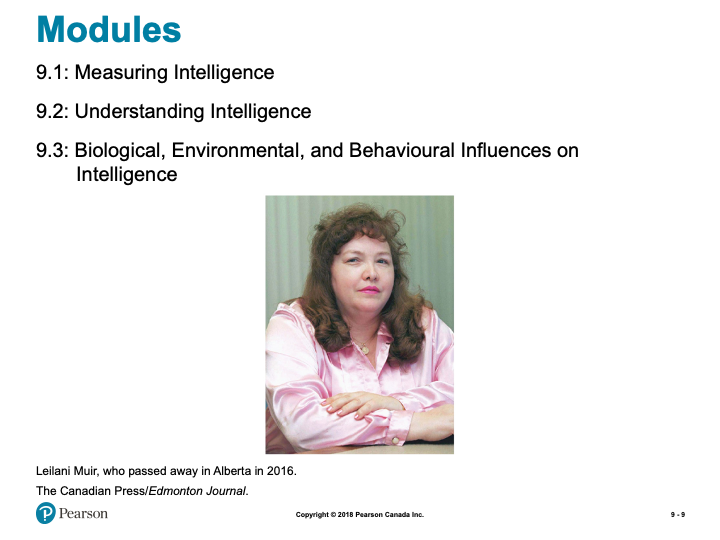

*Modules*

<h5>9.1 Learning Objectives</h5>

- Know the key terminology associated with intelligence and intelligence testing.  
- Understand the reasoning behind the eugenics movements and its use of intelligence tests.  
- Apply the concepts of entity theory and incremental theory to help kids succeed in school.  
- Analyze why it is difficult to remove all cultural bias from intelligence testing.  

<h5>Different Approaches to Intelligence Testing (1 of 2)</h5>

- Sir Francis Galton  
  - Anthropometrics (p. 329)  
- Alfred Binet  
  - Intelligence (p. 330)  
  - Mental age (p. 330)  
- Lewis Terman  
  - Stanford-Binet Test (p. 330)  
- William Stern  
  - Intelligence Quotient (IQ) (p. 330)  

*Slide showing - The Normal Distribution of Scores for a Standardized Intelligence Test*

*Slide showing - Subscales of the Wechsler Adult Intelligence Scale*

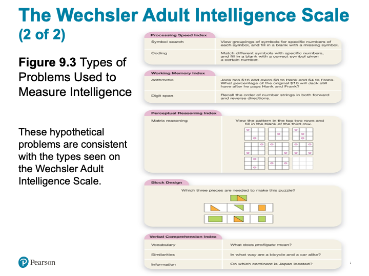

*Slide showing - The Wechsler Adult Intelligence Scale*

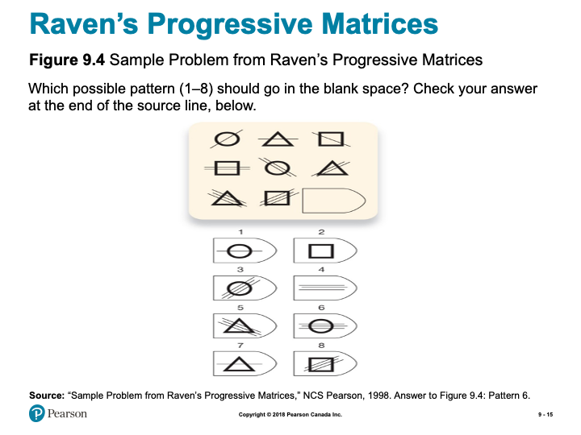

*Slide showing - Sample Problem from Raven’s Progressive Matrices*

<h5>The Checkered Past of Intelligence Testing</h5>

- IQ Testing and Eugenics  
  - Historical context  
  - Social Darwinism  
  - Eugenics  

<h5>The Race and IQ Controversy</h5> 

- Racial differences in IQ scores Problems with the racial superiority interpretation  
  - Culturally biased test content  
  - Culturally biased test process  
  - Stereotype threat (p. 336)  

<h5>Working the Scientific Literacy Model: Beliefs About Intelligence (1 of 3)</h5> 

- What do we know about the kinds of beliefs that may affect test scores?  
  - Entity theory (p. 336)  
  - Incremental theory (p. 336)  
- How can science test whether beliefs affect performance?  

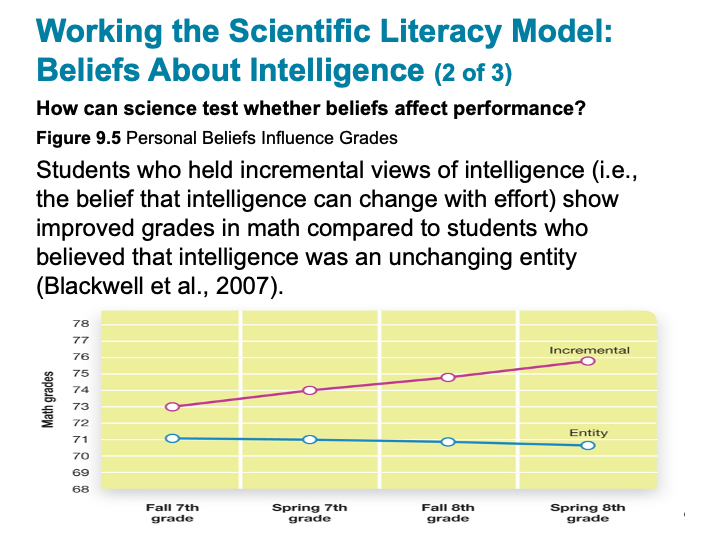

*Slide showing - Personal Beliefs Influence Grades*

<h5>Working the Scientific Literacy Model: Beliefs About Intelligence (3 of 3)</h5>

- Can we critically evaluate this research?  
- Why is this relevant?  

<h5>9.2 Learning Objectives</h5>

- Know the key terminology related to understanding intelligence.  
- Understand why intelligence is described as a hierarchy.  
- Understand intelligence differences between males and females.  
- Apply your knowledge to identify examples that reflect fluid vs. crystallized intelligence.  
- Analyze whether teachers should spend time tailoring lessons to each individual student’s learning style.  

<h5>Intelligence as a Single, General Ability (1 of 3)</h5>

- Spearman’s general intelligence  
  - General intelligence factor, “g” (p. 340)  

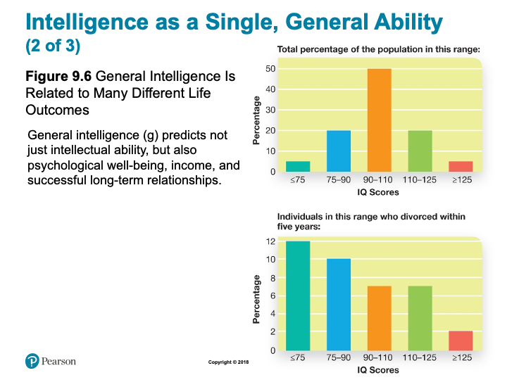

*Slide showing - General Intelligence Is Related to Many Different Life Outcomes*

*Slide showing - General Intelligence Is Related to Many Different Life Outcomes*

<h5>Spearman’s General Intelligence</h5>

- Does “g” tell us the whole story?  

<h5>Intelligence as Multiple, Specific Abilities</h5>

- Spearman  
  - Two factors: “g” and “s”  
- Thurstone  
  - 7 primary mental abilities  
- Hierarchical model of intelligence  
  - Nesting  

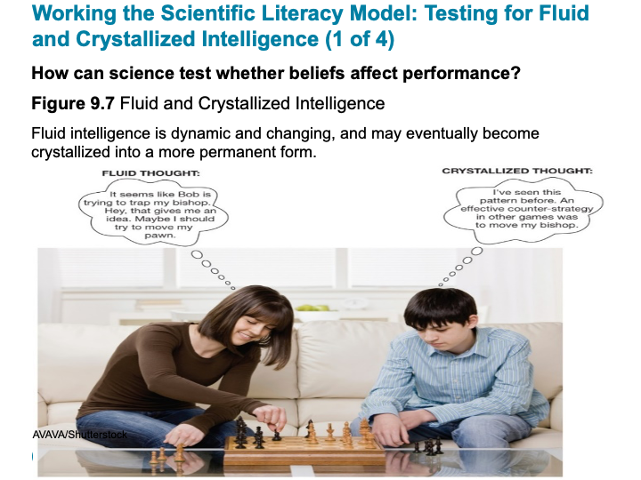

*Slide showing - Fluid and Crystallized Intelligence*

*Slide showing - Measuring Fluid Intelligence*

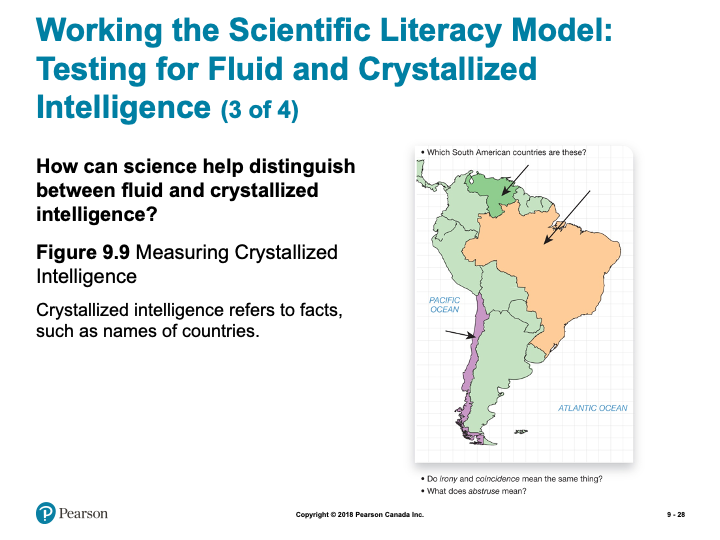

*Slide showing - Measuring Crystallized Intelligence*

<h5>Working the Scientific Literacy Model: Testing for Fluid and Crystallized Intelligence (4 of 4)</h5>

- Can we critically evaluate crystalized and fluid intelligence?  
  - Gf is a blend of several different cognitive abilities  
  - Gf and Gc are not entirely separable  

<h5>Why is this relevant?</h5>

- Stereotypes related to intelligence and age  

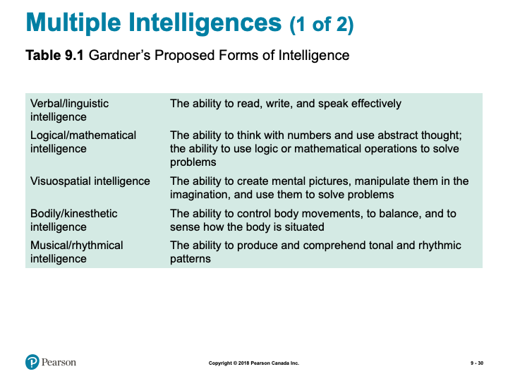

*Slide showing - Gardner’s Proposed Forms of Intelligence*

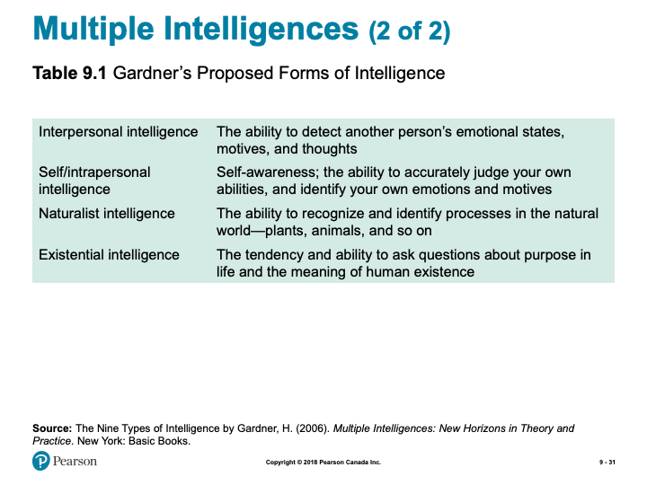

*Slide showing - Gardner’s Proposed Forms of Intelligence*

<h5>Myths in Mind: Learning Styles</h5>

- Visual learners should learn more with visual materials?  
  - Lack of supporting evidence  
- Focus on learning the meaning  

<h5>PSYCH @ The NHL</h5>

- Head injuries in the NHL  
- Chronic traumatic encephalopathy  
- ImPACT  
  - Regular testing checks for declines on specific abilities  

<h5>The Battle of the Sexes?</h5>

- Differences in intelligence?  
  - No sex differences found  
  - Male scores have greater variability  

- Do males and females have unique cognitive abilities?  
  - Females: verbal, memory, emotions  
  - Males: visuospatial  
  - Stereotype threat  

<h5>9.3 Learning Objectives</h5>

- Know the key terminology related to heredity, environment, and intelligence.  
- Understand different approaches to studying the genetic basis of intelligence.  
- Apply your knowledge of environmental and behavioural effects on intelligence to understand how to enhance your own cognitive abilities.  
- Analyze the belief that older children are more intelligent than their younger siblings.  

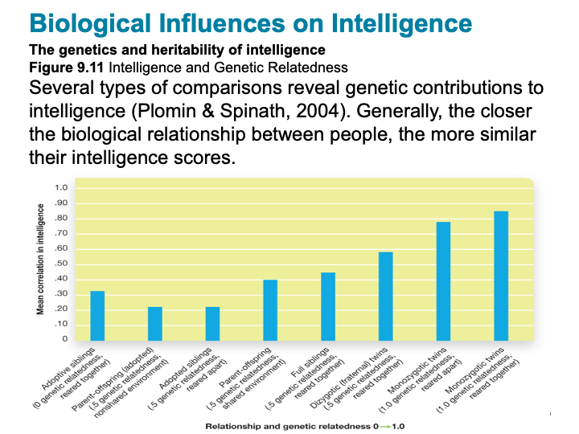

*Slide showing - Intelligence and Genetic Relatedness*

<h5>Working the Scientific Literacy Model: Brain Size and Intelligence (1 of 3)</h5>

- What do we know about brain size and intelligence?  
  - Once believed brain size was related to intelligence  
    - Contributed to prejudice  

*Slide showing - Does Intelligence Increase with Brain Size?*

<h5>Working the Scientific Literacy Model: Brain Size and Intelligence (3 of 3) </h5>

- Can we critically evaluate the issue?  
  - Which abilities underlie the correlation?  
  - Third-variable problem  

- Why is this relevant?  
  - Brain size and IQ used to understand clinical conditions  
    - Prolonged anorexia nervosa and alcohol abuse  

<h5>Environmental Influences on Intelligence</h5>

- Nutrition  
- Socioeconomic Status (SES)  
- Stress  
- Birth Order  
- Education  

*Slide showing - The Flynn Effect*

<h5>Behavioural Influences on Intelligence</h5>

- Brain training programs  
- Nootropic drugs (p. 358)  

\EndKnitrBlock{reflect}

\BeginKnitrBlock{caution}

**Note:** the slides are intended to supplement the information found in your textbook. If you are having trouble viewing them, they can also be downloaded by scrolling to the bottom of the screen and clicking on the "Unit 2 - Slides" link.*

\EndKnitrBlock{caution}

\BeginKnitrBlock{reflect}

**Intelligence Testing**

- Take some intelligence tests for yourself. As you complete them, consider how they might be considered beneficial, and controversial, as measures of intelligence.

**I.Q. Testing**

- Take some I.Q. Tests. Consider how valid and reliable these results are and think about how meaningful the results are.

**Ch. 9 Key Terms Quiz**

- Practice quiz to assess how well you know key terms from Chapter 9.  
- Not for formal evaluation.  
- Each topic will provide a question or scenario for you to consider prior to attending your Learning Lab. Be sure to carefully consider each prompt as you will be expected to contribute to the group discussion.  

\EndKnitrBlock{reflect}
### Resources {-}

Here are some additional resources that will help you complete this unit:

- Krause, M., Corts, D., Smith, S. C., & Dolderman, D. (2018). *Revel for An Introduction to Psychological Science, 2nd Canadian Edition.* Pearson Ed.  
- Other resources will be provided online.  

## What is Intelligence?

### Intelligence {-}

As David Myers points out, intelligence is a slippery concept. We all have an idea of what it refers to, but we cannot agree on a single definition. Perhaps the most helpful advice is to remember, as Myers points out, that “intelligence is a socially constructed concept. Cultures deem ‘intelligent’ whatever attributes enable success in those cultures” (2010). Historically, in North American culture, the idea of intelligence performance on an IQ test. The composition of these tests reflected North American culture’s emphasis on particular mental abilities, specifically, those associated with success in an academic setting. More recently, we have come to realize that there are many kinds of intelligence. In this unit we will consider some varieties of intelligence, or multiple intelligences.

### Types of Intelligence {-}

***Emotional Intelligence***

I have to admit that when I first heard of emotional intelligence (EI) I was skeptical. It sounded like popular psychology - someone trying to make a buck preying on our need for self-knowledge. However, upon further investigation I found that EI was linked to social intelligence (the ability to understand and relate to people), a concept developed by the pioneering psychologist E.L. Thorndike in 1920. And upon still further investigation, I found EI made a lot of sense.

## Sternberg's Three Components of Intelligence

Robert Sternberg wanted to show that intelligence was more than just one general ability (known as *g theory*). He believed our intelligence is best classified into three areas that predict real - world success: ***analytical, creative, and practical.*** The following article does a great job explaining the Triarchic Theory of Intelligence and its three sub-theories. It also makes note of the criticisms that have been brought against this theory. *To better understand Sternberg’s Three Components of Intelligence follow the link below:*

- [**Three Components of Intelligence**](https://www.thoughtco.com/triarchic-theory-of-intelligence-4172497)

## Gardner's Eight Types of Intelligence

Howard Gardner put together a robust, research-based theory of Multiple Intelligences. He put forth an understanding of intelligence promoting our abilities are best classified into nine independent intelligences, which include a broad range of skills beyond traditional school smarts. This illuminating read that can help you understand what your primary intelligences are. Follow the link below:

- [**Eight Types of Intelligence**](https://www.institute4learning.com/resources/articles/multiple-intelligences/)

### Resources: Online Articles of Interest {-}

To add to your exploration of this topic, take a moment to read the following articles:

- [**Emotional Intelligence Consortium Website**](http://www.eiconsortium.org/)  

- [**EQI Web Resource**](http://eqi.org/)  

<!-- [plugin:content-inject](_activities) -->

### Learning Activity {-}

\BeginKnitrBlock{reflect}

#### Intelligence Testing {-}

In this unit we investigated Intelligence Testing. One of the important concepts we learned was that Intelligence Testing can be controversial due to its socially constructed nature.

Below is a link to a website that will allow you to take some Intelligence Tests for yourself. As you work through each test, and see the results, think about why we might consider these types of tests beneficial, and why they might be considered controversial.

- [**Emotional Intelligence Test**](https://www.queendom.com/tests/)  

#### Learning Lab Preparation {-}

Our Learning Lab for this unit will focus on Intelligence Testing. As we have seen, Intelligence Testing is best implemented after careful consideration - this will be the focus of our discussion during this unit's Learning Lab. To help you prepare, consider the following questions:

- ***How do you feel about the EMOTIONAL INTELLIGENCE TESTS? Did you learn anything? If so, what were the important areas that were illumined by the test?***  
- ***Is ‘emotional intelligence’ a valid concept worth measuring?***  
- ***Do you believe E-IQ is more important than "intelligence" as measured by IQ scores for success and happiness in your life?”***  

\EndKnitrBlock{reflect}

## Extremes of Intelligence

### IQ Testing {-}

In this section we continue to build upon our understanding of intelligence and testing to focus on Intelligence tests and those who score at the "extremes." Intelligence tests are the most common tool used to measure intelligence. Intelligence test are one method of assessing an individual’s mental aptitudes and comparing them with those of others using numerical scores. These scores are then plotted on a normal (bell) curve to estimate where a person’s intelligence rates in relation to a standardized population. The extremes of intelligence is the understanding that on one end of the continuum are those with intellectual disabilities and on the other end are those who are geniuses.

### Resources {-}

To supplement our understanding of this topic, take a moment to explore the following resources:

- [**The Arc**](https://thearc.org/)  

- [**MENSA International**](https://www.mensa.org)  

<!-- [plugin:content-inject](_activities) -->

### Learning Activity {-}

\BeginKnitrBlock{reflect}

#### IQ Testing {-}

After considering the above, and having read the textbook’s discussion of intelligence testing, you might want to try some tests yourself. The value in doing this is not that you will get an accurate idea of your IQ score, but rather that you might get a better understanding for some of the problems in testing. As you try some of the tests at the following sites, remind yourself of the problems of test standardization, validity, and reliability. How well do you think these tests measure up?

- [**Queendom IQ Test**](https://www.queendom.com/tests/index.htm)  
- [**davideck.com**](http://www.davideck.com/)  

#### Learning Lab Preparation {-}

As we prepare for our Learning Lab this week, we consider intelligence from a Christian perspective. Read the following passage and carefully consider the questions below to help prepare for our discussion:

*The Bible says, in James; Chapter 2:*

*My brothers, as believers in our glorious Lord Jesus Christ, don't show favoritism. Suppose a man comes into your meeting wearing a gold ring and fine clothes, and a poor man in shabby clothes also comes in. If you show special attention to the man wearing fine clothes and say, "Here's a good seat for you," but say to the poor man, "You stand there" or "Sit on the floor by my feet," have you not discriminated among yourselves and become judges with evil thoughts?*

- ***Could we be guilty of favoritism in esteeming more intelligent people above less intelligent people? In society? In Church?***

\EndKnitrBlock{reflect}

## Nature-Nature and IQ

While the debate rages over the relative contributions of nature and nurture to IQ, no one denies that heredity (nature) plays some role. The question arises then, “So what?” Are we going to try to control (and presumably increase) IQ through genetic engineering or some other method of eugenics (*Eugenics is the search for hereditary factors that give people an evolutionary advantage; translated it can mean “good genes” or “good origin”*)? Are we going to control who should have children and how many, allowing the most intelligent parents to have more children and restricting the less intelligent? When the genetic basis for IQ (or some other component of intelligence) is identified, will parents select embryos with greater potential? For more on this topic see the following quote and the website from which it came.

“If we are concerned for the future of the (hopefully) millions of generations still to be born, we must realize that their fate lies to a considerable extent in the breeding practices of those who are currently alive.” *(Intelligence and Eugenics)*

## What Will You Do?

If or when you have children, will you ban screens (TV, smart phone, tablet, laptop) as a “brain rotter” and read to them every day? Or will you just let nature take its course and allow both screens and reading?

## Test Biases?

IQ tests are generally valid for their original purpose—as predictors of aca­demic performance. Controversy arises when IQ scores are taken to mean over­all intelligence and even overall worth. IQ scores consistently predict that some cultural and racial groups will do better at school than will other groups. These differ­ences are an indication of bias not in the IQ tests but in the back­grounds and academic settings that first create and then magnify differences.

### Resources {-}

To supplement our understanding of this topic, take a moment to read through the following:

- [**The Adoption History Project**](https://darkwing.uoregon.edu/~adoption/topics/naturenurturestudies.htm)  
- [**Nature-Nature and IQ**](http://unisci.com/stories/20012/0417014.htm)  

<!-- [plugin:content-inject](_activities) -->

### Learning Activity {-}

\BeginKnitrBlock{reflect}

#### Ch. 9 Key Terms Quiz {-}

In order to review some of the major terms from Chapter 9 in your textbook, take the following unmarked quiz. Although you will not be evaluated on these terms, they will assist you in the assessments for this course:

#### Learning Lab Preparation {-}

Consider the following scenario (and questions) as you continue to prepare for this unit's Learning Lab. You will be asked to share your thoughts so come prepared

*If you suggest that Asians have darker skin than Caucasians, you are not considered racist; this is an obvious fact with a genetic basis. However, if you suggest that Asians are more intelligent than Caucasians (as IQ tests show), or that African Americans are less intelligent, watch out

- ***What is different about these two claims that makes us accept one and not the other? Is it the role of nature versus nurture? Or is it more closely tied to the high value our culture places on intelligence, and especially IQ scores?***  
- ***If IQ were unimportant would it matter if one racial or gender group tended to score higher than another group? Would you be considered racist or sexist for suggesting this?***  

\EndKnitrBlock{reflect}

## Assessment {-}

\BeginKnitrBlock{assessment}

While there is no "formal" assignment that you will be responsible for submitting for Unit 2, you will be expected to participate in discussion during your Learning Lab. Your facilitator will be providing a participation mark based on your contributions. Below is some information to consider prior to attending your Learning Lab:

*Active participation in group exercises, reflection, and critical discourse is an essential component of this course. You are expected to show respect for all members of the course, both in your speech and actions. Contribute by actively observing and listening, raising thoughtful questions, examining relevant issues, building on others’ ideas, analyzing and evaluating the group’s thinking, synthesizing key points, and expanding the group’s perspectives. Take care not to dominate a conversation, giving space for others to speak. When in small groups help maintain the focus, flow, and quality of conversations, and take the initiative to invite others (particularly those who are quiet) to speak.*

**Rubric for Participation in Learning Labs**

| Emerging (0-64%) | Developing (65-89%) | Mastering (90-100%)|
| -| -|-|
|Never to almost never: Demonstrates active listening (as indicated by disengaged body language and no to rare comments that build on others’ remarks), Initiates any contributions in class or small groups,  Makes insightful or constructive comments, Helps maintain a supportive space for others to speak.| Sometimes to fairly often:  Demonstrates active listening (as indicated by somewhat to often engaged body language and comments that build on others’ remarks), Initiates a contribution at least once in a class or small group discussion; Makes insightful or constructive comments, Helps maintain a supportive space for others to speak.|Very often to nearly always: Demonstrates active listening (as indicated by fully engaged body language and comments that build on others’ remarks), Initiates more than one contribution in a class or small group discussion, Makes insightful or constructive comments, Creates a space for others to speak and takes initiative to include others.|

\EndKnitrBlock{assessment}

## Checking your Learning {-}

\BeginKnitrBlock{progress}

Before you move on to the next unit, check that you are able to:

- Define the key terminology associated with understanding intelligence, intelligence testing, and heredity, environment, and intelligence.  
- Understand the reasoning behind the eugenics movements and its use of intelligence tests, why intelligence is divided into fluid and crystallized types, and the genetic basis of intelligence.  
- Apply the concepts of entity theory and incremental theory to help kids succeed in school, to identify examples from the triarchic and multiple theories of intelligence, and to recognize environmental and behavioral effects on intelligence to understand how to enhance your own cognitive abilities.  
- Analyze why it is difficult to remove all cultural bias from intelligence testing and whether teachers should spend time tailoring lessons to each individual student’s learning style.  

\EndKnitrBlock{progress}

<!--chapter:end:03-u2.Rmd-->

# The Developing Person - Part 1

## Overview {-}

Now that we have covered over some broad and influential topics in psychology, we begin our focus on human development. The focus of the content for this unit, will be on Chapter 10 in your textbook. As you turn ahead, you will notice that Chapter 10 contains a large amount of information - because of this, we will be covering it in this unit, and the next (Unit 4).

In this Unit (Part 1), you will learn about various strategies for researching human development, normal and abnormal prenatal development, and various cognitive, physical, and social developmental factors for infancy, childhood, and adolescence.

### Topics {-}

This unit is divided into the following topics:

 1. Prenatal Development  
 2. Infancy and Childhood  
 3. Adolescence  

### Learning Outcomes {-}

By the end of this unit, student's will be able to:

- Define the key terminology related to prenatal and infant physical development, infancy and childhood, and adolescent development.  
- Understand advantages and disadvantages to different research designs in developmental psychology.  
- Understand the cognitive changes that occur during infancy and childhood, and the importance of attachment and the different styles of attachment.  
- Understand the process of identity formation, relationships, and moral emotions during adolescence.  
- Apply your understanding to identify the best ways expectant parents can ensure the health of their developing fetus, how to promote learning, and how to categorize moral reasoning.  
- Analyze the effects of preterm birth, how to effectively discipline children, and adolescent judgment and risk taking.  

### Activity Checklist {-}

\BeginKnitrBlock{reflect}

Here is a checklist of learning activities you will benefit from in completing this unit. You may find it useful for planning your work:

<!-- [plugin:content-inject](_schedule) -->

**Read and Reflect**

- Read *Krause et al. (2021). Revel for An Introduction to Psychological Science, 3rd Canadian Edition*  
- Continue our study of development - in particular, some of the major changes adolescents go through in their growth.  
- Review *Unit 3 - Slides*

 
CLICK HERE

<h5>Learning Objectives</h5>  

- \(\scriptstyle 12\) The righteous will flourish like a palm tree,they will grow like a cedar of Lebanon;
- \(\scriptstyle 13\) planted in the house of the Lord, they will flourish in the courts of our God.
- \(\scriptstyle 14\) They will still bear fruit in old age,they will stay fresh and green,
- \(\scriptstyle 15\) proclaiming, “The Lord is upright;
  he is my Rock, and there is no wickedness in him.”
- Video: [Annie Murphy Paul: What we learn before we're born](http://www.ted.com/talks/annie_murphy_paul_what_we_learn_before_we_re_born.html)
  

*Slide showing - Introduction*

<h5>Modules</h5>

- Physical Development from Conception through Infancy
- Infancy and Childhood: Cognitive and Emotional Development
- Adolescence
- Adulthood and Aging

<h5>Learning Objectivess</h5>

- Know the key terminology related to prenatal and infant physical development.
- Understand pros and cons to different research designs in developmental psychology.
- Apply your understanding to identify the best ways expectant parents can ensure the health of their developing fetus.
- Analyze the effects of preterm birth.

<h5>Developmental Psychology</h5>

- Developmental psychology (p. 362)  
  - Early development influences later behaviours  

*Slide showing - Cross-Sectional and Longitudinal Methods*

<h5>Patterns of Development: Stages and Continuity</h5>

- Stages
  - Abrupt transitions
- Continuous
  - Slow changes

*Slide showing - Phases of Prenatal Development*

*Slide showing - Fetal Brain Development*

<h5>Nutrition, Teratogens, and Fetal Development</h5>

- Teratogen (p. 366)
  - Alcohol
  - Cigarettes
- Fetal Alcohol Syndrome (p. 366)
  - 1.5 in 1000 worldwide
    - Likely higher
- Stress

<h5>Working the Scientific Literacy Model: The Long-Term Effects of Premature Birth (1 of 2)</h5>

- What do we know about premature birth?
  - Preterm infants (p. 368)
  - 25 weeks: 50% survival
  - 30 weeks: 95% survival
- How can science be used to help preterm infants?
NIDCAP

<h5>Working the Scientific Literacy Model: The Long-Term Effects of Premature Birth (2 of 2)</h5>

- Can we critically evaluate this research?
  - Small sample size
  - Why does the program work?
- Why is this relevant?
  - 9% of infants are born preterm
  - Simple interventions available:
    - Massage
    - Kangaroo care

<h5>Myths in Mind: Vaccinations and Autism</h5>

- 1990 claim that MMR vaccine linked to autism
  - One dose given at year 1
  - Second does before starting school
  - Many parents refused
- Lack of scientific support
  - Article retracted 2010

<h5>Sensory Development in Infancy</h5>

- Sensory before birth
  - 4 months gestation, brain receiving signals from eyes and ears
  - 7-8 months gestation, fetus actively listening
- Vision at birth
  - 30 cm or less
  - 20/20 by 12 months
- Smell at birth
  - Cringe at foul odours
  - Discriminate mother’s breastmilk

*Slide showing - Experimental Stimuli for Studying Visual Habituation in Infants*

*Slide showing - The Visual Cliff*

*Slide showing - A Few Key Infant Reflexes*

*Slide showing - Motor Skills Develop in Stages*

*Slide showing - The Processes of Synaptic Pruning*

<h5>Learning Objectives</h5>

- Know the key terminology associated with infancy and childhood.
Understand the cognitive changes that occur during infancy and childhood.
- Understand the importance of attachment and the different styles of attachment.
- Apply the concept of scaffolding and the zone of proximal development to understand how to best promote learning.
- Analyze how to effectively discipline children in order to promote moral behaviour.

<h5>The Importance of Sensitive Periods</h5>

- Sensitive period (p. 375)
  - Language fluency
  - Perception
  - Balance
  - Recognition of parents
  - Identifying with a particular culture

*Slide showing - Piaget’s Stages of Cognitive Development*

<h5>The Sensorimotor Stage: Objects and the Physical World</h5>

- Sensorimotor stage (p. 375)
  - Birth to 2 years
  - Object permanence (p. 376)
    - Hidden toy test

*Slide showing - Testing Conservation*

*Slide showing - Scale Errors and Testing for Scale Model Comprehension*

<h5>The Concrete Operational Stage: Using Logical Thought</h5>

- Concrete operational stage (p. 377) 
  - 7 to 11 years
  - Transitivity

<h5>The Formal Operational Stage: Abstract and Hypothetical Thought</h5>

- Formal operational stage (p. 378)
  - 11 years to adulthood
  - Scientific thinking

<h5>Working the Scientific Literacy Model: Evaluating Piaget (1 of 3)</h5>

- What do we know about cognitive abilities in infants?
  - Core knowledge hypothesis (p. 378) 
  - Habituation (p. 378)
  - Dishabituation (p. 378)

*Slide showing - Testing Infants’ Understanding of Quantity*

<h5>Complementary Approaches to Piaget</h5>

- Vygotsky
  - Zone of proximal development (p. 380) 
    - Scaffolding (p. 380)
      - Cultural differences

<h5>Social Development and Attachment (1 of 2)</h5>

- Attachment (p. 381)
- Harry Harlow’s monkey experiments
- Strange situation test (p.382)

*Slide showing - The Strange Situation*

<h5>Social Development and Attachment (1 of 2)</h5>

- Types of Attachment
- Secure attachment
  - Insecure attachment
  - Disorganized
  - Anxious/Ambivalent
  - Avoidant

<h5>Social Development and Attachment (1 of 2)</h5>

- Parenting and Attachment
- Attachment behavioural system (p. 383)
- Caregiving behavioural system (p. 383)
- Conditional approaches
- Introjection (p. 383)
- Inductive discipline (p. 383)

<h5>Self-Awareness (1 of 3)</h5>

- Self-awareness (p. 384)
  - Reflection in mirror
- Egocentric (p. 384)

*Slide showing - Piaget’s Test for Egocentric Perspective in Children*

<h5>Self-Awareness (3 of 3)</h5>

- Theory of mind (p. 384)
- False-belief task

<h5>Psychosocial Development Across the Lifespan (1 of 2)</h5>

- Infancy
  - Sense of security
- Toddlerhood
  - Exploring autonomy
- Early Childhood
  - Pushing boundaries and experimenting
- Childhood
  - Active engagement

<h5>10.3 Learning Objectives</h5>

- Know the key terminology concerning adolescent development.
- Understand the process of identity formation during adolescence.
- Understand the importance of relationships in adolescence.
- Understand the functions of moral emotions.
- Apply your understanding of the categories of moral reasoning.
- Analyze the relationship between brain development and adolescent judgment and risk taking.

*Slide showing - Physical Changes That Accompany Puberty in Male and Female Adolescents*

<h5>Emotional Challenges in Adolescence</h5>

- Intense and volatile emotions
- Cognitive reframing	
- Ability to delay gratification (p. 392)

<h5>Working the Scientific Literacy Model: Adolescent Risk and Decision Making (1 of 4)</h5>

- What do we know about adolescence and decision making?
  - Ongoing changes in prefrontal cortex
    - Region involved in impulse control, mood, planning, organizing, and reasoning

*Slide showing - Extended Brain Development*

<h5>Working the Scientific Literacy Model: Adolescent Risk and Decision Making (3 of 4)</h5>

- Can we critically evaluate this explanation for risky decision making?
  - Still capable of making good decisions
  - Temperament and personality
  - Situational factors
- Why is this relevant?
  - Major public health problem

*Slide showing - What Drives Teenagers to Take Risks?*

<h5>Cognitive Development: Moral Reasoning vs. Emotions</h5>

- Formal operational stage
  - Abstract thinking
  - Scientific thinking
  - Perspective taking

<h5>Kohlberg’s Moral Development: Learning Right from Wrong (1 of 2)</h5>

- A trolley is hurtling down the tracks toward a group of five unsuspecting people. You are standing next to a lever that, if pulled, would direct the trolley onto another track, thereby saving the five individuals. However, on the second track stands a single, unsuspecting person, who would be struck by the diverted trolley.

*Slide showing - Kohlberg’s Stages of Moral Reasoning*

<h5>Moral Development</h5>

- Social intuitionist model
  - Julie and Steven are brother and sister. They are travelling together in France on summer vacation from college. One night they are staying alone in a cabin near the beach. They decide that it would be interesting and fun if they shared a romantic kiss. At the very least it would be a new experience for each of them. They both enjoy the experience, but they decide not to do it again. They keep that night as a special secret, which makes them feel even closer to each other.

<h5>Social Development: Identity and Relationships</h5>

- Identity (p. 395) 
  - Personal qualities
  - Social qualities
  - Future goals
- Adolescence identity crisis
  - Curiosity, questioning, and exploration
- Peer groups
- Romantic relationships

<h5>10.4 Learning Objectives</h5>

- Know the key terminology concerning adulthood and aging.
- Know the key areas of growth experiences by emerging adults.
- Understand age-related disorders such as Alzheimer’s disease.
- Understand how cognitive abilities change with age.
- Apply your attitudes about marriage.
- Analyze the stereotype that old age is a time of unhappiness.

<h5>Physical Changes in Adulthood</h5>

- Age brackets:
  - Young adulthood: 18-40 years
  - Middle adulthood: 40-65 years
  - Older adulthood: 65 years and onward
- Menopause (p. 399)

<h5>Psychosocial Development Across the Lifespan (2 of 2)</h5>

- Ages 25 to 40
  - Separate from parents
  - Work on intimate relationships
  - Failure can result in isolation
- Ages 45 to 65
- Producing something of value
- Work and/or family
- Ages 65+
- Reflect on life of fulfillment (or not)

<h5>Love and Marriage</h5>

- Most adults pursue some kind of long-term relationship
- Marriage associated with longer life, happiness
- Gottman
  - Conflict and communication
  - “Four horsemen of the Apocalypse”

<h5>Parenting</h5>

- Shift in identity, lifestyle
- Children affect marriage
- Empty nest myth

*Slide showing - Emotion, Memory, and Aging*

<h5>PSYCH @ The Driver’s Seat</h5>

- Driving skills and age
- UFOV Speed of Processing training
  - Computer-based
  - Decreases accident risk

*Slide showing - How Alzheimer’s Disease Affects the Brain*

<h5>Working the Scientific Literacy Model: Aging and Cognitive Change (1 of 3)</h5>

- What do we know about cognitive abilities?
  - Fluid intelligence declines
  - Crystalized intelligence remains largely intact
- How can science explain age-related differences in cognitive abilities?
  - Activation of brain areas

<h5>Working the Scientific Literacy Model: Aging and Cognitive Change (2 of 3)</h5>

- Can we critically evaluate our assumptions about age-related cognitive changes?
  - Too simplistic to say memory declines
    - Many different types of memory
  - Compensation
- Why is this relevant?
  - Control over how one ages

*Slide showing - Memory and Aging*

\EndKnitrBlock{reflect}

\BeginKnitrBlock{caution}

**Note:** The slides are intended to supplement the information found in your textbook. If you are having trouble viewing them, they can also be downloaded by scrolling to the bottom of the screen and clicking on the "Unit 3 - Slides" link.

\EndKnitrBlock{caution}

\BeginKnitrBlock{reflect}

**Designer Babies**

 - Explore and reflect upon this contemporary and controversial issue. Designer babies pose many ethical issues and requires careful consideration.

**Cognitive Change**

 - Reflect on your own development before taking a "test" to develop additional insights into your own developmental trajectory.

**Terminology Practice**

- Take this flip-card activity to self-evaluate how well you know some of the important terms from Chapter 10.   

***Learning Lab Preparation***

- Each topic will provide a question or scenario for you to consider prior to attending your Learning Lab. Be sure to carefully consider each prompt as you will be expected to contribute to the group discussion.  

\EndKnitrBlock{reflect}

### Resources {-}

Here are some additional resources that will help you complete this unit:

- Krause, M., Corts, D., Smith, S. C., & Dolderman, D. (2018). *Revel for An Introduction to Psychological Science, 2nd Canadian Edition.* Pearson Ed.  
- Other resources will be provided online.  

## Prenatal Development

### Physical Development {-}

Prenatal development is a time of rapid growth and change. This rapid change continues throughout the first few years of life. Development during early life is clearly a function both of nature and of the environment.

<!-- [plugin:content-inject](_alert) -->

***Questions to Consider***

After you have read the first few pages of this chapter you should be able to answer the following questions:

- ***How is the gender of an offspring determined?***
- ***What differentiates zygotes from embryos and embryos from fetuses?***

*(These questions are intended for personal reflection - you are not intended to submit anything for assessment)*

### Designer Babies {-}

It is beginning to look inevitable that, however fierce the debate, the technology to make designer babies will happen - maybe just 20 years from now. Geneticists claim to have found the gene for good-parenting, genes for obesity, Alzheimer's, red hair, and even happiness. Incredibly, scientists have even constructed an artificial human chromosome, which could carry any genes a geneticist - or prospective parents - desired.

Embryo A technique called Pre-implantation Genetic Diagnosis (PGD) is already being used to screen embryos for genetic diseases. Embryos created outside the body using in vitro fertilization are tested to see whether they carry a genetic disorder before being transferred to the uterus. It's deeply controversial whether parents should ever be allowed to select embryos just because they're genetically different.

At the moment the technique is used for therapeutic purposes only, to screen for children who may have a deadly genetic disease. Even if some parents and their doctors were willing to use PGD for cosmetic or enhancement purposes, which remains absolutely taboo, the technique is limited in a crucial way - PGD can only select an embryo with genes inherited from the parents.

***Bottled Genes?*** *One day parents may be able to pick any gene they desire from a range of bottled genes and have it put into their embryos. (quoted from "Designer Babies" website)*

<!-- [plugin:content-inject](_activities) -->

### Learning Activities {-}

#### Designer Babies {-}

This activity involves some reading and reflection around the topic of genetic engineering. As this is a contemporary issue, it will be valuable to familiarize yourself with some of the complexities of this technology and think critically about some of the ethical challenges. Your task is to read the following resources and carefully consider the implications of this technology:

- [**Editing the DNA of Embryos with CRISPR**](https://www.statnews.com/2019/09/16/could-editing-the-dna-of-embryos-with-crispr-help-save-people-who-are-already-alive/)  
- [**Designer Babies, CRISPR, & Genetic Engineering**](https://www.geneticsandsociety.org/internal-content/designer-babies-crispr-genetic-engineering)  

#### Learning Lab Preparation {-}

Prior to your Learning Lab, take some time to think about the following scenario and questions. You will be asked to share your thoughts in this week's Learning Lab:

*Modern techniques of conception and human genetic engineer­ing raise important new issues for human development. A pam­phlet containing the following message was left at doorsteps in TWU professor Philipchalk's neighborhood:*

*Image showing an example of surrogacy message *

(*You may also wish to comment on the “Designer Babies” topic above.*)

1. ***How do you feel about this request?***
2. ***What problems might you anticipate?***

## **Infancy and Childhood**

### A Child’s View of God {-}

One evening on a camping trip several years ago, my wife and I listened outside the tent as our five-year-old Joelle and three-year-old Matthew tried to get to sleep. Always the "mother," Joelle attempted to dispel her little brother's fear of bears and other wild creatures by reminding him that Jesus was watching over them. Not content with generalities, Matt responded, "Does Jesus got a gun?" *(Psychology and Christianity by Ronald Philipchalk, p. 141)*

As any Sunday School teacher knows, children see God differently from adults—often in very concrete terms (protection requires a gun!). Studying cognitive development can help us to understand as well as teach children at their own level.

### The Process of Cognitive Change {-}

Our textbook provides a good summary of the structure (stages) of cognitive development. The section, however, does not address the process by which a person moves from one stage to the next. Piaget believed that the key to cognitive development is something called cognitive conflict or cognitive disequilibrium. For cognitive development to proceed, the individual must constantly re-evaluate his or her schemas. According to Piaget, we develop schemas from an early age of life. Schemas are our cognitive representations of the world. Schemas help us to organize our experiences. They also allow us to make predictions about what outcomes might result from particular behaviours. Schemas are very important in helping us to understand and to adapt to the world.

Although schemas are important in helping us to understand the world, they are not always accurate. People at all ages can have mental representations of the world that are not correct.

***Can you think of any examples of inaccurate schemas?***

Although people at all ages can have inaccurate mental representations of the world, children are especially prone to view the world in an incorrect way. The reason children may view the world in an incorrect way is because the structure of their cognitive processing is developing. Piaget believed that inaccurate schemas are changed only when they are challenged in the cognitive structure of the child. This challenge has been termed cognitive conflict.

Basically, the process of cognitive change works as follows:

- People are motivated to maintain a state of cognitive equilibrium.  
- When a child encounters information from the world and the information is inconsistent with his or her schema, the new piece of information creates a state of disequilibrium or cognitive conflict.  
- ***Equilibrium*** may be restored through one of the two processes of adapation called assimilation and accommodation.  
- ***Assimilation*** occurs when a child re-organizes the new information in such a way as to make the new piece of information consistent with his or her preexisting schema of the world.  
- ***Accommodation*** occurs when a child alters his or her schema such that the new piece of information can now be incorporated into the new schema.  

Thus the process of accommodation produces the greatest cognitive change. Can you think of examples of both assimilation and accommodation? Here is an example:

**Equilibrium-Preexisting Schema:** Child has grown up in an environment where all people he interacted with were of the same race (mom, dad, siblings, grandma, grandpa, etc.) Child has seen people of other racial groups, but has never interacted with them. Child develops the schema that people tend to like others who are of the same race as him or her.

**Cognitive Conflict Produced:** At four years of age the child begins to attend preschool. At this time he starts to interact with children of various races. The child begins to develop a friendship with a child of a different race. This friendship creates cognitive conflict for the child: "How can I like someone who is a different color?" To resolve this cognitive conflict, the child has two options:

***Option A***- **Assimilation:** In order to maintain his or her preexisting schema, the child re-organizes the information such that the other child is not perceived to be so dissimilar after all: "Maybe he is a different color from me, but we both speak English. We must not be so dissimilar after all."

***Option B***- **Accommodation:** The child's preexisting schema is altered such that the new information can be incorporated into a new way of perceiving the world, "Maybe I can be friends with someone who is different from me."

### Cognitive Equilibrium is Restored {-}

Although cognitive equilibrium is restored via either assimilation or accommodation, assimilation serves to maintain an inaccurate schema (that differences inhibit the development of friendships) whereas accommodation serves to produce cognitive change and hence produces a more accurate representation of the world (that differences do not inhibit the development of friendships).

<!-- [plugin:content-inject](_activities) -->

### Learning Activities {-}

\BeginKnitrBlock{reflect}

#### Cognitive Change {-}

The first three links below are articles that are intended to give you an opportunity to reflect upon your own considerations around development. The last link is a test - along with the first three links, it is intended to provide some insights about your developmental trajectory in light of your crisis resolution, attachment style, and parenting styles:

- [**Erik Erikson’s Stages of Social-Emotional Development**](http://www.childdevelopmentinfo.com/development/erickson.shtml )  
- [**The Link Between Substance Abuse and Attachment Disorder**](http://www.attachmentdisorder.net/ )  
- [**Stepfamilies: How to Help Your Child Adjust**](https://www.mayoclinic.org/healthy-lifestyle/childrens-health/in-depth/stepfamilies/art-20047046)  
- [**What is Your Parenting Style**](https://www.3smartcubes.com/pages/tests/parentingstyle/parentingstyle_instructions/)  

#### Learning Lab Preparation {-}

Prior to your Learning Lab, take some time to think about the following questions. You will be asked to share your thoughts in this week's Learning Lab:

 - ***What is God like for children of different levels of cognitive development? If you can, give some examples from children you know....***
 - ***Would children even have an idea of God if they were not taught it?***

\EndKnitrBlock{reflect}

## Adolescence

John has just turned 13. Over the past year he has experienced may changes. He has grown over six inches and he has developed acne over his face and back. Not only is he changing physically, he is also experiencing a wave of emotional, spiritual, cognitive, and sexual changes. John has become self-focused and very self-critical. In addition, he is beginning to think abstractly and to challenge adults' "dominion" on knowledge. John is also on a quest to understand "who he is" and "what his place is in the world". John's quest for an identity makes him more vulnerable to peer pressure and to the influence of radical groups and cults. During this time that we call adolescence, John will make many decisions that will have a profound effect on the direction his life will take.

*Does any of the above sound familiar?*

Before you begin reading the textbook section on adolescence, think back to your own adolescence. As you think about your experience of adolescence, use the following questions to guide your reflection:

- What physical changes did you experience in adolescence?
- How did these physical changes make you feel?
- In what ways did your view of the world change during adolescence?
- How did your way of treating other people change during adolescence?
- What was most important to you during adolescence?
- To what extent is "who you are today" a function of "who you became during adolescence"?

### No Adolescence? {-}

In other times and in other cultures to­day, adolescence does not exist as a significant and distinct period of develop­ment. This might seem surprising and difficult to imagine. Think of how modern society would be different, or if it could even exist, without a period of adolescence. What are the advantages and disadvantages of having an adolescent period?

### Identity  {-}

The concept of identity is a rich topic for consideration. The most familiar aspect of identity is occupational identity, since much of “who we are” in our society rests on the kind of work we do. Perhaps you can readily relate to this in your choice of major. Less familiar, but equally important, is ideological identity. Ideologi­cal identity, including both religious and political orientations, may un­dergo a tremen­dous upheaval during your student years. Do you have the same political beliefs as your parents? What about religious beliefs? Conflict and questioning of parental beliefs and values may be a necessary part of establishing your personal iden­tity—even if the beliefs and values you ultimately adopt are the same as those of your parents.

<!-- [plugin:content-inject](_activities) -->
### Learning Activities {-}

\BeginKnitrBlock{reflect}

#### Read and Reflect {-}

In this section we explore adolescence and the changes in development we go through. Below are some resources that help to help support your understanding:

- [**Journal of Adolescence**](https://www.sciencedirect.com/journal/journal-of-adolescence)  
- [**Erik Erikson’s Stages of Social-Emotional Development**](https://childdevelopmentinfo.com/child-development/erickson/#gs.d8mpcv)  
- [**4 Tips for Parenting Teenagers**](http://drjamesdobson.org/quiz/parenting-quiz/4-tips-for-parenting-teenagers)  

#### Terminology Practice {-}

In order to review some of the major terms from Chapter 10 in your textbook, practice using the activity below. Although you will not be evaluated on these terms, they will assist you in the assessments for this course:

#### Learning Lab Preparation {-}

Prior to your Learning Lab, take some time to think about the following questions. You will be asked to share your thoughts in this week's Learning Lab:

- ***Would you want to live your adolescence over again if you could? Why or why not?***
<!-- content goes here -->
\EndKnitrBlock{reflect}

## Assessment {-}

\BeginKnitrBlock{assessment}

While there is no "formal" assignment that you will be responsible for submitting for Unit 3, you will be expected to participate in discussion during your Learning Lab. Your facilitator will be providing a participation mark based on your contributions. Below is some information to consider prior to attending your Learning Lab:

*Active participation in group exercises, reflection, and critical discourse is an essential component of this course. You are expected to show respect for all members of the course, both in your speech and actions. Contribute by actively observing and listening, raising thoughtful questions, examining relevant issues, building on others’ ideas, analyzing and evaluating the group’s thinking, synthesizing key points, and expanding the group’s perspectives. Take care not to dominate a conversation, giving space for others to speak. When in small groups help maintain the focus, flow, and quality of conversations, and take the initiative to invite others (particularly those who are quiet) to speak.*

**Rubric for Participation in Learning Labs**

| Emerging (0-64%) | Developing (65-89%) | Mastering (90-100%)|
| -| -|-|
|Never to almost never: Demonstrates active listening (as indicated by disengaged body language and no to rare comments that build on others’ remarks),Initiates any contributions in class or small groups, Makes insightful or constructive comments, Helps maintain a supportive space for others to speak.|Sometimes to fairly often: Demonstrates active listening (as indicated by somewhat to often engaged body language and comments that build on others’ remarks), Initiates a contribution at least once in a class or small group discussion; Makes insightful or constructive comments, Helps maintain a supportive space for others to speak.|Very often to nearly always: Demonstrates active listening (as indicated by fully engaged body language and comments that build on others’ remarks), Initiates more than one contribution in a class or small group discussion, Makes insightful or constructive comments, Creates a space for others to speak and takes initiative to include others.

\EndKnitrBlock{assessment}

## Checking your Learning {-}

\BeginKnitrBlock{progress}

Before you move on to the next unit, check that you are able to:

- Define the key terminology related to prenatal and infant physical development, infancy and childhood, and adolescent development.  
- Understand advantages and disadvantages to different research designs in developmental psychology.  
- Understand the cognitive changes that occur during infancy and childhood, and the importance of attachment and the different styles of attachment.  
- Understand the process of identity formation, relationships, and moral emotions during adolescence.  
- Apply your understanding to identify the best ways expectant parents can ensure the health of their developing fetus, how to promote learning, and how to categorize moral reasoning.  
- Analyze the effects of preterm birth, how to effectively discipline children, and adolescent judgment and risk taking.  

\EndKnitrBlock{progress}

<!--chapter:end:04-u3.Rmd-->

# Title

<!--chapter:end:05-u4.Rmd-->

# Title

<!--chapter:end:06-u5.Rmd-->

# Title

<!--chapter:end:07-u6.Rmd-->

# Sample Unit Format {-}

## Overview {-}

In this first unit, we begin the course by…  

##  Topics {-}  

1. *Topic*  
1. *Topic*  
1. *Topic*  
1. *Topic*  

##  Learning Outcomes{-}  

- *Describe…*
- *Contrast…*
- *Analyze…*
- *Determine…*
- *Create…*

##  Activity Checklist{-}  

Here is a checklist of learning activities you will benefit from in completing this unit. You may find it useful for planning your work.

\BeginKnitrBlock{reflect}

Unit 1 Learning Activities 

-   
-   

\EndKnitrBlock{reflect}

\BeginKnitrBlock{assessment}
Unit 1 Assessment 

Please check Moodle for details on what you are required to present for this unit.

\EndKnitrBlock{assessment}

\BeginKnitrBlock{feedback}
**Tips for Instructors:**
Learning activities are typically ungraded, and can be optional for students, however they are designed to help students learn the material and prepare for the assignments.
\EndKnitrBlock{feedback}

## Resources {-}

Here are the resources you will need to complete this unit.

-   
-   

## Topic 1 Title 

[Add content]

\BeginKnitrBlock{feedback}
**Tips for Instructors:** Topic content can be 1-2 paragraphs or several pages. Consider using instructional videos, graphics, charts, or other images to convey information and appeal to visual learners.
\EndKnitrBlock{feedback}

### Activity: Introductory Readings & Video {-}

\BeginKnitrBlock{reflect}

📗 Read ...

#### Questions to Consider{-}  
After completing the activities above, consider the following questions:

- ...  
- ...  

\EndKnitrBlock{reflect}

*Note that the learning activities in this course are ungraded, unless specified.  They are designed to help you succeed in your assessments in this course, so you are strongly encouraged to complete them.*

\BeginKnitrBlock{feedback}
**Tips for Instructors:**
As you add the details of the chapter/article/website to read, be sure to add the context for the reading (details about author and/or subject) and relate the reading to the unit learning outcomes.

The "Questions to Consider" feature gives students an opportunity to reflect on readings and make connections, encouraging higher order thinking. In addition to questions, ask students to create graphic organizers and jot down notes in a Reflective Journal.
\EndKnitrBlock{feedback}

### Learning Activities {-}

### Questions to Consider {-}

## Topic 2 Title 

[add content]

### Questions to Consider{-}  

After completing the activities above, consider the following questions:

- ...  
- ...  

## Topic 3 Title 

[add content]

### Learning Activity {-}

\BeginKnitrBlock{reflect}

does this need content
\EndKnitrBlock{reflect}

#### Questions to Consider{-}  

After completing the activities above, consider the following questions:

- ...  
- ...  

## Unit 1 Summary{-}

[add content]

\BeginKnitrBlock{feedback}
**Tips for Instructors:**
Remind students of a few key points and how they apply to a greater context.  You can mention the assignment or perhaps prepare them for what is in the next unit.
\EndKnitrBlock{feedback}

##  Assessment{-}

\BeginKnitrBlock{assessment}

Assessment

Please check Moodle for details on what you are required to present for this unit.

\EndKnitrBlock{assessment}

\BeginKnitrBlock{feedback}
**Tips for Instructors:**
Use a variety of assessment techniques to gauge students understanding of the course learning outcomes. Assessment types include: essays (include drafts/outlines), quizzes, presentations, group projects, discussions, journals, blogs, e-portfolios, interviews, and media projects (infographics, graphic organizer, video, podcast).
\EndKnitrBlock{feedback}

##  Checking your Learning{-}

\BeginKnitrBlock{progress}
Now that you have completed the learning activities and assignments for this unit, check the unit learning outcomes below to see if you are able to do the following:

- *Describe…*  
- *Contrast…*  
- *Analyze…*  
- *Determine…*  
- *Create…*  

Feel free to review topics more in depth or continue on to the next unit.
\EndKnitrBlock{progress}

<!--chapter:end:97-sample-unit.Rmd-->

# Course Credits {-}

## Course Contributors {-}
### Curriculum Developer {-}
*** ***

### Course Instructors {-}

## Copyright & Credits {-}

**Copyright © 2023 Trinity Western University. All rights reserved.**

The content of this course material is the property of Trinity Western University (TWU) and is protected by copyright law worldwide. This material may be used by students enrolled at TWU for personal study purposes only.

TWU seeks to ensure that any course content that is owned by others has been appropriately cleared for use in this course. Anyone wishing to make additional use of such third party material must obtain clearance from the copyright holder.

### Course Development Team

Course Writer: 
Instructional Designer: 
Production Team: 
Department Chair:
Dean:

Trinity Western University
22500 University Drive
Langley, BC, Canada | V2Y 1Y1

<!--chapter:end:98-credits.Rmd-->

# References {-}

The following are key references used in this course.  ***Check with your course syllabus for required readings.***

<!--chapter:end:99-references.Rmd-->

